## Imports and File Read


```python
import pandas as pd
import datetime # to handle date/time attributes
from os import listdir # os is a module for interacting with the OS
from os.path import isfile, join # to verify file object, and concatenate paths
import glob # to find pathnames matching a specific pattern
import re # regular expressions :)
import numpy as np
import matplotlib.pyplot as plt
import seaborn as sns
```


```python
NobelData = pd.read_csv("archiveData_Cleaned.csv")
NobelData
```


<div>
<style scoped>
    .dataframe tbody tr th:only-of-type {
        vertical-align: middle;
    }

    .dataframe tbody tr th {
        vertical-align: top;
    }

    .dataframe thead th {
        text-align: right;
    }
</style>
<table border="1" class="dataframe">
  <thead>
    <tr style="text-align: right;">
      <th></th>
      <th>Unnamed: 0</th>
      <th>Year</th>
      <th>Category</th>
      <th>Prize</th>
      <th>Prize Share</th>
      <th>Laureate ID</th>
      <th>Laureate Type</th>
      <th>Full Name</th>
      <th>Birth Date</th>
      <th>Birth City</th>
      <th>Birth Country</th>
      <th>Sex</th>
      <th>Organization Name</th>
      <th>Organization City</th>
      <th>Organization Country</th>
    </tr>
  </thead>
  <tbody>
    <tr>
      <th>0</th>
      <td>0</td>
      <td>1901</td>
      <td>Chemistry</td>
      <td>The Nobel Prize in Chemistry 1901</td>
      <td>1/1</td>
      <td>160</td>
      <td>Individual</td>
      <td>Jacobus Henricus van 't Hoff</td>
      <td>1852-08-30</td>
      <td>Rotterdam</td>
      <td>Netherlands</td>
      <td>Male</td>
      <td>Berlin University</td>
      <td>Berlin</td>
      <td>Germany</td>
    </tr>
    <tr>
      <th>1</th>
      <td>1</td>
      <td>1901</td>
      <td>Literature</td>
      <td>The Nobel Prize in Literature 1901</td>
      <td>1/1</td>
      <td>569</td>
      <td>Individual</td>
      <td>Sully Prudhomme</td>
      <td>1839-03-16</td>
      <td>Paris</td>
      <td>France</td>
      <td>Male</td>
      <td>Self</td>
      <td>Self</td>
      <td>Self</td>
    </tr>
    <tr>
      <th>2</th>
      <td>2</td>
      <td>1901</td>
      <td>Medicine</td>
      <td>The Nobel Prize in Physiology or Medicine 1901</td>
      <td>1/1</td>
      <td>293</td>
      <td>Individual</td>
      <td>Emil Adolf von Behring</td>
      <td>1854-03-15</td>
      <td>Hansdorf (Lawice)</td>
      <td>Prussia (Poland)</td>
      <td>Male</td>
      <td>Marburg University</td>
      <td>Marburg</td>
      <td>Germany</td>
    </tr>
    <tr>
      <th>3</th>
      <td>3</td>
      <td>1901</td>
      <td>Peace</td>
      <td>The Nobel Peace Prize 1901</td>
      <td>1/2</td>
      <td>462</td>
      <td>Individual</td>
      <td>Jean Henry Dunant</td>
      <td>1828-05-08</td>
      <td>Geneva</td>
      <td>Switzerland</td>
      <td>Male</td>
      <td>Self</td>
      <td>Self</td>
      <td>Self</td>
    </tr>
    <tr>
      <th>4</th>
      <td>4</td>
      <td>1901</td>
      <td>Peace</td>
      <td>The Nobel Peace Prize 1901</td>
      <td>1/2</td>
      <td>463</td>
      <td>Individual</td>
      <td>Frédéric Passy</td>
      <td>1822-05-20</td>
      <td>Paris</td>
      <td>France</td>
      <td>Male</td>
      <td>Self</td>
      <td>Self</td>
      <td>Self</td>
    </tr>
    <tr>
      <th>5</th>
      <td>5</td>
      <td>1901</td>
      <td>Physics</td>
      <td>The Nobel Prize in Physics 1901</td>
      <td>1/1</td>
      <td>1</td>
      <td>Individual</td>
      <td>Wilhelm Conrad Röntgen</td>
      <td>1845-03-27</td>
      <td>Lennep (Remscheid)</td>
      <td>Prussia (Germany)</td>
      <td>Male</td>
      <td>Munich University</td>
      <td>Munich</td>
      <td>Germany</td>
    </tr>
    <tr>
      <th>6</th>
      <td>6</td>
      <td>1902</td>
      <td>Chemistry</td>
      <td>The Nobel Prize in Chemistry 1902</td>
      <td>1/1</td>
      <td>161</td>
      <td>Individual</td>
      <td>Hermann Emil Fischer</td>
      <td>1852-10-09</td>
      <td>Euskirchen</td>
      <td>Prussia (Germany)</td>
      <td>Male</td>
      <td>Berlin University</td>
      <td>Berlin</td>
      <td>Germany</td>
    </tr>
    <tr>
      <th>7</th>
      <td>7</td>
      <td>1902</td>
      <td>Literature</td>
      <td>The Nobel Prize in Literature 1902</td>
      <td>1/1</td>
      <td>571</td>
      <td>Individual</td>
      <td>Christian Matthias Theodor Mommsen</td>
      <td>1817-11-30</td>
      <td>Garding</td>
      <td>Schleswig (Germany)</td>
      <td>Male</td>
      <td>Self</td>
      <td>Self</td>
      <td>Self</td>
    </tr>
    <tr>
      <th>8</th>
      <td>8</td>
      <td>1902</td>
      <td>Medicine</td>
      <td>The Nobel Prize in Physiology or Medicine 1902</td>
      <td>1/1</td>
      <td>294</td>
      <td>Individual</td>
      <td>Ronald Ross</td>
      <td>1857-05-13</td>
      <td>Almora</td>
      <td>India</td>
      <td>Male</td>
      <td>University College</td>
      <td>Liverpool</td>
      <td>United Kingdom</td>
    </tr>
    <tr>
      <th>9</th>
      <td>9</td>
      <td>1902</td>
      <td>Peace</td>
      <td>The Nobel Peace Prize 1902</td>
      <td>1/2</td>
      <td>464</td>
      <td>Individual</td>
      <td>Élie Ducommun</td>
      <td>1833-02-19</td>
      <td>Geneva</td>
      <td>Switzerland</td>
      <td>Male</td>
      <td>Self</td>
      <td>Self</td>
      <td>Self</td>
    </tr>
    <tr>
      <th>10</th>
      <td>10</td>
      <td>1902</td>
      <td>Peace</td>
      <td>The Nobel Peace Prize 1902</td>
      <td>1/2</td>
      <td>465</td>
      <td>Individual</td>
      <td>Charles Albert Gobat</td>
      <td>1843-05-21</td>
      <td>Tramelan</td>
      <td>Switzerland</td>
      <td>Male</td>
      <td>Self</td>
      <td>Self</td>
      <td>Self</td>
    </tr>
    <tr>
      <th>11</th>
      <td>11</td>
      <td>1902</td>
      <td>Physics</td>
      <td>The Nobel Prize in Physics 1902</td>
      <td>1/2</td>
      <td>2</td>
      <td>Individual</td>
      <td>Hendrik Antoon Lorentz</td>
      <td>1853-07-18</td>
      <td>Arnhem</td>
      <td>Netherlands</td>
      <td>Male</td>
      <td>Leiden University</td>
      <td>Leiden</td>
      <td>Netherlands</td>
    </tr>
    <tr>
      <th>12</th>
      <td>12</td>
      <td>1902</td>
      <td>Physics</td>
      <td>The Nobel Prize in Physics 1902</td>
      <td>1/2</td>
      <td>3</td>
      <td>Individual</td>
      <td>Pieter Zeeman</td>
      <td>1865-05-25</td>
      <td>Zonnemaire</td>
      <td>Netherlands</td>
      <td>Male</td>
      <td>Amsterdam University</td>
      <td>Amsterdam</td>
      <td>Netherlands</td>
    </tr>
    <tr>
      <th>13</th>
      <td>13</td>
      <td>1903</td>
      <td>Chemistry</td>
      <td>The Nobel Prize in Chemistry 1903</td>
      <td>1/1</td>
      <td>162</td>
      <td>Individual</td>
      <td>Svante August Arrhenius</td>
      <td>1859-02-19</td>
      <td>Vik</td>
      <td>Sweden</td>
      <td>Male</td>
      <td>Stockholm University</td>
      <td>Stockholm</td>
      <td>Sweden</td>
    </tr>
    <tr>
      <th>14</th>
      <td>14</td>
      <td>1903</td>
      <td>Literature</td>
      <td>The Nobel Prize in Literature 1903</td>
      <td>1/1</td>
      <td>572</td>
      <td>Individual</td>
      <td>Bjørnstjerne Martinus Bjørnson</td>
      <td>1832-12-08</td>
      <td>Kvikne</td>
      <td>Norway</td>
      <td>Male</td>
      <td>Self</td>
      <td>Self</td>
      <td>Self</td>
    </tr>
    <tr>
      <th>15</th>
      <td>15</td>
      <td>1903</td>
      <td>Medicine</td>
      <td>The Nobel Prize in Physiology or Medicine 1903</td>
      <td>1/1</td>
      <td>295</td>
      <td>Individual</td>
      <td>Niels Ryberg Finsen</td>
      <td>1860-12-15</td>
      <td>Thorshavn</td>
      <td>Faroe Islands (Denmark)</td>
      <td>Male</td>
      <td>Finsen Medical Light Institute</td>
      <td>Copenhagen</td>
      <td>Denmark</td>
    </tr>
    <tr>
      <th>16</th>
      <td>16</td>
      <td>1903</td>
      <td>Peace</td>
      <td>The Nobel Peace Prize 1903</td>
      <td>1/1</td>
      <td>466</td>
      <td>Individual</td>
      <td>William Randal Cremer</td>
      <td>1828-03-18</td>
      <td>Fareham</td>
      <td>United Kingdom</td>
      <td>Male</td>
      <td>Self</td>
      <td>Self</td>
      <td>Self</td>
    </tr>
    <tr>
      <th>17</th>
      <td>17</td>
      <td>1903</td>
      <td>Physics</td>
      <td>The Nobel Prize in Physics 1903</td>
      <td>1/2</td>
      <td>4</td>
      <td>Individual</td>
      <td>Antoine Henri Becquerel</td>
      <td>1852-12-15</td>
      <td>Paris</td>
      <td>France</td>
      <td>Male</td>
      <td>École Polytechnique</td>
      <td>Paris</td>
      <td>France</td>
    </tr>
    <tr>
      <th>18</th>
      <td>18</td>
      <td>1903</td>
      <td>Physics</td>
      <td>The Nobel Prize in Physics 1903</td>
      <td>1/4</td>
      <td>5</td>
      <td>Individual</td>
      <td>Pierre Curie</td>
      <td>1859-05-15</td>
      <td>Paris</td>
      <td>France</td>
      <td>Male</td>
      <td>École municipale de physique et de chimie indu...</td>
      <td>Paris</td>
      <td>France</td>
    </tr>
    <tr>
      <th>19</th>
      <td>19</td>
      <td>1903</td>
      <td>Physics</td>
      <td>The Nobel Prize in Physics 1903</td>
      <td>1/4</td>
      <td>6</td>
      <td>Individual</td>
      <td>Marie Curie, née Sklodowska</td>
      <td>1867-11-07</td>
      <td>Warsaw</td>
      <td>Russian Empire (Poland)</td>
      <td>Female</td>
      <td>self</td>
      <td>self</td>
      <td>self</td>
    </tr>
    <tr>
      <th>20</th>
      <td>20</td>
      <td>1904</td>
      <td>Chemistry</td>
      <td>The Nobel Prize in Chemistry 1904</td>
      <td>1/1</td>
      <td>163</td>
      <td>Individual</td>
      <td>Sir William Ramsay</td>
      <td>1852-10-02</td>
      <td>Glasgow</td>
      <td>Scotland</td>
      <td>Male</td>
      <td>University College</td>
      <td>London</td>
      <td>United Kingdom</td>
    </tr>
    <tr>
      <th>21</th>
      <td>21</td>
      <td>1904</td>
      <td>Literature</td>
      <td>The Nobel Prize in Literature 1904</td>
      <td>1/2</td>
      <td>573</td>
      <td>Individual</td>
      <td>Frédéric Mistral</td>
      <td>1830-09-08</td>
      <td>Maillane</td>
      <td>France</td>
      <td>Male</td>
      <td>Self</td>
      <td>Self</td>
      <td>Self</td>
    </tr>
    <tr>
      <th>22</th>
      <td>22</td>
      <td>1904</td>
      <td>Literature</td>
      <td>The Nobel Prize in Literature 1904</td>
      <td>1/2</td>
      <td>574</td>
      <td>Individual</td>
      <td>José Echegaray y Eizaguirre</td>
      <td>1832-04-19</td>
      <td>Madrid</td>
      <td>Spain</td>
      <td>Male</td>
      <td>Self</td>
      <td>Self</td>
      <td>Self</td>
    </tr>
    <tr>
      <th>23</th>
      <td>23</td>
      <td>1904</td>
      <td>Medicine</td>
      <td>The Nobel Prize in Physiology or Medicine 1904</td>
      <td>1/1</td>
      <td>296</td>
      <td>Individual</td>
      <td>Ivan Petrovich Pavlov</td>
      <td>1849-09-14</td>
      <td>Ryazan</td>
      <td>Russia</td>
      <td>Male</td>
      <td>Military Medical Academy</td>
      <td>St. Petersburg</td>
      <td>Russia</td>
    </tr>
    <tr>
      <th>24</th>
      <td>25</td>
      <td>1904</td>
      <td>Physics</td>
      <td>The Nobel Prize in Physics 1904</td>
      <td>1/1</td>
      <td>8</td>
      <td>Individual</td>
      <td>Lord Rayleigh (John William Strutt)</td>
      <td>1842-11-12</td>
      <td>Langford Grove, Maldon, Essex</td>
      <td>United Kingdom</td>
      <td>Male</td>
      <td>Royal Institution of Great Britain</td>
      <td>London</td>
      <td>United Kingdom</td>
    </tr>
    <tr>
      <th>25</th>
      <td>26</td>
      <td>1905</td>
      <td>Chemistry</td>
      <td>The Nobel Prize in Chemistry 1905</td>
      <td>1/1</td>
      <td>164</td>
      <td>Individual</td>
      <td>Johann Friedrich Wilhelm Adolf von Baeyer</td>
      <td>1835-10-31</td>
      <td>Berlin</td>
      <td>Prussia (Germany)</td>
      <td>Male</td>
      <td>Munich University</td>
      <td>Munich</td>
      <td>Germany</td>
    </tr>
    <tr>
      <th>26</th>
      <td>27</td>
      <td>1905</td>
      <td>Literature</td>
      <td>The Nobel Prize in Literature 1905</td>
      <td>1/1</td>
      <td>575</td>
      <td>Individual</td>
      <td>Henryk Sienkiewicz</td>
      <td>1846-05-05</td>
      <td>Wola Okrzejska</td>
      <td>Poland</td>
      <td>Male</td>
      <td>Self</td>
      <td>Self</td>
      <td>Self</td>
    </tr>
    <tr>
      <th>27</th>
      <td>28</td>
      <td>1905</td>
      <td>Medicine</td>
      <td>The Nobel Prize in Physiology or Medicine 1905</td>
      <td>1/1</td>
      <td>297</td>
      <td>Individual</td>
      <td>Robert Koch</td>
      <td>1843-12-11</td>
      <td>Clausthal (Clausthal-Zellerfeld)</td>
      <td>Germany</td>
      <td>Male</td>
      <td>Institute for Infectious Diseases</td>
      <td>Berlin</td>
      <td>Germany</td>
    </tr>
    <tr>
      <th>28</th>
      <td>29</td>
      <td>1905</td>
      <td>Peace</td>
      <td>The Nobel Peace Prize 1905</td>
      <td>1/1</td>
      <td>468</td>
      <td>Individual</td>
      <td>Baroness Bertha Sophie Felicita von Suttner, n...</td>
      <td>1843-06-09</td>
      <td>Prague</td>
      <td>Austrian Empire (Czech Republic)</td>
      <td>Female</td>
      <td>Self</td>
      <td>Self</td>
      <td>Self</td>
    </tr>
    <tr>
      <th>29</th>
      <td>30</td>
      <td>1905</td>
      <td>Physics</td>
      <td>The Nobel Prize in Physics 1905</td>
      <td>1/1</td>
      <td>9</td>
      <td>Individual</td>
      <td>Philipp Eduard Anton von Lenard</td>
      <td>1862-06-07</td>
      <td>Pressburg (Bratislava)</td>
      <td>Hungary (Slovakia)</td>
      <td>Male</td>
      <td>Kiel University</td>
      <td>Kiel</td>
      <td>Germany</td>
    </tr>
    <tr>
      <th>...</th>
      <td>...</td>
      <td>...</td>
      <td>...</td>
      <td>...</td>
      <td>...</td>
      <td>...</td>
      <td>...</td>
      <td>...</td>
      <td>...</td>
      <td>...</td>
      <td>...</td>
      <td>...</td>
      <td>...</td>
      <td>...</td>
      <td>...</td>
    </tr>
    <tr>
      <th>913</th>
      <td>938</td>
      <td>2014</td>
      <td>Medicine</td>
      <td>The Nobel Prize in Physiology or Medicine 2014</td>
      <td>1/4</td>
      <td>905</td>
      <td>Individual</td>
      <td>Edvard I. Moser</td>
      <td>1962-04-27</td>
      <td>Ålesund</td>
      <td>Norway</td>
      <td>Male</td>
      <td>Norwegian University of Science and Technology...</td>
      <td>Trondheim</td>
      <td>Norway</td>
    </tr>
    <tr>
      <th>914</th>
      <td>939</td>
      <td>2014</td>
      <td>Peace</td>
      <td>The Nobel Peace Prize 2014</td>
      <td>1/2</td>
      <td>913</td>
      <td>Individual</td>
      <td>Kailash Satyarthi</td>
      <td>1954-01-11</td>
      <td>Vidisha</td>
      <td>India</td>
      <td>Male</td>
      <td>Self</td>
      <td>Self</td>
      <td>Self</td>
    </tr>
    <tr>
      <th>915</th>
      <td>940</td>
      <td>2014</td>
      <td>Peace</td>
      <td>The Nobel Peace Prize 2014</td>
      <td>1/2</td>
      <td>914</td>
      <td>Individual</td>
      <td>Malala Yousafzai</td>
      <td>1997-07-12</td>
      <td>Mingora</td>
      <td>Pakistan</td>
      <td>Female</td>
      <td>Self</td>
      <td>Self</td>
      <td>Self</td>
    </tr>
    <tr>
      <th>916</th>
      <td>941</td>
      <td>2014</td>
      <td>Physics</td>
      <td>The Nobel Prize in Physics 2014</td>
      <td>1/3</td>
      <td>906</td>
      <td>Individual</td>
      <td>Isamu Akasaki</td>
      <td>1929-01-30</td>
      <td>Chiran</td>
      <td>Japan</td>
      <td>Male</td>
      <td>Meijo University</td>
      <td>Nagoya</td>
      <td>Japan</td>
    </tr>
    <tr>
      <th>917</th>
      <td>942</td>
      <td>2014</td>
      <td>Physics</td>
      <td>The Nobel Prize in Physics 2014</td>
      <td>1/3</td>
      <td>906</td>
      <td>Individual</td>
      <td>Isamu Akasaki</td>
      <td>1929-01-30</td>
      <td>Chiran</td>
      <td>Japan</td>
      <td>Male</td>
      <td>Nagoya University</td>
      <td>Nagoya</td>
      <td>Japan</td>
    </tr>
    <tr>
      <th>918</th>
      <td>943</td>
      <td>2014</td>
      <td>Physics</td>
      <td>The Nobel Prize in Physics 2014</td>
      <td>1/3</td>
      <td>907</td>
      <td>Individual</td>
      <td>Hiroshi Amano</td>
      <td>1960-09-11</td>
      <td>Hamamatsu</td>
      <td>Japan</td>
      <td>Male</td>
      <td>Nagoya University</td>
      <td>Nagoya</td>
      <td>Japan</td>
    </tr>
    <tr>
      <th>919</th>
      <td>944</td>
      <td>2014</td>
      <td>Physics</td>
      <td>The Nobel Prize in Physics 2014</td>
      <td>1/3</td>
      <td>908</td>
      <td>Individual</td>
      <td>Shuji Nakamura</td>
      <td>1954-05-22</td>
      <td>Ikata</td>
      <td>Japan</td>
      <td>Male</td>
      <td>University of California</td>
      <td>Santa Barbara, CA</td>
      <td>United States of America</td>
    </tr>
    <tr>
      <th>920</th>
      <td>945</td>
      <td>2015</td>
      <td>Chemistry</td>
      <td>The Nobel Prize in Chemistry 2015</td>
      <td>1/3</td>
      <td>921</td>
      <td>Individual</td>
      <td>Tomas Lindahl</td>
      <td>1938-01-28</td>
      <td>Stockholm</td>
      <td>Sweden</td>
      <td>Male</td>
      <td>Francis Crick Institute</td>
      <td>Hertfordshire</td>
      <td>United Kingdom</td>
    </tr>
    <tr>
      <th>921</th>
      <td>946</td>
      <td>2015</td>
      <td>Chemistry</td>
      <td>The Nobel Prize in Chemistry 2015</td>
      <td>1/3</td>
      <td>921</td>
      <td>Individual</td>
      <td>Tomas Lindahl</td>
      <td>1938-01-28</td>
      <td>Stockholm</td>
      <td>Sweden</td>
      <td>Male</td>
      <td>Clare Hall Laboratory</td>
      <td>Hertfordshire</td>
      <td>United Kingdom</td>
    </tr>
    <tr>
      <th>922</th>
      <td>947</td>
      <td>2015</td>
      <td>Chemistry</td>
      <td>The Nobel Prize in Chemistry 2015</td>
      <td>1/3</td>
      <td>922</td>
      <td>Individual</td>
      <td>Paul Modrich</td>
      <td>1946-06-13</td>
      <td>Raton, NM</td>
      <td>United States of America</td>
      <td>Male</td>
      <td>Howard Hughes Medical Institute</td>
      <td>Durham, NC</td>
      <td>United States of America</td>
    </tr>
    <tr>
      <th>923</th>
      <td>948</td>
      <td>2015</td>
      <td>Chemistry</td>
      <td>The Nobel Prize in Chemistry 2015</td>
      <td>1/3</td>
      <td>922</td>
      <td>Individual</td>
      <td>Paul Modrich</td>
      <td>1946-06-13</td>
      <td>Raton, NM</td>
      <td>United States of America</td>
      <td>Male</td>
      <td>Duke University School of Medicine</td>
      <td>Durham, NC</td>
      <td>United States of America</td>
    </tr>
    <tr>
      <th>924</th>
      <td>949</td>
      <td>2015</td>
      <td>Chemistry</td>
      <td>The Nobel Prize in Chemistry 2015</td>
      <td>1/3</td>
      <td>923</td>
      <td>Individual</td>
      <td>Aziz Sancar</td>
      <td>1946-09-08</td>
      <td>Savur</td>
      <td>Turkey</td>
      <td>Male</td>
      <td>University of North Carolina</td>
      <td>Chapel Hill, NC</td>
      <td>United States of America</td>
    </tr>
    <tr>
      <th>925</th>
      <td>950</td>
      <td>2015</td>
      <td>Economics</td>
      <td>The Sveriges Riksbank Prize in Economic Scienc...</td>
      <td>1/1</td>
      <td>926</td>
      <td>Individual</td>
      <td>Angus Deaton</td>
      <td>1945-10-19</td>
      <td>Edinburgh</td>
      <td>United Kingdom</td>
      <td>Male</td>
      <td>Princeton University</td>
      <td>Princeton, NJ</td>
      <td>United States of America</td>
    </tr>
    <tr>
      <th>926</th>
      <td>951</td>
      <td>2015</td>
      <td>Literature</td>
      <td>The Nobel Prize in Literature 2015</td>
      <td>1/1</td>
      <td>924</td>
      <td>Individual</td>
      <td>Svetlana Alexievich</td>
      <td>1948-05-31</td>
      <td>Ivano-Frankivsk</td>
      <td>Ukraine</td>
      <td>Female</td>
      <td>Self</td>
      <td>Self</td>
      <td>Self</td>
    </tr>
    <tr>
      <th>927</th>
      <td>952</td>
      <td>2015</td>
      <td>Medicine</td>
      <td>The Nobel Prize in Physiology or Medicine 2015</td>
      <td>1/4</td>
      <td>916</td>
      <td>Individual</td>
      <td>William C. Campbell</td>
      <td>1930-06-28</td>
      <td>Ramelton</td>
      <td>Ireland</td>
      <td>Male</td>
      <td>Drew University</td>
      <td>Madison, NJ</td>
      <td>United States of America</td>
    </tr>
    <tr>
      <th>928</th>
      <td>953</td>
      <td>2015</td>
      <td>Medicine</td>
      <td>The Nobel Prize in Physiology or Medicine 2015</td>
      <td>1/4</td>
      <td>917</td>
      <td>Individual</td>
      <td>Satoshi Ōmura</td>
      <td>1935-07-12</td>
      <td>Yamanashi Prefecture</td>
      <td>Japan</td>
      <td>Male</td>
      <td>Kitasato University</td>
      <td>Tokyo</td>
      <td>Japan</td>
    </tr>
    <tr>
      <th>929</th>
      <td>954</td>
      <td>2015</td>
      <td>Medicine</td>
      <td>The Nobel Prize in Physiology or Medicine 2015</td>
      <td>1/2</td>
      <td>918</td>
      <td>Individual</td>
      <td>Youyou Tu</td>
      <td>1930-12-30</td>
      <td>Zhejiang Ningbo</td>
      <td>China</td>
      <td>Female</td>
      <td>China Academy of Traditional Chinese Medicine</td>
      <td>Beijing</td>
      <td>China</td>
    </tr>
    <tr>
      <th>930</th>
      <td>956</td>
      <td>2015</td>
      <td>Physics</td>
      <td>The Nobel Prize in Physics 2015</td>
      <td>1/2</td>
      <td>919</td>
      <td>Individual</td>
      <td>Takaaki Kajita</td>
      <td>1959-03-09</td>
      <td>Higashimatsuyama</td>
      <td>Japan</td>
      <td>Male</td>
      <td>University of Tokyo</td>
      <td>Kashiwa</td>
      <td>Japan</td>
    </tr>
    <tr>
      <th>931</th>
      <td>957</td>
      <td>2015</td>
      <td>Physics</td>
      <td>The Nobel Prize in Physics 2015</td>
      <td>1/2</td>
      <td>920</td>
      <td>Individual</td>
      <td>Arthur B. McDonald</td>
      <td>1943-08-29</td>
      <td>Sydney</td>
      <td>Canada</td>
      <td>Male</td>
      <td>Queen's University</td>
      <td>Kingston</td>
      <td>Canada</td>
    </tr>
    <tr>
      <th>932</th>
      <td>958</td>
      <td>2016</td>
      <td>Chemistry</td>
      <td>The Nobel Prize in Chemistry 2016</td>
      <td>1/3</td>
      <td>931</td>
      <td>Individual</td>
      <td>Jean-Pierre Sauvage</td>
      <td>1944-10-21</td>
      <td>Paris</td>
      <td>France</td>
      <td>Male</td>
      <td>University of Strasbourg</td>
      <td>Strasbourg</td>
      <td>France</td>
    </tr>
    <tr>
      <th>933</th>
      <td>959</td>
      <td>2016</td>
      <td>Chemistry</td>
      <td>The Nobel Prize in Chemistry 2016</td>
      <td>1/3</td>
      <td>932</td>
      <td>Individual</td>
      <td>Sir J. Fraser Stoddart</td>
      <td>1942-05-24</td>
      <td>Edinburgh</td>
      <td>United Kingdom</td>
      <td>Male</td>
      <td>Northwestern University</td>
      <td>Evanston, IL</td>
      <td>United States of America</td>
    </tr>
    <tr>
      <th>934</th>
      <td>960</td>
      <td>2016</td>
      <td>Chemistry</td>
      <td>The Nobel Prize in Chemistry 2016</td>
      <td>1/3</td>
      <td>933</td>
      <td>Individual</td>
      <td>Bernard L. Feringa</td>
      <td>1951-05-18</td>
      <td>Barger-Compascuum</td>
      <td>Netherlands</td>
      <td>Male</td>
      <td>University of Groningen</td>
      <td>Groningen</td>
      <td>Netherlands</td>
    </tr>
    <tr>
      <th>935</th>
      <td>961</td>
      <td>2016</td>
      <td>Economics</td>
      <td>The Sveriges Riksbank Prize in Economic Scienc...</td>
      <td>1/2</td>
      <td>935</td>
      <td>Individual</td>
      <td>Oliver Hart</td>
      <td>1948-10-09</td>
      <td>London</td>
      <td>United Kingdom</td>
      <td>Male</td>
      <td>Harvard University</td>
      <td>Cambridge, MA</td>
      <td>United States of America</td>
    </tr>
    <tr>
      <th>936</th>
      <td>962</td>
      <td>2016</td>
      <td>Economics</td>
      <td>The Sveriges Riksbank Prize in Economic Scienc...</td>
      <td>1/2</td>
      <td>936</td>
      <td>Individual</td>
      <td>Bengt Holmström</td>
      <td>1949-04-18</td>
      <td>Helsinki</td>
      <td>Finland</td>
      <td>Male</td>
      <td>Massachusetts Institute of Technology (MIT)</td>
      <td>Cambridge, MA</td>
      <td>United States of America</td>
    </tr>
    <tr>
      <th>937</th>
      <td>963</td>
      <td>2016</td>
      <td>Literature</td>
      <td>The Nobel Prize in Literature 2016</td>
      <td>1/1</td>
      <td>937</td>
      <td>Individual</td>
      <td>Bob Dylan</td>
      <td>1941-05-24</td>
      <td>Duluth, MN</td>
      <td>United States of America</td>
      <td>Male</td>
      <td>Self</td>
      <td>Self</td>
      <td>Self</td>
    </tr>
    <tr>
      <th>938</th>
      <td>964</td>
      <td>2016</td>
      <td>Medicine</td>
      <td>The Nobel Prize in Physiology or Medicine 2016</td>
      <td>1/1</td>
      <td>927</td>
      <td>Individual</td>
      <td>Yoshinori Ohsumi</td>
      <td>1945-02-09</td>
      <td>Fukuoka</td>
      <td>Japan</td>
      <td>Male</td>
      <td>Tokyo Institute of Technology</td>
      <td>Tokyo</td>
      <td>Japan</td>
    </tr>
    <tr>
      <th>939</th>
      <td>965</td>
      <td>2016</td>
      <td>Peace</td>
      <td>The Nobel Peace Prize 2016</td>
      <td>1/1</td>
      <td>934</td>
      <td>Individual</td>
      <td>Juan Manuel Santos</td>
      <td>1951-08-10</td>
      <td>Bogotá</td>
      <td>Colombia</td>
      <td>Male</td>
      <td>Self</td>
      <td>Self</td>
      <td>Self</td>
    </tr>
    <tr>
      <th>940</th>
      <td>966</td>
      <td>2016</td>
      <td>Physics</td>
      <td>The Nobel Prize in Physics 2016</td>
      <td>1/2</td>
      <td>928</td>
      <td>Individual</td>
      <td>David J. Thouless</td>
      <td>1934-09-21</td>
      <td>Bearsden</td>
      <td>United Kingdom</td>
      <td>Male</td>
      <td>University of Washington</td>
      <td>Seattle, WA</td>
      <td>United States of America</td>
    </tr>
    <tr>
      <th>941</th>
      <td>967</td>
      <td>2016</td>
      <td>Physics</td>
      <td>The Nobel Prize in Physics 2016</td>
      <td>1/4</td>
      <td>929</td>
      <td>Individual</td>
      <td>F. Duncan M. Haldane</td>
      <td>1951-09-14</td>
      <td>London</td>
      <td>United Kingdom</td>
      <td>Male</td>
      <td>Princeton University</td>
      <td>Princeton, NJ</td>
      <td>United States of America</td>
    </tr>
    <tr>
      <th>942</th>
      <td>968</td>
      <td>2016</td>
      <td>Physics</td>
      <td>The Nobel Prize in Physics 2016</td>
      <td>1/4</td>
      <td>930</td>
      <td>Individual</td>
      <td>J. Michael Kosterlitz</td>
      <td>1943-06-22</td>
      <td>Aberdeen</td>
      <td>United Kingdom</td>
      <td>Male</td>
      <td>Brown University</td>
      <td>Providence, RI</td>
      <td>United States of America</td>
    </tr>
  </tbody>
</table>
<p>943 rows × 15 columns</p>
</div>


## Creating data frames for each prize category for visualization


```python
Chemistry = NobelData[(NobelData.Category == 'Chemistry')]
Economics = NobelData[(NobelData.Category == 'Economics')]
Literature = NobelData[(NobelData.Category == 'Literature')]
Medicine = NobelData[(NobelData.Category == 'Medicine')]
Peace = NobelData[(NobelData.Category == 'Peace')]
Physics = NobelData[(NobelData.Category == 'Physics')]

```

## Nobel Prizes by Category from 1901 to 2016


```python
YearCategory=NobelData.groupby(['Year','Category'])['Laureate ID'].count().reset_index()
YearCategory
g = sns.FacetGrid(YearCategory, col='Category', hue='Category', col_wrap=8, )
g = g.map(plt.plot, 'Year', 'Laureate ID')
g = g.map(plt.fill_between, 'Year', 'Laureate ID', alpha=0.1).set_titles("{col_name} Category")
g = g.set_titles("{col_name}")
plt.show()
```


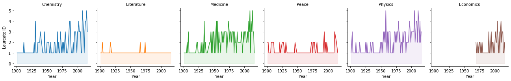


## Number of Nobel Prizes in each category


```python

NobelCategory=NobelData['Category'].value_counts()
sns.barplot(x=NobelCategory.index,y=NobelCategory.values)
plt.xticks(rotation=90)
plt.title('Nobel Prizes by Category')
plt.show()
```


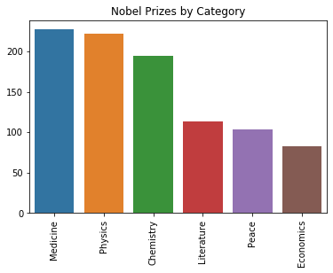


## Visualization of number of prizes in each country in every category, USA dominance


```python

plt.figure(figsize=(12,22))
DataGraph = sns.countplot(y="Birth Country", data=NobelData,
              order=NobelData['Birth Country'].value_counts().index,
              palette='GnBu_d')
plt.show()
```


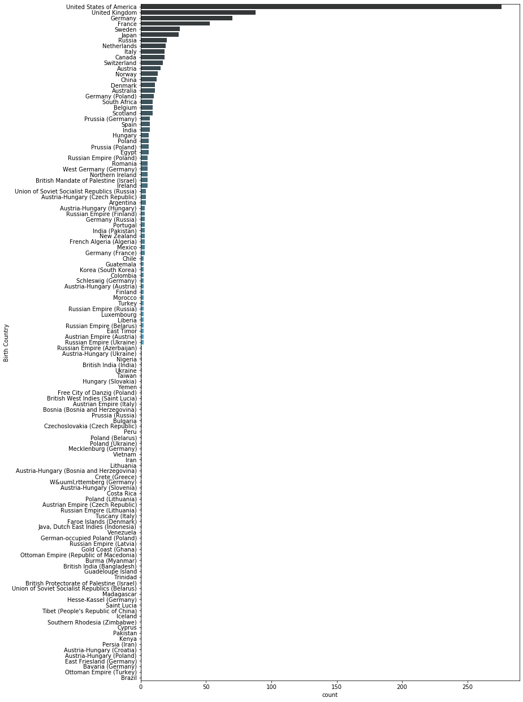


## Visualization of number of prizes in each country in Chemistry category 


```python
plt.figure(figsize=(12,12))
ChemestryGraph = sns.countplot(y="Birth Country", data=Chemistry,
              order=Chemistry['Birth Country'].value_counts().index,
              palette='GnBu_d')
plt.show()
```


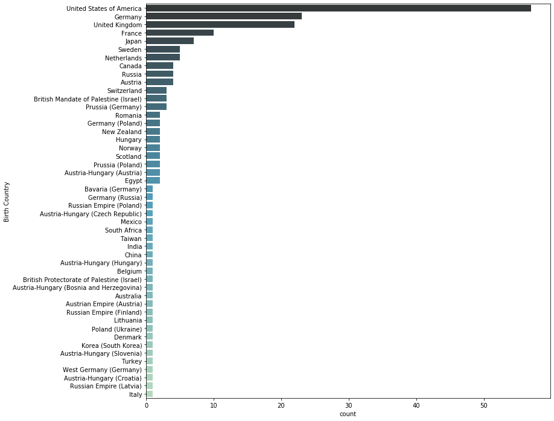


## Visualization of number of prizes in each country in Economics category


```python
plt.figure(figsize=(12,12))
EconomicsGraph = sns.countplot(y="Birth Country", data=Economics,
              order=Economics['Birth Country'].value_counts().index,
              palette='GnBu_d')
plt.show()
```


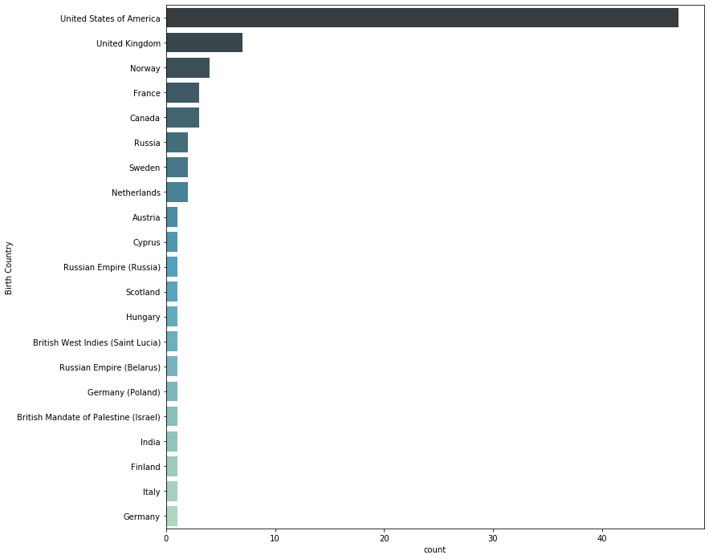


## Visualization of number of prizes in each country in Literature category


```python
plt.figure(figsize=(12,12))
LiteratureGraph = sns.countplot(y="Birth Country", data=Literature,
              order=Literature['Birth Country'].value_counts().index,
              palette='GnBu_d')
plt.show()
```


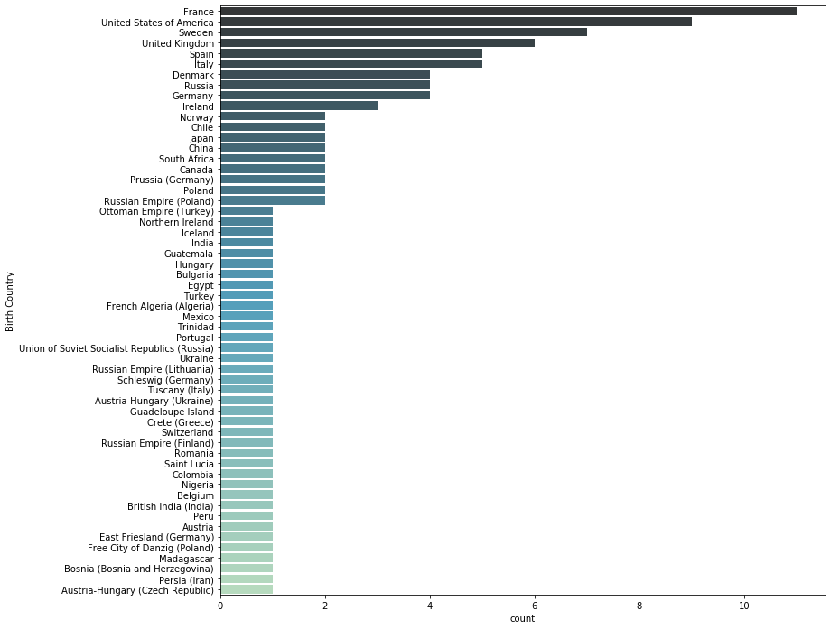


## Visualization of number of prizes in each country in Medicine category


```python
plt.figure(figsize=(12,12))
MedicineGraph = sns.countplot(y="Birth Country", data=Medicine,
              order=Medicine['Birth Country'].value_counts().index,
              palette='GnBu_d')
plt.show()
```


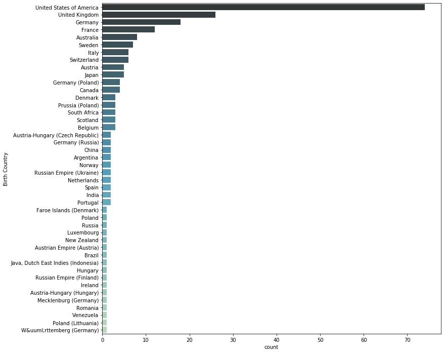


## Visualization of number of prizes in each country in Peace category


```python
plt.figure(figsize=(12,12))
PeaceGraph = sns.countplot(y="Birth Country", data=Peace,
              order=Peace['Birth Country'].value_counts().index,
              palette='GnBu_d')
plt.show()
```


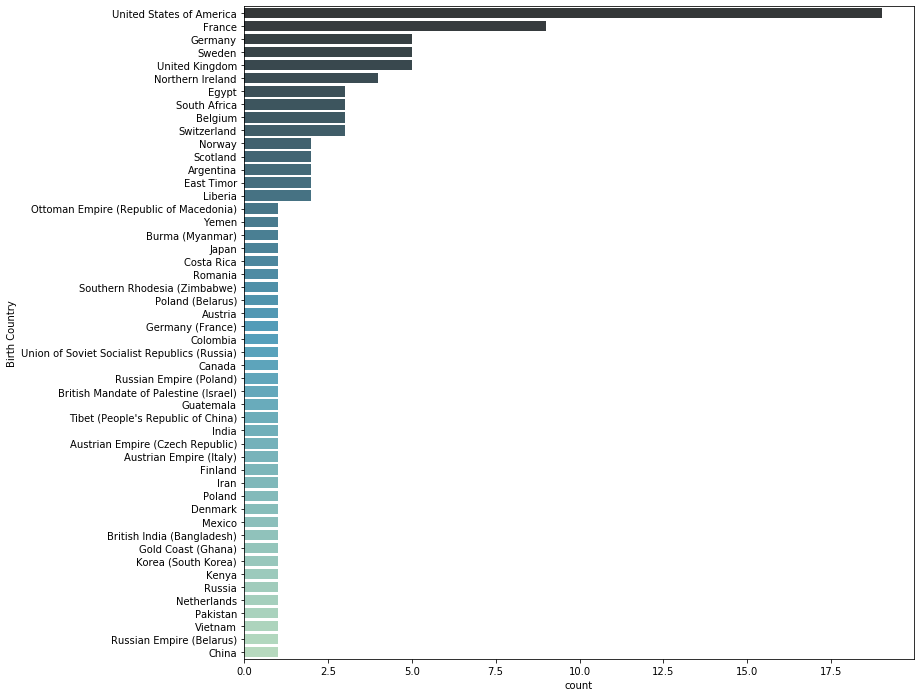


## Visualization of number of prizes in each country in Physics category


```python
plt.figure(figsize=(12,12))
PhysicsGraph = sns.countplot(y="Birth Country", data=Physics,
              order=Physics['Birth Country'].value_counts().index,
              palette='GnBu_d')
plt.show()
```


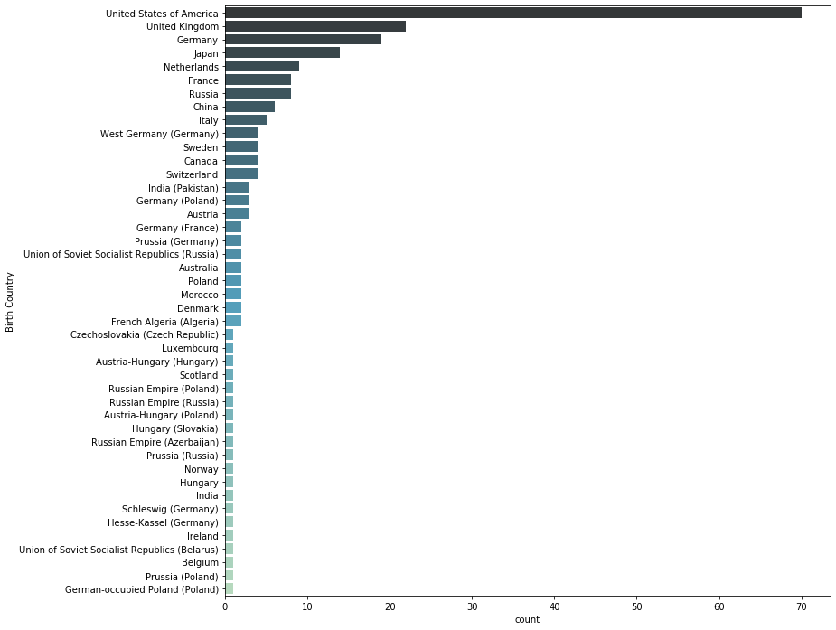


## Pie chart for the whole dataframe gender, which gender is most likely to win a nobel prize?


```python
from matplotlib.pyplot import pie, axis, show

AllCategoryGender = NobelData['Sex'].value_counts()
print(AllCategoryGender)

pie(AllCategoryGender, labels=AllCategoryGender.index, autopct='%1.1f%%');
show()
```

    Male      893
    Female     50
    Name: Sex, dtype: int64


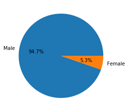


## Age differences between the whole nobel prize categories


```python
import warnings
warnings.filterwarnings('ignore')
NobelData['Birth Date'] = NobelData['Birth Date'].str[0:4]
NobelData['Birth Date'] = NobelData['Birth Date'].replace(to_replace="nan", value=0)
NobelData['Birth Date'] = NobelData['Birth Date'].apply(pd.to_numeric)
NobelData["Age"] = NobelData["Year"] - NobelData["Birth Date"]
```


```python
bins = [0, 19, 29, 39, 49, 59, 69, 79, 89, 100]
groupNames = ['Teens', '20s', '30s', '40s', '50s', '60s', '70s', '80s', '90s']
NobelData['Age Categorical'] = pd.cut(NobelData['Age'], bins, labels=groupNames)
```


```python
NobelAge = NobelData['Age Categorical'].value_counts()
print(NobelAge)

pie(NobelAge, labels=NobelAge.index, autopct='%1.1f%%');
show()
```

    60s      270
    50s      246
    70s      163
    40s      163
    30s       51
    80s       47
    90s        1
    20s        1
    Teens      1
    Name: Age Categorical, dtype: int64


## Age differences between the chemistry category


```python
Chemistry['Birth Date'] = Chemistry['Birth Date'].str[0:4]
Chemistry['Birth Date'] = Chemistry['Birth Date'].replace(to_replace="nan", value=0)
Chemistry['Birth Date'] = Chemistry['Birth Date'].apply(pd.to_numeric)
Chemistry["Age"] = Chemistry["Year"] - Chemistry["Birth Date"]
```


```python
bins = [0, 19, 29, 39, 49, 59, 69, 79, 89, 100]
groupNames = ['Teens', '20s', '30s', '40s', '50s', '60s', '70s', '80s', '90s']
Chemistry['Age Categorical'] = pd.cut(Chemistry['Age'], bins, labels=groupNames)

```


```python
Chemistry = Chemistry['Age Categorical'].value_counts()
print(Chemistry)

pie(NobelAge, labels=NobelAge.index, autopct='%1.1f%%');
show()
```

    50s      61
    60s      52
    40s      39
    70s      24
    80s       9
    30s       9
    90s       0
    20s       0
    Teens     0
    Name: Age Categorical, dtype: int64


## Age differences between the Economics category


```python
Economics['Birth Date'] = Economics['Birth Date'].str[0:4]
Economics['Birth Date'] = Economics['Birth Date'].replace(to_replace="nan", value=0)
Economics['Birth Date'] = Economics['Birth Date'].apply(pd.to_numeric)
Economics["Age"] = Economics["Year"] - Economics["Birth Date"]
```


```python
bins = [0, 19, 29, 39, 49, 59, 69, 79, 89, 100]
groupNames = ['Teens', '20s', '30s', '40s', '50s', '60s', '70s', '80s', '90s']
Economics['Age Categorical'] = pd.cut(Economics['Age'], bins, labels=groupNames)
```


```python
Economics = Economics['Age Categorical'].value_counts()
print(Economics)

pie(NobelAge, labels=NobelAge.index, autopct='%1.1f%%');
show()
```

    60s      42
    70s      24
    50s      12
    80s       4
    90s       1
    40s       0
    30s       0
    20s       0
    Teens     0
    Name: Age Categorical, dtype: int64


## Age differences between the Literature  category


```python
Literature['Birth Date'] = Literature['Birth Date'].str[0:4]
Literature['Birth Date'] = Literature['Birth Date'].replace(to_replace="nan", value=0)
Literature['Birth Date'] = Literature['Birth Date'].apply(pd.to_numeric)
Literature["Age"] = Literature["Year"] - Literature["Birth Date"]
```


```python
bins = [0, 19, 29, 39, 49, 59, 69, 79, 89, 100]
groupNames = ['Teens', '20s', '30s', '40s', '50s', '60s', '70s', '80s', '90s']
Literature['Age Categorical'] = pd.cut(Literature['Age'], bins, labels=groupNames)
```


```python
Literature = Literature['Age Categorical'].value_counts()
print(Literature)

pie(NobelAge, labels=NobelAge.index, autopct='%1.1f%%');
show()
```

    60s      37
    70s      33
    50s      28
    40s       9
    80s       6
    90s       0
    30s       0
    20s       0
    Teens     0
    Name: Age Categorical, dtype: int64


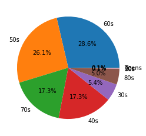


## Age differences between the Medicine category


```python
Medicine['Birth Date'] = Medicine['Birth Date'].str[0:4]
Medicine['Birth Date'] = Medicine['Birth Date'].replace(to_replace="nan", value=0)
Medicine['Birth Date'] = Medicine['Birth Date'].apply(pd.to_numeric)
Medicine["Age"] = Medicine["Year"] - Medicine["Birth Date"]
```


```python
bins = [0, 19, 29, 39, 49, 59, 69, 79, 89, 100]
groupNames = ['Teens', '20s', '30s', '40s', '50s', '60s', '70s', '80s', '90s']
Medicine['Age Categorical'] = pd.cut(Medicine['Age'], bins, labels=groupNames)
```


```python
Medicine = Medicine['Age Categorical'].value_counts()
print(Medicine)

pie(NobelAge, labels=NobelAge.index, autopct='%1.1f%%');
show()
```

    50s      74
    60s      56
    40s      44
    70s      31
    30s      12
    80s      10
    90s       0
    20s       0
    Teens     0
    Name: Age Categorical, dtype: int64


## Age differences between the Peace category


```python
Peace['Birth Date'] = Peace['Birth Date'].str[0:4]
Peace['Birth Date'] = Peace['Birth Date'].replace(to_replace="nan", value=0)
Peace['Birth Date'] = Peace['Birth Date'].apply(pd.to_numeric)
Peace["Age"] = Peace["Year"] - Peace["Birth Date"]
```


```python
bins = [0, 19, 29, 39, 49, 59, 69, 79, 89, 100]
groupNames = ['Teens', '20s', '30s', '40s', '50s', '60s', '70s', '80s', '90s']
Peace['Age Categorical'] = pd.cut(Peace['Age'], bins, labels=groupNames)
```


```python
Peace = Peace['Age Categorical'].value_counts()
print(Peace)

pie(NobelAge, labels=NobelAge.index, autopct='%1.1f%%');
show()
```

    60s      32
    70s      26
    50s      19
    40s      14
    80s       6
    30s       6
    Teens     1
    90s       0
    20s       0
    Name: Age Categorical, dtype: int64


## Age differences between the Physics category


```python
Physics['Birth Date'] = Physics['Birth Date'].str[0:4]
Physics['Birth Date'] = Physics['Birth Date'].replace(to_replace="nan", value=0)
Physics['Birth Date'] = Physics['Birth Date'].apply(pd.to_numeric)
Physics["Age"] = Physics["Year"] - Physics["Birth Date"]
```


```python
bins = [0, 19, 29, 39, 49, 59, 69, 79, 89, 100]
groupNames = ['Teens', '20s', '30s', '40s', '50s', '60s', '70s', '80s', '90s']
Physics['Age Categorical'] = pd.cut(Physics['Age'], bins, labels=groupNames)
```


```python
Physics = Physics['Age Categorical'].value_counts()
print(Physics)

pie(NobelAge, labels=NobelAge.index, autopct='%1.1f%%');
show()
```

    40s      57
    50s      52
    60s      51
    70s      25
    30s      24
    80s      12
    20s       1
    90s       0
    Teens     0
    Name: Age Categorical, dtype: int64


## Distribution of Age of Winners in each Category using boxplot


```python
sns.boxplot(data=NobelData,
         x='Category',
         y='Age')

plt.show()
```


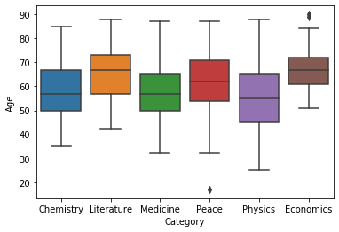


## Organizations with the largest number of nobel prizes


```python
org = NobelData['Organization Name'].value_counts().reset_index().head(20)

sns.barplot(x='Organization Name',y='index',data=org)
plt.xticks(rotation=90)
plt.ylabel('Organization Name')
plt.xlabel('Count')
plt.show()
```


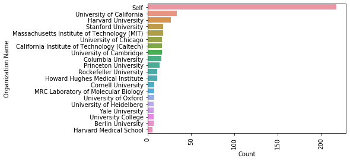


## Oldest nobel prize winners


```python
OldestWinners=NobelData.nlargest(5,'Age')
display(OldestWinners[['Category','Full Name','Birth Country','Sex','Age']])
```


<div>
<style scoped>
    .dataframe tbody tr th:only-of-type {
        vertical-align: middle;
    }

    .dataframe tbody tr th {
        vertical-align: top;
    }

    .dataframe thead th {
        text-align: right;
    }
</style>
<table border="1" class="dataframe">
  <thead>
    <tr style="text-align: right;">
      <th></th>
      <th>Category</th>
      <th>Full Name</th>
      <th>Birth Country</th>
      <th>Sex</th>
      <th>Age</th>
    </tr>
  </thead>
  <tbody>
    <tr>
      <th>803</th>
      <td>Economics</td>
      <td>Leonid Hurwicz</td>
      <td>Russia</td>
      <td>Male</td>
      <td>90</td>
    </tr>
    <tr>
      <th>881</th>
      <td>Economics</td>
      <td>Lloyd S. Shapley</td>
      <td>United States of America</td>
      <td>Male</td>
      <td>89</td>
    </tr>
    <tr>
      <th>750</th>
      <td>Physics</td>
      <td>Raymond Davis Jr.</td>
      <td>United States of America</td>
      <td>Male</td>
      <td>88</td>
    </tr>
    <tr>
      <th>806</th>
      <td>Literature</td>
      <td>Doris Lessing</td>
      <td>Persia (Iran)</td>
      <td>Female</td>
      <td>88</td>
    </tr>
    <tr>
      <th>379</th>
      <td>Medicine</td>
      <td>Peyton Rous</td>
      <td>United States of America</td>
      <td>Male</td>
      <td>87</td>
    </tr>
  </tbody>
</table>
</div>


## Youngest nobel prize winners


```python
YoungestWinner=NobelData.nsmallest(5,'Age')
display(YoungestWinner[['Category','Full Name','Birth Country','Sex','Age']])
```


<div>
<style scoped>
    .dataframe tbody tr th:only-of-type {
        vertical-align: middle;
    }

    .dataframe tbody tr th {
        vertical-align: top;
    }

    .dataframe thead th {
        text-align: right;
    }
</style>
<table border="1" class="dataframe">
  <thead>
    <tr style="text-align: right;">
      <th></th>
      <th>Category</th>
      <th>Full Name</th>
      <th>Birth Country</th>
      <th>Sex</th>
      <th>Age</th>
    </tr>
  </thead>
  <tbody>
    <tr>
      <th>915</th>
      <td>Peace</td>
      <td>Malala Yousafzai</td>
      <td>Pakistan</td>
      <td>Female</td>
      <td>17</td>
    </tr>
    <tr>
      <th>84</th>
      <td>Physics</td>
      <td>William Lawrence Bragg</td>
      <td>Australia</td>
      <td>Male</td>
      <td>25</td>
    </tr>
    <tr>
      <th>166</th>
      <td>Physics</td>
      <td>Werner Karl Heisenberg</td>
      <td>Germany</td>
      <td>Male</td>
      <td>31</td>
    </tr>
    <tr>
      <th>171</th>
      <td>Physics</td>
      <td>Paul Adrien Maurice Dirac</td>
      <td>United Kingdom</td>
      <td>Male</td>
      <td>31</td>
    </tr>
    <tr>
      <th>191</th>
      <td>Physics</td>
      <td>Carl David Anderson</td>
      <td>United States of America</td>
      <td>Male</td>
      <td>31</td>
    </tr>
  </tbody>
</table>
</div>


## First woman to win the nobel prize


```python
female=NobelData[NobelData['Sex']=="Female"].nsmallest(1,'Year')
female[['Year','Category','Full Name','Prize']]
```


<div>
<style scoped>
    .dataframe tbody tr th:only-of-type {
        vertical-align: middle;
    }

    .dataframe tbody tr th {
        vertical-align: top;
    }

    .dataframe thead th {
        text-align: right;
    }
</style>
<table border="1" class="dataframe">
  <thead>
    <tr style="text-align: right;">
      <th></th>
      <th>Year</th>
      <th>Category</th>
      <th>Full Name</th>
      <th>Prize</th>
    </tr>
  </thead>
  <tbody>
    <tr>
      <th>19</th>
      <td>1903</td>
      <td>Physics</td>
      <td>Marie Curie, née Sklodowska</td>
      <td>The Nobel Prize in Physics 1903</td>
    </tr>
  </tbody>
</table>
</div>


## Repeat laureates


```python
repeat=NobelData.groupby(['Category','Full Name']).filter(lambda group : len(group)>=2)
repeat
```


<div>
<style scoped>
    .dataframe tbody tr th:only-of-type {
        vertical-align: middle;
    }

    .dataframe tbody tr th {
        vertical-align: top;
    }

    .dataframe thead th {
        text-align: right;
    }
</style>
<table border="1" class="dataframe">
  <thead>
    <tr style="text-align: right;">
      <th></th>
      <th>Unnamed: 0</th>
      <th>Year</th>
      <th>Category</th>
      <th>Prize</th>
      <th>Prize Share</th>
      <th>Laureate ID</th>
      <th>Laureate Type</th>
      <th>Full Name</th>
      <th>Birth Date</th>
      <th>Birth City</th>
      <th>Birth Country</th>
      <th>Sex</th>
      <th>Organization Name</th>
      <th>Organization City</th>
      <th>Organization Country</th>
      <th>Age</th>
      <th>Age Categorical</th>
    </tr>
  </thead>
  <tbody>
    <tr>
      <th>45</th>
      <td>46</td>
      <td>1908</td>
      <td>Medicine</td>
      <td>The Nobel Prize in Physiology or Medicine 1908</td>
      <td>1/2</td>
      <td>302</td>
      <td>Individual</td>
      <td>Paul Ehrlich</td>
      <td>1854</td>
      <td>Strehlen (Strzelin)</td>
      <td>Prussia (Poland)</td>
      <td>Male</td>
      <td>Goettingen University</td>
      <td>Göttingen</td>
      <td>Germany</td>
      <td>54</td>
      <td>50s</td>
    </tr>
    <tr>
      <th>46</th>
      <td>47</td>
      <td>1908</td>
      <td>Medicine</td>
      <td>The Nobel Prize in Physiology or Medicine 1908</td>
      <td>1/2</td>
      <td>302</td>
      <td>Individual</td>
      <td>Paul Ehrlich</td>
      <td>1854</td>
      <td>Strehlen (Strzelin)</td>
      <td>Prussia (Poland)</td>
      <td>Male</td>
      <td>Königliches Institut für experimentelle Therap...</td>
      <td>Frankfurt-on-the-Main</td>
      <td>Germany</td>
      <td>54</td>
      <td>50s</td>
    </tr>
    <tr>
      <th>154</th>
      <td>157</td>
      <td>1931</td>
      <td>Chemistry</td>
      <td>The Nobel Prize in Chemistry 1931</td>
      <td>1/2</td>
      <td>189</td>
      <td>Individual</td>
      <td>Carl Bosch</td>
      <td>1874</td>
      <td>Cologne</td>
      <td>Germany</td>
      <td>Male</td>
      <td>University of Heidelberg</td>
      <td>Heidelberg</td>
      <td>Germany</td>
      <td>57</td>
      <td>50s</td>
    </tr>
    <tr>
      <th>155</th>
      <td>158</td>
      <td>1931</td>
      <td>Chemistry</td>
      <td>The Nobel Prize in Chemistry 1931</td>
      <td>1/2</td>
      <td>189</td>
      <td>Individual</td>
      <td>Carl Bosch</td>
      <td>1874</td>
      <td>Cologne</td>
      <td>Germany</td>
      <td>Male</td>
      <td>I.G. Farbenindustrie A.G.</td>
      <td>Heidelberg</td>
      <td>Germany</td>
      <td>57</td>
      <td>50s</td>
    </tr>
    <tr>
      <th>156</th>
      <td>159</td>
      <td>1931</td>
      <td>Chemistry</td>
      <td>The Nobel Prize in Chemistry 1931</td>
      <td>1/2</td>
      <td>190</td>
      <td>Individual</td>
      <td>Friedrich Bergius</td>
      <td>1884</td>
      <td>Goldschmieden, near Breslau</td>
      <td>Germany (Poland)</td>
      <td>Male</td>
      <td>University of Heidelberg</td>
      <td>Heidelberg</td>
      <td>Germany</td>
      <td>47</td>
      <td>40s</td>
    </tr>
    <tr>
      <th>157</th>
      <td>160</td>
      <td>1931</td>
      <td>Chemistry</td>
      <td>The Nobel Prize in Chemistry 1931</td>
      <td>1/2</td>
      <td>190</td>
      <td>Individual</td>
      <td>Friedrich Bergius</td>
      <td>1884</td>
      <td>Goldschmieden, near Breslau</td>
      <td>Germany (Poland)</td>
      <td>Male</td>
      <td>I.G. Farbenindustrie A.G.</td>
      <td>Mannheim-Rheinau</td>
      <td>Germany</td>
      <td>47</td>
      <td>40s</td>
    </tr>
    <tr>
      <th>176</th>
      <td>179</td>
      <td>1934</td>
      <td>Medicine</td>
      <td>The Nobel Prize in Physiology or Medicine 1934</td>
      <td>1/3</td>
      <td>328</td>
      <td>Individual</td>
      <td>William Parry Murphy</td>
      <td>1892</td>
      <td>Stoughton, WI</td>
      <td>United States of America</td>
      <td>Male</td>
      <td>Harvard University</td>
      <td>Cambridge, MA</td>
      <td>United States of America</td>
      <td>42</td>
      <td>40s</td>
    </tr>
    <tr>
      <th>177</th>
      <td>180</td>
      <td>1934</td>
      <td>Medicine</td>
      <td>The Nobel Prize in Physiology or Medicine 1934</td>
      <td>1/3</td>
      <td>328</td>
      <td>Individual</td>
      <td>William Parry Murphy</td>
      <td>1892</td>
      <td>Stoughton, WI</td>
      <td>United States of America</td>
      <td>Male</td>
      <td>Peter Brent Brigham Hospital</td>
      <td>Boston, MA</td>
      <td>United States of America</td>
      <td>42</td>
      <td>40s</td>
    </tr>
    <tr>
      <th>184</th>
      <td>187</td>
      <td>1936</td>
      <td>Chemistry</td>
      <td>The Nobel Prize in Chemistry 1936</td>
      <td>1/1</td>
      <td>195</td>
      <td>Individual</td>
      <td>Petrus (Peter) Josephus Wilhelmus Debye</td>
      <td>1884</td>
      <td>Maastricht</td>
      <td>Netherlands</td>
      <td>Male</td>
      <td>Berlin University</td>
      <td>Berlin</td>
      <td>Germany</td>
      <td>52</td>
      <td>50s</td>
    </tr>
    <tr>
      <th>185</th>
      <td>188</td>
      <td>1936</td>
      <td>Chemistry</td>
      <td>The Nobel Prize in Chemistry 1936</td>
      <td>1/1</td>
      <td>195</td>
      <td>Individual</td>
      <td>Petrus (Peter) Josephus Wilhelmus Debye</td>
      <td>1884</td>
      <td>Maastricht</td>
      <td>Netherlands</td>
      <td>Male</td>
      <td>Kaiser-Wilhelm-Institut (now Max-Planck-Instit...</td>
      <td>Berlin</td>
      <td>Germany</td>
      <td>52</td>
      <td>50s</td>
    </tr>
    <tr>
      <th>199</th>
      <td>202</td>
      <td>1938</td>
      <td>Chemistry</td>
      <td>The Nobel Prize in Chemistry 1938</td>
      <td>1/1</td>
      <td>198</td>
      <td>Individual</td>
      <td>Richard Kuhn</td>
      <td>1900</td>
      <td>Vienna</td>
      <td>Austria-Hungary (Austria)</td>
      <td>Male</td>
      <td>Kaiser-Wilhelm-Institut (now Max-Planck Instit...</td>
      <td>Heidelberg</td>
      <td>Germany</td>
      <td>38</td>
      <td>30s</td>
    </tr>
    <tr>
      <th>200</th>
      <td>203</td>
      <td>1938</td>
      <td>Chemistry</td>
      <td>The Nobel Prize in Chemistry 1938</td>
      <td>1/1</td>
      <td>198</td>
      <td>Individual</td>
      <td>Richard Kuhn</td>
      <td>1900</td>
      <td>Vienna</td>
      <td>Austria-Hungary (Austria)</td>
      <td>Male</td>
      <td>University of Heidelberg</td>
      <td>Heidelberg</td>
      <td>Germany</td>
      <td>38</td>
      <td>30s</td>
    </tr>
    <tr>
      <th>204</th>
      <td>208</td>
      <td>1939</td>
      <td>Chemistry</td>
      <td>The Nobel Prize in Chemistry 1939</td>
      <td>1/2</td>
      <td>199</td>
      <td>Individual</td>
      <td>Adolf Friedrich Johann Butenandt</td>
      <td>1903</td>
      <td>Bremerhaven-Lehe</td>
      <td>Germany</td>
      <td>Male</td>
      <td>Kaiser-Wilhelm-Institut (now Max-Planck-Instit...</td>
      <td>Berlin-Dahlem</td>
      <td>Germany</td>
      <td>36</td>
      <td>30s</td>
    </tr>
    <tr>
      <th>205</th>
      <td>209</td>
      <td>1939</td>
      <td>Chemistry</td>
      <td>The Nobel Prize in Chemistry 1939</td>
      <td>1/2</td>
      <td>199</td>
      <td>Individual</td>
      <td>Adolf Friedrich Johann Butenandt</td>
      <td>1903</td>
      <td>Bremerhaven-Lehe</td>
      <td>Germany</td>
      <td>Male</td>
      <td>Berlin University</td>
      <td>Berlin</td>
      <td>Germany</td>
      <td>36</td>
      <td>30s</td>
    </tr>
    <tr>
      <th>247</th>
      <td>254</td>
      <td>1949</td>
      <td>Medicine</td>
      <td>The Nobel Prize in Physiology or Medicine 1949</td>
      <td>1/2</td>
      <td>348</td>
      <td>Individual</td>
      <td>Antonio Caetano de Abreu Freire Egas Moniz</td>
      <td>1874</td>
      <td>Avanca</td>
      <td>Portugal</td>
      <td>Male</td>
      <td>University of Lisbon</td>
      <td>Lisbon</td>
      <td>Portugal</td>
      <td>75</td>
      <td>70s</td>
    </tr>
    <tr>
      <th>248</th>
      <td>255</td>
      <td>1949</td>
      <td>Medicine</td>
      <td>The Nobel Prize in Physiology or Medicine 1949</td>
      <td>1/2</td>
      <td>348</td>
      <td>Individual</td>
      <td>Antonio Caetano de Abreu Freire Egas Moniz</td>
      <td>1874</td>
      <td>Avanca</td>
      <td>Portugal</td>
      <td>Male</td>
      <td>Neurological Institute</td>
      <td>Lisbon</td>
      <td>Portugal</td>
      <td>75</td>
      <td>70s</td>
    </tr>
    <tr>
      <th>250</th>
      <td>257</td>
      <td>1949</td>
      <td>Physics</td>
      <td>The Nobel Prize in Physics 1949</td>
      <td>1/1</td>
      <td>54</td>
      <td>Individual</td>
      <td>Hideki Yukawa</td>
      <td>1907</td>
      <td>Tokyo</td>
      <td>Japan</td>
      <td>Male</td>
      <td>Kyoto Imperial University</td>
      <td>Kyoto</td>
      <td>Japan</td>
      <td>42</td>
      <td>40s</td>
    </tr>
    <tr>
      <th>251</th>
      <td>258</td>
      <td>1949</td>
      <td>Physics</td>
      <td>The Nobel Prize in Physics 1949</td>
      <td>1/1</td>
      <td>54</td>
      <td>Individual</td>
      <td>Hideki Yukawa</td>
      <td>1907</td>
      <td>Tokyo</td>
      <td>Japan</td>
      <td>Male</td>
      <td>Columbia University</td>
      <td>New York, NY</td>
      <td>United States of America</td>
      <td>42</td>
      <td>40s</td>
    </tr>
    <tr>
      <th>274</th>
      <td>281</td>
      <td>1953</td>
      <td>Chemistry</td>
      <td>The Nobel Prize in Chemistry 1953</td>
      <td>1/1</td>
      <td>216</td>
      <td>Individual</td>
      <td>Hermann Staudinger</td>
      <td>1881</td>
      <td>Worms</td>
      <td>Germany</td>
      <td>Male</td>
      <td>University of Freiburg</td>
      <td>Breisgau</td>
      <td>Federal Republic of Germany</td>
      <td>72</td>
      <td>70s</td>
    </tr>
    <tr>
      <th>275</th>
      <td>282</td>
      <td>1953</td>
      <td>Chemistry</td>
      <td>The Nobel Prize in Chemistry 1953</td>
      <td>1/1</td>
      <td>216</td>
      <td>Individual</td>
      <td>Hermann Staudinger</td>
      <td>1881</td>
      <td>Worms</td>
      <td>Germany</td>
      <td>Male</td>
      <td>Staatliches Institut für makromolekulare Chemi...</td>
      <td>Breisgau</td>
      <td>Federal Republic of Germany</td>
      <td>72</td>
      <td>70s</td>
    </tr>
    <tr>
      <th>278</th>
      <td>285</td>
      <td>1953</td>
      <td>Medicine</td>
      <td>The Nobel Prize in Physiology or Medicine 1953</td>
      <td>1/2</td>
      <td>355</td>
      <td>Individual</td>
      <td>Fritz Albert Lipmann</td>
      <td>1899</td>
      <td>Koenigsberg (Kaliningrad)</td>
      <td>Germany (Russia)</td>
      <td>Male</td>
      <td>Harvard Medical School</td>
      <td>Boston, MA</td>
      <td>United States of America</td>
      <td>54</td>
      <td>50s</td>
    </tr>
    <tr>
      <th>279</th>
      <td>286</td>
      <td>1953</td>
      <td>Medicine</td>
      <td>The Nobel Prize in Physiology or Medicine 1953</td>
      <td>1/2</td>
      <td>355</td>
      <td>Individual</td>
      <td>Fritz Albert Lipmann</td>
      <td>1899</td>
      <td>Koenigsberg (Kaliningrad)</td>
      <td>Germany (Russia)</td>
      <td>Male</td>
      <td>Massachusetts General Hospital</td>
      <td>Boston, MA</td>
      <td>United States of America</td>
      <td>54</td>
      <td>50s</td>
    </tr>
    <tr>
      <th>284</th>
      <td>291</td>
      <td>1954</td>
      <td>Medicine</td>
      <td>The Nobel Prize in Physiology or Medicine 1954</td>
      <td>1/3</td>
      <td>356</td>
      <td>Individual</td>
      <td>John Franklin Enders</td>
      <td>1897</td>
      <td>West Hartford, CT</td>
      <td>United States of America</td>
      <td>Male</td>
      <td>Harvard Medical School</td>
      <td>Boston, MA</td>
      <td>United States of America</td>
      <td>57</td>
      <td>50s</td>
    </tr>
    <tr>
      <th>285</th>
      <td>292</td>
      <td>1954</td>
      <td>Medicine</td>
      <td>The Nobel Prize in Physiology or Medicine 1954</td>
      <td>1/3</td>
      <td>356</td>
      <td>Individual</td>
      <td>John Franklin Enders</td>
      <td>1897</td>
      <td>West Hartford, CT</td>
      <td>United States of America</td>
      <td>Male</td>
      <td>Research Division of Infectious Diseases, Chil...</td>
      <td>Boston, MA</td>
      <td>United States of America</td>
      <td>57</td>
      <td>50s</td>
    </tr>
    <tr>
      <th>289</th>
      <td>297</td>
      <td>1954</td>
      <td>Physics</td>
      <td>The Nobel Prize in Physics 1954</td>
      <td>1/2</td>
      <td>62</td>
      <td>Individual</td>
      <td>Walther Bothe</td>
      <td>1891</td>
      <td>Oranienburg</td>
      <td>Germany</td>
      <td>Male</td>
      <td>University of Heidelberg</td>
      <td>Heidelberg</td>
      <td>Federal Republic of Germany</td>
      <td>63</td>
      <td>60s</td>
    </tr>
    <tr>
      <th>290</th>
      <td>298</td>
      <td>1954</td>
      <td>Physics</td>
      <td>The Nobel Prize in Physics 1954</td>
      <td>1/2</td>
      <td>62</td>
      <td>Individual</td>
      <td>Walther Bothe</td>
      <td>1891</td>
      <td>Oranienburg</td>
      <td>Germany</td>
      <td>Male</td>
      <td>Max-Planck-Institut für medizinische Forschung</td>
      <td>Heidelberg</td>
      <td>Federal Republic of Germany</td>
      <td>63</td>
      <td>60s</td>
    </tr>
    <tr>
      <th>300</th>
      <td>308</td>
      <td>1956</td>
      <td>Medicine</td>
      <td>The Nobel Prize in Physiology or Medicine 1956</td>
      <td>1/3</td>
      <td>361</td>
      <td>Individual</td>
      <td>Werner Forssmann</td>
      <td>1904</td>
      <td>Berlin</td>
      <td>Germany</td>
      <td>Male</td>
      <td>Mainz University</td>
      <td>Mainz</td>
      <td>Federal Republic of Germany</td>
      <td>52</td>
      <td>50s</td>
    </tr>
    <tr>
      <th>301</th>
      <td>309</td>
      <td>1956</td>
      <td>Medicine</td>
      <td>The Nobel Prize in Physiology or Medicine 1956</td>
      <td>1/3</td>
      <td>361</td>
      <td>Individual</td>
      <td>Werner Forssmann</td>
      <td>1904</td>
      <td>Berlin</td>
      <td>Germany</td>
      <td>Male</td>
      <td>Self</td>
      <td>Bad Kreuznach</td>
      <td>Federal Republic of Germany</td>
      <td>52</td>
      <td>50s</td>
    </tr>
    <tr>
      <th>304</th>
      <td>312</td>
      <td>1956</td>
      <td>Physics</td>
      <td>The Nobel Prize in Physics 1956</td>
      <td>1/3</td>
      <td>66</td>
      <td>Individual</td>
      <td>John Bardeen</td>
      <td>1908</td>
      <td>Madison, WI</td>
      <td>United States of America</td>
      <td>Male</td>
      <td>University of Illinois</td>
      <td>Urbana, IL</td>
      <td>United States of America</td>
      <td>48</td>
      <td>40s</td>
    </tr>
    <tr>
      <th>312</th>
      <td>320</td>
      <td>1958</td>
      <td>Chemistry</td>
      <td>The Nobel Prize in Chemistry 1958</td>
      <td>1/1</td>
      <td>222</td>
      <td>Individual</td>
      <td>Frederick Sanger</td>
      <td>1918</td>
      <td>Rendcombe</td>
      <td>United Kingdom</td>
      <td>Male</td>
      <td>University of Cambridge</td>
      <td>Cambridge</td>
      <td>United Kingdom</td>
      <td>40</td>
      <td>40s</td>
    </tr>
    <tr>
      <th>...</th>
      <td>...</td>
      <td>...</td>
      <td>...</td>
      <td>...</td>
      <td>...</td>
      <td>...</td>
      <td>...</td>
      <td>...</td>
      <td>...</td>
      <td>...</td>
      <td>...</td>
      <td>...</td>
      <td>...</td>
      <td>...</td>
      <td>...</td>
      <td>...</td>
      <td>...</td>
    </tr>
    <tr>
      <th>864</th>
      <td>887</td>
      <td>2011</td>
      <td>Medicine</td>
      <td>The Nobel Prize in Physiology or Medicine 2011</td>
      <td>1/4</td>
      <td>861</td>
      <td>Individual</td>
      <td>Bruce A. Beutler</td>
      <td>1957</td>
      <td>Chicago, IL</td>
      <td>United States of America</td>
      <td>Male</td>
      <td>University of Texas Southwestern Medical Cente...</td>
      <td>Dallas, TX</td>
      <td>United States of America</td>
      <td>54</td>
      <td>50s</td>
    </tr>
    <tr>
      <th>865</th>
      <td>888</td>
      <td>2011</td>
      <td>Medicine</td>
      <td>The Nobel Prize in Physiology or Medicine 2011</td>
      <td>1/4</td>
      <td>861</td>
      <td>Individual</td>
      <td>Bruce A. Beutler</td>
      <td>1957</td>
      <td>Chicago, IL</td>
      <td>United States of America</td>
      <td>Male</td>
      <td>The Scripps Research Institute</td>
      <td>La Jolla, CA</td>
      <td>United States of America</td>
      <td>54</td>
      <td>50s</td>
    </tr>
    <tr>
      <th>871</th>
      <td>894</td>
      <td>2011</td>
      <td>Physics</td>
      <td>The Nobel Prize in Physics 2011</td>
      <td>1/2</td>
      <td>864</td>
      <td>Individual</td>
      <td>Saul Perlmutter</td>
      <td>1959</td>
      <td>Champaign-Urbana, IL</td>
      <td>United States of America</td>
      <td>Male</td>
      <td>Lawrence Berkeley National Laboratory</td>
      <td>Berkeley, CA</td>
      <td>United States of America</td>
      <td>52</td>
      <td>50s</td>
    </tr>
    <tr>
      <th>872</th>
      <td>895</td>
      <td>2011</td>
      <td>Physics</td>
      <td>The Nobel Prize in Physics 2011</td>
      <td>1/2</td>
      <td>864</td>
      <td>Individual</td>
      <td>Saul Perlmutter</td>
      <td>1959</td>
      <td>Champaign-Urbana, IL</td>
      <td>United States of America</td>
      <td>Male</td>
      <td>University of California</td>
      <td>Berkeley, CA</td>
      <td>United States of America</td>
      <td>52</td>
      <td>50s</td>
    </tr>
    <tr>
      <th>874</th>
      <td>897</td>
      <td>2011</td>
      <td>Physics</td>
      <td>The Nobel Prize in Physics 2011</td>
      <td>1/4</td>
      <td>866</td>
      <td>Individual</td>
      <td>Adam G. Riess</td>
      <td>1969</td>
      <td>Washington, DC</td>
      <td>United States of America</td>
      <td>Male</td>
      <td>Johns Hopkins University</td>
      <td>Baltimore, MD</td>
      <td>United States of America</td>
      <td>42</td>
      <td>40s</td>
    </tr>
    <tr>
      <th>875</th>
      <td>898</td>
      <td>2011</td>
      <td>Physics</td>
      <td>The Nobel Prize in Physics 2011</td>
      <td>1/4</td>
      <td>866</td>
      <td>Individual</td>
      <td>Adam G. Riess</td>
      <td>1969</td>
      <td>Washington, DC</td>
      <td>United States of America</td>
      <td>Male</td>
      <td>Space Telescope Science Institute</td>
      <td>Baltimore, MD</td>
      <td>United States of America</td>
      <td>42</td>
      <td>40s</td>
    </tr>
    <tr>
      <th>876</th>
      <td>899</td>
      <td>2012</td>
      <td>Chemistry</td>
      <td>The Nobel Prize in Chemistry 2012</td>
      <td>1/2</td>
      <td>878</td>
      <td>Individual</td>
      <td>Robert J. Lefkowitz</td>
      <td>1943</td>
      <td>New York, NY</td>
      <td>United States of America</td>
      <td>Male</td>
      <td>Howard Hughes Medical Institute</td>
      <td>Maryland</td>
      <td>USA</td>
      <td>69</td>
      <td>60s</td>
    </tr>
    <tr>
      <th>877</th>
      <td>900</td>
      <td>2012</td>
      <td>Chemistry</td>
      <td>The Nobel Prize in Chemistry 2012</td>
      <td>1/2</td>
      <td>878</td>
      <td>Individual</td>
      <td>Robert J. Lefkowitz</td>
      <td>1943</td>
      <td>New York, NY</td>
      <td>United States of America</td>
      <td>Male</td>
      <td>Duke University Medical Center</td>
      <td>Maryland</td>
      <td>USA</td>
      <td>69</td>
      <td>60s</td>
    </tr>
    <tr>
      <th>879</th>
      <td>902</td>
      <td>2012</td>
      <td>Economics</td>
      <td>The Sveriges Riksbank Prize in Economic Scienc...</td>
      <td>1/2</td>
      <td>882</td>
      <td>Individual</td>
      <td>Alvin E. Roth</td>
      <td>1951</td>
      <td>New York, NY</td>
      <td>United States of America</td>
      <td>Male</td>
      <td>Harvard University</td>
      <td>Cambridge, MA</td>
      <td>United States of America</td>
      <td>61</td>
      <td>60s</td>
    </tr>
    <tr>
      <th>880</th>
      <td>903</td>
      <td>2012</td>
      <td>Economics</td>
      <td>The Sveriges Riksbank Prize in Economic Scienc...</td>
      <td>1/2</td>
      <td>882</td>
      <td>Individual</td>
      <td>Alvin E. Roth</td>
      <td>1951</td>
      <td>New York, NY</td>
      <td>United States of America</td>
      <td>Male</td>
      <td>Harvard Business School</td>
      <td>Boston, MA</td>
      <td>United States of America</td>
      <td>61</td>
      <td>60s</td>
    </tr>
    <tr>
      <th>884</th>
      <td>907</td>
      <td>2012</td>
      <td>Medicine</td>
      <td>The Nobel Prize in Physiology or Medicine 2012</td>
      <td>1/2</td>
      <td>875</td>
      <td>Individual</td>
      <td>Shinya Yamanaka</td>
      <td>1962</td>
      <td>Osaka</td>
      <td>Japan</td>
      <td>Male</td>
      <td>Kyoto University</td>
      <td>Kyoto</td>
      <td>Japan</td>
      <td>50</td>
      <td>50s</td>
    </tr>
    <tr>
      <th>885</th>
      <td>908</td>
      <td>2012</td>
      <td>Medicine</td>
      <td>The Nobel Prize in Physiology or Medicine 2012</td>
      <td>1/2</td>
      <td>875</td>
      <td>Individual</td>
      <td>Shinya Yamanaka</td>
      <td>1962</td>
      <td>Osaka</td>
      <td>Japan</td>
      <td>Male</td>
      <td>Gladstone Institutes</td>
      <td>San Francisco, CA</td>
      <td>United States of America</td>
      <td>50</td>
      <td>50s</td>
    </tr>
    <tr>
      <th>886</th>
      <td>910</td>
      <td>2012</td>
      <td>Physics</td>
      <td>The Nobel Prize in Physics 2012</td>
      <td>1/2</td>
      <td>876</td>
      <td>Individual</td>
      <td>Serge Haroche</td>
      <td>1944</td>
      <td>Casablanca</td>
      <td>Morocco</td>
      <td>Male</td>
      <td>Collège de France</td>
      <td>Paris</td>
      <td>France</td>
      <td>68</td>
      <td>60s</td>
    </tr>
    <tr>
      <th>887</th>
      <td>911</td>
      <td>2012</td>
      <td>Physics</td>
      <td>The Nobel Prize in Physics 2012</td>
      <td>1/2</td>
      <td>876</td>
      <td>Individual</td>
      <td>Serge Haroche</td>
      <td>1944</td>
      <td>Casablanca</td>
      <td>Morocco</td>
      <td>Male</td>
      <td>École Normale Supérieure</td>
      <td>Paris</td>
      <td>France</td>
      <td>68</td>
      <td>60s</td>
    </tr>
    <tr>
      <th>888</th>
      <td>912</td>
      <td>2012</td>
      <td>Physics</td>
      <td>The Nobel Prize in Physics 2012</td>
      <td>1/2</td>
      <td>877</td>
      <td>Individual</td>
      <td>David J. Wineland</td>
      <td>1944</td>
      <td>Milwaukee, WI</td>
      <td>United States of America</td>
      <td>Male</td>
      <td>National Institute of Standards and Technology</td>
      <td>Boulder, CO</td>
      <td>United States of America</td>
      <td>68</td>
      <td>60s</td>
    </tr>
    <tr>
      <th>889</th>
      <td>913</td>
      <td>2012</td>
      <td>Physics</td>
      <td>The Nobel Prize in Physics 2012</td>
      <td>1/2</td>
      <td>877</td>
      <td>Individual</td>
      <td>David J. Wineland</td>
      <td>1944</td>
      <td>Milwaukee, WI</td>
      <td>United States of America</td>
      <td>Male</td>
      <td>University of Colorado</td>
      <td>Boulder, CO</td>
      <td>United States of America</td>
      <td>68</td>
      <td>60s</td>
    </tr>
    <tr>
      <th>890</th>
      <td>914</td>
      <td>2013</td>
      <td>Chemistry</td>
      <td>The Nobel Prize in Chemistry 2013</td>
      <td>1/3</td>
      <td>889</td>
      <td>Individual</td>
      <td>Martin Karplus</td>
      <td>1930</td>
      <td>Vienna</td>
      <td>Austria</td>
      <td>Male</td>
      <td>Université de Strasbourg</td>
      <td>Strasbourg</td>
      <td>France</td>
      <td>83</td>
      <td>80s</td>
    </tr>
    <tr>
      <th>891</th>
      <td>915</td>
      <td>2013</td>
      <td>Chemistry</td>
      <td>The Nobel Prize in Chemistry 2013</td>
      <td>1/3</td>
      <td>889</td>
      <td>Individual</td>
      <td>Martin Karplus</td>
      <td>1930</td>
      <td>Vienna</td>
      <td>Austria</td>
      <td>Male</td>
      <td>Harvard University</td>
      <td>Cambridge, MA</td>
      <td>United States of America</td>
      <td>83</td>
      <td>80s</td>
    </tr>
    <tr>
      <th>899</th>
      <td>923</td>
      <td>2013</td>
      <td>Medicine</td>
      <td>The Nobel Prize in Physiology or Medicine 2013</td>
      <td>1/3</td>
      <td>885</td>
      <td>Individual</td>
      <td>Randy W. Schekman</td>
      <td>1948</td>
      <td>St. Paul, MN</td>
      <td>United States of America</td>
      <td>Male</td>
      <td>University of California</td>
      <td>Maryland</td>
      <td>USA</td>
      <td>65</td>
      <td>60s</td>
    </tr>
    <tr>
      <th>900</th>
      <td>924</td>
      <td>2013</td>
      <td>Medicine</td>
      <td>The Nobel Prize in Physiology or Medicine 2013</td>
      <td>1/3</td>
      <td>885</td>
      <td>Individual</td>
      <td>Randy W. Schekman</td>
      <td>1948</td>
      <td>St. Paul, MN</td>
      <td>United States of America</td>
      <td>Male</td>
      <td>Howard Hughes Medical Institute</td>
      <td>Maryland</td>
      <td>USA</td>
      <td>65</td>
      <td>60s</td>
    </tr>
    <tr>
      <th>901</th>
      <td>925</td>
      <td>2013</td>
      <td>Medicine</td>
      <td>The Nobel Prize in Physiology or Medicine 2013</td>
      <td>1/3</td>
      <td>886</td>
      <td>Individual</td>
      <td>Thomas C. Südhof</td>
      <td>1955</td>
      <td>Göttingen</td>
      <td>Germany</td>
      <td>Male</td>
      <td>Stanford University</td>
      <td>Maryland</td>
      <td>USA</td>
      <td>58</td>
      <td>50s</td>
    </tr>
    <tr>
      <th>902</th>
      <td>926</td>
      <td>2013</td>
      <td>Medicine</td>
      <td>The Nobel Prize in Physiology or Medicine 2013</td>
      <td>1/3</td>
      <td>886</td>
      <td>Individual</td>
      <td>Thomas C. Südhof</td>
      <td>1955</td>
      <td>Göttingen</td>
      <td>Germany</td>
      <td>Male</td>
      <td>Howard Hughes Medical Institute</td>
      <td>Maryland</td>
      <td>USA</td>
      <td>58</td>
      <td>50s</td>
    </tr>
    <tr>
      <th>906</th>
      <td>931</td>
      <td>2014</td>
      <td>Chemistry</td>
      <td>The Nobel Prize in Chemistry 2014</td>
      <td>1/3</td>
      <td>910</td>
      <td>Individual</td>
      <td>Stefan W. Hell</td>
      <td>1962</td>
      <td>Arad</td>
      <td>Romania</td>
      <td>Male</td>
      <td>Max Planck Institute for Biophysical Chemistry</td>
      <td>Göttingen</td>
      <td>Germany</td>
      <td>52</td>
      <td>50s</td>
    </tr>
    <tr>
      <th>907</th>
      <td>932</td>
      <td>2014</td>
      <td>Chemistry</td>
      <td>The Nobel Prize in Chemistry 2014</td>
      <td>1/3</td>
      <td>910</td>
      <td>Individual</td>
      <td>Stefan W. Hell</td>
      <td>1962</td>
      <td>Arad</td>
      <td>Romania</td>
      <td>Male</td>
      <td>German Cancer Research Center</td>
      <td>Heidelberg</td>
      <td>Germany</td>
      <td>52</td>
      <td>50s</td>
    </tr>
    <tr>
      <th>916</th>
      <td>941</td>
      <td>2014</td>
      <td>Physics</td>
      <td>The Nobel Prize in Physics 2014</td>
      <td>1/3</td>
      <td>906</td>
      <td>Individual</td>
      <td>Isamu Akasaki</td>
      <td>1929</td>
      <td>Chiran</td>
      <td>Japan</td>
      <td>Male</td>
      <td>Meijo University</td>
      <td>Nagoya</td>
      <td>Japan</td>
      <td>85</td>
      <td>80s</td>
    </tr>
    <tr>
      <th>917</th>
      <td>942</td>
      <td>2014</td>
      <td>Physics</td>
      <td>The Nobel Prize in Physics 2014</td>
      <td>1/3</td>
      <td>906</td>
      <td>Individual</td>
      <td>Isamu Akasaki</td>
      <td>1929</td>
      <td>Chiran</td>
      <td>Japan</td>
      <td>Male</td>
      <td>Nagoya University</td>
      <td>Nagoya</td>
      <td>Japan</td>
      <td>85</td>
      <td>80s</td>
    </tr>
    <tr>
      <th>920</th>
      <td>945</td>
      <td>2015</td>
      <td>Chemistry</td>
      <td>The Nobel Prize in Chemistry 2015</td>
      <td>1/3</td>
      <td>921</td>
      <td>Individual</td>
      <td>Tomas Lindahl</td>
      <td>1938</td>
      <td>Stockholm</td>
      <td>Sweden</td>
      <td>Male</td>
      <td>Francis Crick Institute</td>
      <td>Hertfordshire</td>
      <td>United Kingdom</td>
      <td>77</td>
      <td>70s</td>
    </tr>
    <tr>
      <th>921</th>
      <td>946</td>
      <td>2015</td>
      <td>Chemistry</td>
      <td>The Nobel Prize in Chemistry 2015</td>
      <td>1/3</td>
      <td>921</td>
      <td>Individual</td>
      <td>Tomas Lindahl</td>
      <td>1938</td>
      <td>Stockholm</td>
      <td>Sweden</td>
      <td>Male</td>
      <td>Clare Hall Laboratory</td>
      <td>Hertfordshire</td>
      <td>United Kingdom</td>
      <td>77</td>
      <td>70s</td>
    </tr>
    <tr>
      <th>922</th>
      <td>947</td>
      <td>2015</td>
      <td>Chemistry</td>
      <td>The Nobel Prize in Chemistry 2015</td>
      <td>1/3</td>
      <td>922</td>
      <td>Individual</td>
      <td>Paul Modrich</td>
      <td>1946</td>
      <td>Raton, NM</td>
      <td>United States of America</td>
      <td>Male</td>
      <td>Howard Hughes Medical Institute</td>
      <td>Durham, NC</td>
      <td>United States of America</td>
      <td>69</td>
      <td>60s</td>
    </tr>
    <tr>
      <th>923</th>
      <td>948</td>
      <td>2015</td>
      <td>Chemistry</td>
      <td>The Nobel Prize in Chemistry 2015</td>
      <td>1/3</td>
      <td>922</td>
      <td>Individual</td>
      <td>Paul Modrich</td>
      <td>1946</td>
      <td>Raton, NM</td>
      <td>United States of America</td>
      <td>Male</td>
      <td>Duke University School of Medicine</td>
      <td>Durham, NC</td>
      <td>United States of America</td>
      <td>69</td>
      <td>60s</td>
    </tr>
  </tbody>
</table>
<p>119 rows × 17 columns</p>
</div>


## EXTRA: age distribution of nobel prize winners among the years using scatterplot


```python
sns.lmplot('Year','Age',data=NobelData,lowess=True, aspect=2,  line_kws={'color' : 'black'})
plt.show()
```


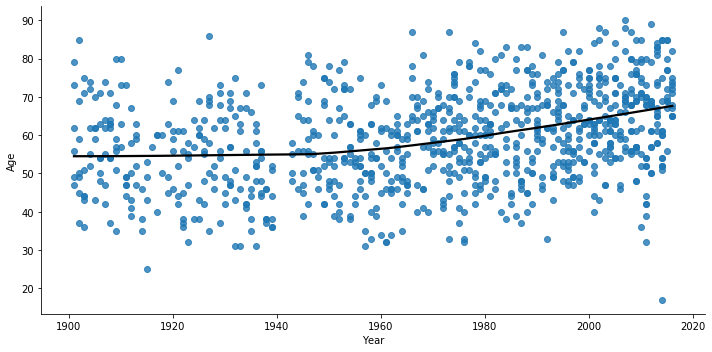


```python

```
