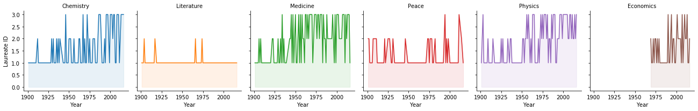
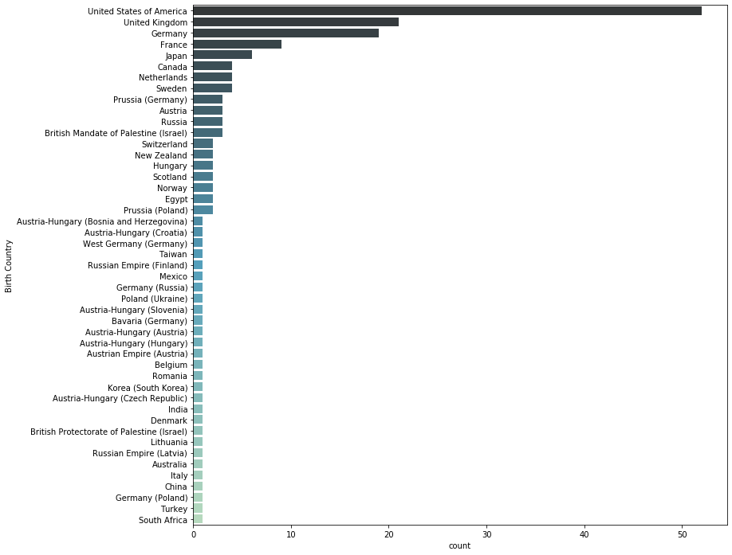
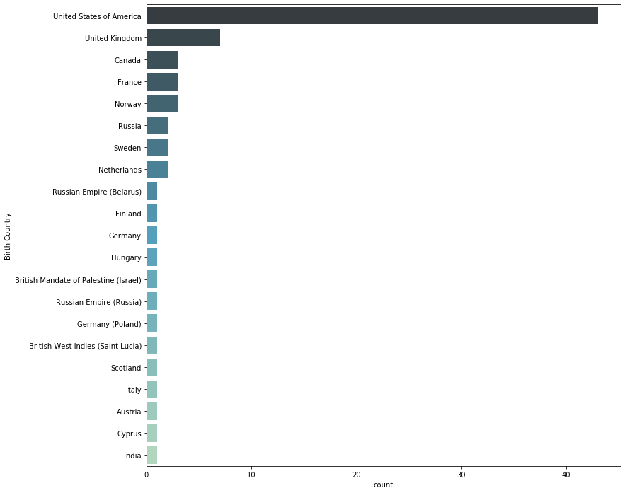
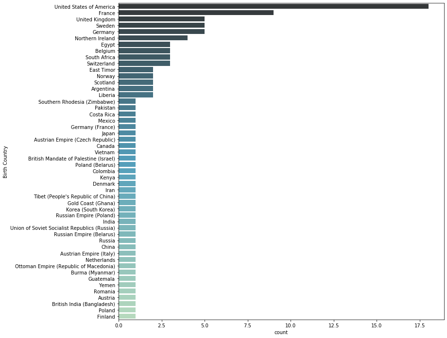
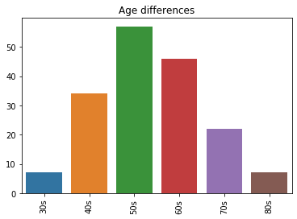
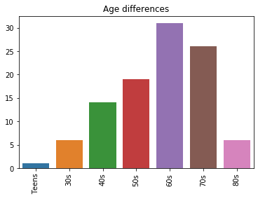
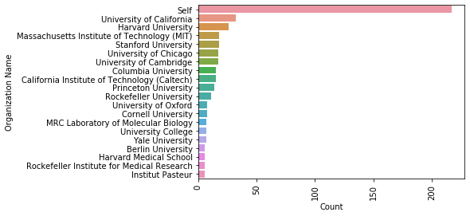

<iframe src='https://docs.google.com/presentation/d/1jOM2AgLenzFTCzW-_EEtfIyIFpKB8hE4QoYsgLXZyIs/edit?usp=sharing' width='100%' height='600px' frameborder='0'>

# Overview
###### The Nobel Prize is perhaps the world's most well known scientific award. Every year it is given to scientists and scholars in chemistry, literature, physics, medicine, economics, and peace. The first Nobel Prize was handed out in 1901, and at that time the prize was Eurocentric and male-focused, but nowadays it's not biased in any way. Surely, right? Well, we’re going to find out! The Nobel Foundation has made a dataset available of all prize winners from the start of the prize, in 1901, to 2016. Let’s load it in and check it out.

## Imports


```python
import numpy as np
import os
import pandas as pd
import matplotlib.pyplot as plt
import seaborn as sns
```

## Reading Data


```python

dff = pd.read_csv('archive.csv')
df = dff.copy()
df.sample(5)
```


<div>
<style scoped>
    .dataframe tbody tr th:only-of-type {
        vertical-align: middle;
    }

    .dataframe tbody tr th {
        vertical-align: top;
    }

    .dataframe thead th {
        text-align: right;
    }
</style>
<table border="1" class="dataframe">
  <thead>
    <tr style="text-align: right;">
      <th></th>
      <th>Year</th>
      <th>Category</th>
      <th>Prize</th>
      <th>Motivation</th>
      <th>Prize Share</th>
      <th>Laureate ID</th>
      <th>Laureate Type</th>
      <th>Full Name</th>
      <th>Birth Date</th>
      <th>Birth City</th>
      <th>Birth Country</th>
      <th>Sex</th>
      <th>Organization Name</th>
      <th>Organization City</th>
      <th>Organization Country</th>
      <th>Death Date</th>
      <th>Death City</th>
      <th>Death Country</th>
    </tr>
  </thead>
  <tbody>
    <tr>
      <th>446</th>
      <td>1973</td>
      <td>Economics</td>
      <td>The Sveriges Riksbank Prize in Economic Scienc...</td>
      <td>"for the development of the input-output metho...</td>
      <td>1/1</td>
      <td>683</td>
      <td>Individual</td>
      <td>Wassily Leontief</td>
      <td>1906-08-05</td>
      <td>St. Petersburg</td>
      <td>Russia</td>
      <td>Male</td>
      <td>Harvard University</td>
      <td>Cambridge, MA</td>
      <td>United States of America</td>
      <td>1999-02-05</td>
      <td>New York, NY</td>
      <td>United States of America</td>
    </tr>
    <tr>
      <th>278</th>
      <td>1952</td>
      <td>Peace</td>
      <td>The Nobel Peace Prize 1952</td>
      <td>NaN</td>
      <td>1/1</td>
      <td>513</td>
      <td>Individual</td>
      <td>Albert Schweitzer</td>
      <td>1875-01-14</td>
      <td>Kaysersberg</td>
      <td>Germany (France)</td>
      <td>Male</td>
      <td>NaN</td>
      <td>NaN</td>
      <td>NaN</td>
      <td>1965-09-04</td>
      <td>Lambaréné</td>
      <td>Gabon</td>
    </tr>
    <tr>
      <th>606</th>
      <td>1988</td>
      <td>Literature</td>
      <td>The Nobel Prize in Literature 1988</td>
      <td>"who, through works rich in nuance - now clear...</td>
      <td>1/1</td>
      <td>665</td>
      <td>Individual</td>
      <td>Naguib Mahfouz</td>
      <td>1911-12-11</td>
      <td>Cairo</td>
      <td>Egypt</td>
      <td>Male</td>
      <td>NaN</td>
      <td>NaN</td>
      <td>NaN</td>
      <td>2006-08-30</td>
      <td>Cairo</td>
      <td>Egypt</td>
    </tr>
    <tr>
      <th>675</th>
      <td>1995</td>
      <td>Chemistry</td>
      <td>The Nobel Prize in Chemistry 1995</td>
      <td>"for their work in atmospheric chemistry, part...</td>
      <td>1/3</td>
      <td>283</td>
      <td>Individual</td>
      <td>F. Sherwood Rowland</td>
      <td>1927-06-28</td>
      <td>Delaware, OH</td>
      <td>United States of America</td>
      <td>Male</td>
      <td>University of California</td>
      <td>Irvine, CA</td>
      <td>United States of America</td>
      <td>2012-03-10</td>
      <td>Corona del Mar, CA</td>
      <td>United States of America</td>
    </tr>
    <tr>
      <th>782</th>
      <td>2003</td>
      <td>Physics</td>
      <td>The Nobel Prize in Physics 2003</td>
      <td>"for pioneering contributions to the theory of...</td>
      <td>1/3</td>
      <td>766</td>
      <td>Individual</td>
      <td>Alexei A. Abrikosov</td>
      <td>1928-06-25</td>
      <td>Moscow</td>
      <td>Union of Soviet Socialist Republics (Russia)</td>
      <td>Male</td>
      <td>Argonne National Laboratory</td>
      <td>Argonne, IL</td>
      <td>United States of America</td>
      <td>NaN</td>
      <td>NaN</td>
      <td>NaN</td>
    </tr>
  </tbody>
</table>
</div>


## Data Exploration and Cleaning

### How many nobel prizes we have between 1901 and 2016


```python
print("Shape\n%s Rows \n%s Columns " % (df.shape[0],df.shape[1]))
```

    Shape
    969 Rows 
    18 Columns 
    

### How many male nobel prizes and how many female nobel prizes


```python
df1 = df.groupby(['Sex']).size()
print (df1)
```

    Sex
    Female     50
    Male      893
    dtype: int64
    

## Different nationalities winning the nobel prize


```python
df2 =  df.groupby("Birth Country").agg('size')

print(df2.sort_values( ascending=False))

```

    Birth Country
    United States of America                  276
    United Kingdom                             88
    Germany                                    70
    France                                     53
    Sweden                                     30
                                             ... 
    Ottoman Empire (Republic of Macedonia)      1
    Ottoman Empire (Turkey)                     1
    Pakistan                                    1
    Persia (Iran)                               1
    Java, Dutch East Indies (Indonesia)         1
    Length: 121, dtype: int64
    

### From the previous group by we can conclude that the USA dominates in the noble prizes birth country as there is 276 nobel prize holder from USA

### Calculate the proption of female lauretes per decade


```python
df3=df[df["Sex"] == "Female"].groupby("Year").size()
print(df3)
```

    Year
    1903    1
    1905    1
    1909    1
    1911    1
    1926    1
    1928    1
    1931    1
    1935    1
    1938    1
    1945    1
    1946    1
    1947    1
    1963    1
    1964    1
    1966    1
    1976    2
    1977    1
    1979    1
    1982    1
    1983    1
    1986    1
    1988    1
    1991    2
    1992    1
    1993    1
    1995    1
    1996    1
    1997    1
    2003    1
    2004    3
    2007    1
    2008    1
    2009    6
    2011    3
    2013    1
    2014    2
    2015    2
    dtype: int64
    

### Calculate the proption of female lauretes per category


```python
df4=df[df["Sex"] == "Female"].groupby("Category").size()
print(df4)
```

    Category
    Chemistry      4
    Economics      2
    Literature    14
    Medicine      12
    Peace         16
    Physics        2
    dtype: int64
    

### The first woman to win the Nobel Prize


```python
s=df[df["Sex"] == "Female"]
s2=s.sort_values(by=['Year'])
s3=s2.nsmallest(1,'Year')
s3
```


<div>
<style scoped>
    .dataframe tbody tr th:only-of-type {
        vertical-align: middle;
    }

    .dataframe tbody tr th {
        vertical-align: top;
    }

    .dataframe thead th {
        text-align: right;
    }
</style>
<table border="1" class="dataframe">
  <thead>
    <tr style="text-align: right;">
      <th></th>
      <th>Year</th>
      <th>Category</th>
      <th>Prize</th>
      <th>Motivation</th>
      <th>Prize Share</th>
      <th>Laureate ID</th>
      <th>Laureate Type</th>
      <th>Full Name</th>
      <th>Birth Date</th>
      <th>Birth City</th>
      <th>Birth Country</th>
      <th>Sex</th>
      <th>Organization Name</th>
      <th>Organization City</th>
      <th>Organization Country</th>
      <th>Death Date</th>
      <th>Death City</th>
      <th>Death Country</th>
    </tr>
  </thead>
  <tbody>
    <tr>
      <th>19</th>
      <td>1903</td>
      <td>Physics</td>
      <td>The Nobel Prize in Physics 1903</td>
      <td>"in recognition of the extraordinary services ...</td>
      <td>1/4</td>
      <td>6</td>
      <td>Individual</td>
      <td>Marie Curie, née Sklodowska</td>
      <td>1867-11-07</td>
      <td>Warsaw</td>
      <td>Russian Empire (Poland)</td>
      <td>Female</td>
      <td>NaN</td>
      <td>NaN</td>
      <td>NaN</td>
      <td>1934-07-04</td>
      <td>Sallanches</td>
      <td>France</td>
    </tr>
  </tbody>
</table>
</div>


### Who won the nobel prize more than once?


```python
df5=  df.groupby("Full Name").agg('size')
print(df5.sort_values( ascending=False))

```

    Full Name
    Jack W. Szostak                                                                      3
    Comité international de la Croix Rouge (International Committee of the Red Cross)    3
    Randy W. Schekman                                                                    2
    Robert J. Lefkowitz                                                                  2
    Roderick MacKinnon                                                                   2
                                                                                        ..
    National Dialogue Quartet                                                            1
    Naguib Mahfouz                                                                       1
    Nadine Gordimer                                                                      1
    Médecins Sans Frontières                                                             1
    A. Michael Spence                                                                    1
    Length: 904, dtype: int64
    

### To Know the number of entries and the columns


```python
df.info()
```

    <class 'pandas.core.frame.DataFrame'>
    RangeIndex: 969 entries, 0 to 968
    Data columns (total 18 columns):
    Year                    969 non-null int64
    Category                969 non-null object
    Prize                   969 non-null object
    Motivation              881 non-null object
    Prize Share             969 non-null object
    Laureate ID             969 non-null int64
    Laureate Type           969 non-null object
    Full Name               969 non-null object
    Birth Date              940 non-null object
    Birth City              941 non-null object
    Birth Country           943 non-null object
    Sex                     943 non-null object
    Organization Name       722 non-null object
    Organization City       716 non-null object
    Organization Country    716 non-null object
    Death Date              617 non-null object
    Death City              599 non-null object
    Death Country           605 non-null object
    dtypes: int64(2), object(16)
    memory usage: 136.4+ KB
    

### Checking how many null values for each column


```python
df.isnull().sum()
```


    Year                      0
    Category                  0
    Prize                     0
    Motivation               88
    Prize Share               0
    Laureate ID               0
    Laureate Type             0
    Full Name                 0
    Birth Date               29
    Birth City               28
    Birth Country            26
    Sex                      26
    Organization Name       247
    Organization City       253
    Organization Country    253
    Death Date              352
    Death City              370
    Death Country           364
    dtype: int64


### What are the values for the Laureate Type


```python
pd.unique(df["Laureate Type"])
```


    array(['Individual', 'Organization'], dtype=object)


### Number of Cells having Laureate type = Organization


```python
df[df["Laureate Type"] == "Organization"].shape
```


    (30, 18)


```python
df[df["Sex"].isnull()]
```


<div>
<style scoped>
    .dataframe tbody tr th:only-of-type {
        vertical-align: middle;
    }

    .dataframe tbody tr th {
        vertical-align: top;
    }

    .dataframe thead th {
        text-align: right;
    }
</style>
<table border="1" class="dataframe">
  <thead>
    <tr style="text-align: right;">
      <th></th>
      <th>Year</th>
      <th>Category</th>
      <th>Prize</th>
      <th>Motivation</th>
      <th>Prize Share</th>
      <th>Laureate ID</th>
      <th>Laureate Type</th>
      <th>Full Name</th>
      <th>Birth Date</th>
      <th>Birth City</th>
      <th>Birth Country</th>
      <th>Sex</th>
      <th>Organization Name</th>
      <th>Organization City</th>
      <th>Organization Country</th>
      <th>Death Date</th>
      <th>Death City</th>
      <th>Death Country</th>
    </tr>
  </thead>
  <tbody>
    <tr>
      <th>24</th>
      <td>1904</td>
      <td>Peace</td>
      <td>The Nobel Peace Prize 1904</td>
      <td>NaN</td>
      <td>1/1</td>
      <td>467</td>
      <td>Organization</td>
      <td>Institut de droit international (Institute of ...</td>
      <td>NaN</td>
      <td>NaN</td>
      <td>NaN</td>
      <td>NaN</td>
      <td>NaN</td>
      <td>NaN</td>
      <td>NaN</td>
      <td>NaN</td>
      <td>NaN</td>
      <td>NaN</td>
    </tr>
    <tr>
      <th>61</th>
      <td>1910</td>
      <td>Peace</td>
      <td>The Nobel Peace Prize 1910</td>
      <td>NaN</td>
      <td>1/1</td>
      <td>477</td>
      <td>Organization</td>
      <td>Bureau international permanent de la Paix (Per...</td>
      <td>NaN</td>
      <td>NaN</td>
      <td>NaN</td>
      <td>NaN</td>
      <td>NaN</td>
      <td>NaN</td>
      <td>NaN</td>
      <td>NaN</td>
      <td>NaN</td>
      <td>NaN</td>
    </tr>
    <tr>
      <th>90</th>
      <td>1917</td>
      <td>Peace</td>
      <td>The Nobel Peace Prize 1917</td>
      <td>NaN</td>
      <td>1/1</td>
      <td>482</td>
      <td>Organization</td>
      <td>Comité international de la Croix Rouge (Intern...</td>
      <td>NaN</td>
      <td>NaN</td>
      <td>NaN</td>
      <td>NaN</td>
      <td>NaN</td>
      <td>NaN</td>
      <td>NaN</td>
      <td>NaN</td>
      <td>NaN</td>
      <td>NaN</td>
    </tr>
    <tr>
      <th>206</th>
      <td>1938</td>
      <td>Peace</td>
      <td>The Nobel Peace Prize 1938</td>
      <td>NaN</td>
      <td>1/1</td>
      <td>503</td>
      <td>Organization</td>
      <td>Office international Nansen pour les Réfugiés ...</td>
      <td>NaN</td>
      <td>NaN</td>
      <td>NaN</td>
      <td>NaN</td>
      <td>NaN</td>
      <td>NaN</td>
      <td>NaN</td>
      <td>NaN</td>
      <td>NaN</td>
      <td>NaN</td>
    </tr>
    <tr>
      <th>222</th>
      <td>1944</td>
      <td>Peace</td>
      <td>The Nobel Peace Prize 1944</td>
      <td>NaN</td>
      <td>1/1</td>
      <td>482</td>
      <td>Organization</td>
      <td>Comité international de la Croix Rouge (Intern...</td>
      <td>NaN</td>
      <td>NaN</td>
      <td>NaN</td>
      <td>NaN</td>
      <td>NaN</td>
      <td>NaN</td>
      <td>NaN</td>
      <td>NaN</td>
      <td>NaN</td>
      <td>NaN</td>
    </tr>
    <tr>
      <th>244</th>
      <td>1947</td>
      <td>Peace</td>
      <td>The Nobel Peace Prize 1947</td>
      <td>NaN</td>
      <td>1/2</td>
      <td>508</td>
      <td>Organization</td>
      <td>Friends Service Council (The Quakers)</td>
      <td>NaN</td>
      <td>NaN</td>
      <td>NaN</td>
      <td>NaN</td>
      <td>NaN</td>
      <td>NaN</td>
      <td>NaN</td>
      <td>NaN</td>
      <td>NaN</td>
      <td>NaN</td>
    </tr>
    <tr>
      <th>245</th>
      <td>1947</td>
      <td>Peace</td>
      <td>The Nobel Peace Prize 1947</td>
      <td>NaN</td>
      <td>1/2</td>
      <td>509</td>
      <td>Organization</td>
      <td>American Friends Service Committee (The Quakers)</td>
      <td>NaN</td>
      <td>NaN</td>
      <td>NaN</td>
      <td>NaN</td>
      <td>NaN</td>
      <td>NaN</td>
      <td>NaN</td>
      <td>NaN</td>
      <td>NaN</td>
      <td>NaN</td>
    </tr>
    <tr>
      <th>295</th>
      <td>1954</td>
      <td>Peace</td>
      <td>The Nobel Peace Prize 1954</td>
      <td>NaN</td>
      <td>1/1</td>
      <td>515</td>
      <td>Organization</td>
      <td>Office of the United Nations High Commissioner...</td>
      <td>NaN</td>
      <td>NaN</td>
      <td>NaN</td>
      <td>NaN</td>
      <td>NaN</td>
      <td>NaN</td>
      <td>NaN</td>
      <td>NaN</td>
      <td>NaN</td>
      <td>NaN</td>
    </tr>
    <tr>
      <th>365</th>
      <td>1963</td>
      <td>Peace</td>
      <td>The Nobel Peace Prize 1963</td>
      <td>NaN</td>
      <td>1/2</td>
      <td>482</td>
      <td>Organization</td>
      <td>Comité international de la Croix Rouge (Intern...</td>
      <td>NaN</td>
      <td>NaN</td>
      <td>NaN</td>
      <td>NaN</td>
      <td>NaN</td>
      <td>NaN</td>
      <td>NaN</td>
      <td>NaN</td>
      <td>NaN</td>
      <td>NaN</td>
    </tr>
    <tr>
      <th>366</th>
      <td>1963</td>
      <td>Peace</td>
      <td>The Nobel Peace Prize 1963</td>
      <td>NaN</td>
      <td>1/2</td>
      <td>523</td>
      <td>Organization</td>
      <td>Ligue des Sociétés de la Croix-Rouge (League o...</td>
      <td>NaN</td>
      <td>NaN</td>
      <td>NaN</td>
      <td>NaN</td>
      <td>NaN</td>
      <td>NaN</td>
      <td>NaN</td>
      <td>NaN</td>
      <td>NaN</td>
      <td>NaN</td>
    </tr>
    <tr>
      <th>383</th>
      <td>1965</td>
      <td>Peace</td>
      <td>The Nobel Peace Prize 1965</td>
      <td>NaN</td>
      <td>1/1</td>
      <td>525</td>
      <td>Organization</td>
      <td>United Nations Children's Fund (UNICEF)</td>
      <td>NaN</td>
      <td>NaN</td>
      <td>NaN</td>
      <td>NaN</td>
      <td>NaN</td>
      <td>NaN</td>
      <td>NaN</td>
      <td>NaN</td>
      <td>NaN</td>
      <td>NaN</td>
    </tr>
    <tr>
      <th>416</th>
      <td>1969</td>
      <td>Peace</td>
      <td>The Nobel Peace Prize 1969</td>
      <td>NaN</td>
      <td>1/1</td>
      <td>527</td>
      <td>Organization</td>
      <td>International Labour Organization (I.L.O.)</td>
      <td>NaN</td>
      <td>NaN</td>
      <td>NaN</td>
      <td>NaN</td>
      <td>NaN</td>
      <td>NaN</td>
      <td>NaN</td>
      <td>NaN</td>
      <td>NaN</td>
      <td>NaN</td>
    </tr>
    <tr>
      <th>498</th>
      <td>1977</td>
      <td>Peace</td>
      <td>The Nobel Peace Prize 1977</td>
      <td>NaN</td>
      <td>1/1</td>
      <td>537</td>
      <td>Organization</td>
      <td>Amnesty International</td>
      <td>NaN</td>
      <td>NaN</td>
      <td>NaN</td>
      <td>NaN</td>
      <td>NaN</td>
      <td>NaN</td>
      <td>NaN</td>
      <td>NaN</td>
      <td>NaN</td>
      <td>NaN</td>
    </tr>
    <tr>
      <th>543</th>
      <td>1981</td>
      <td>Peace</td>
      <td>The Nobel Peace Prize 1981</td>
      <td>NaN</td>
      <td>1/1</td>
      <td>515</td>
      <td>Organization</td>
      <td>Office of the United Nations High Commissioner...</td>
      <td>NaN</td>
      <td>NaN</td>
      <td>NaN</td>
      <td>NaN</td>
      <td>NaN</td>
      <td>NaN</td>
      <td>NaN</td>
      <td>NaN</td>
      <td>NaN</td>
      <td>NaN</td>
    </tr>
    <tr>
      <th>578</th>
      <td>1985</td>
      <td>Peace</td>
      <td>The Nobel Peace Prize 1985</td>
      <td>NaN</td>
      <td>1/1</td>
      <td>547</td>
      <td>Organization</td>
      <td>International Physicians for the Prevention of...</td>
      <td>NaN</td>
      <td>NaN</td>
      <td>NaN</td>
      <td>NaN</td>
      <td>NaN</td>
      <td>NaN</td>
      <td>NaN</td>
      <td>NaN</td>
      <td>NaN</td>
      <td>NaN</td>
    </tr>
    <tr>
      <th>610</th>
      <td>1988</td>
      <td>Peace</td>
      <td>The Nobel Peace Prize 1988</td>
      <td>NaN</td>
      <td>1/1</td>
      <td>550</td>
      <td>Organization</td>
      <td>United Nations Peacekeeping Forces</td>
      <td>NaN</td>
      <td>NaN</td>
      <td>NaN</td>
      <td>NaN</td>
      <td>NaN</td>
      <td>NaN</td>
      <td>NaN</td>
      <td>NaN</td>
      <td>NaN</td>
      <td>NaN</td>
    </tr>
    <tr>
      <th>682</th>
      <td>1995</td>
      <td>Peace</td>
      <td>The Nobel Peace Prize 1995</td>
      <td>"for their efforts to diminish the part played...</td>
      <td>1/2</td>
      <td>561</td>
      <td>Organization</td>
      <td>Pugwash Conferences on Science and World Affairs</td>
      <td>NaN</td>
      <td>NaN</td>
      <td>NaN</td>
      <td>NaN</td>
      <td>NaN</td>
      <td>NaN</td>
      <td>NaN</td>
      <td>NaN</td>
      <td>NaN</td>
      <td>NaN</td>
    </tr>
    <tr>
      <th>705</th>
      <td>1997</td>
      <td>Peace</td>
      <td>The Nobel Peace Prize 1997</td>
      <td>"for their work for the banning and clearing o...</td>
      <td>1/2</td>
      <td>564</td>
      <td>Organization</td>
      <td>International Campaign to Ban Landmines (ICBL)</td>
      <td>NaN</td>
      <td>NaN</td>
      <td>NaN</td>
      <td>NaN</td>
      <td>NaN</td>
      <td>NaN</td>
      <td>NaN</td>
      <td>NaN</td>
      <td>NaN</td>
      <td>NaN</td>
    </tr>
    <tr>
      <th>728</th>
      <td>1999</td>
      <td>Peace</td>
      <td>The Nobel Peace Prize 1999</td>
      <td>"in recognition of the organization's pioneeri...</td>
      <td>1/1</td>
      <td>568</td>
      <td>Organization</td>
      <td>Médecins Sans Frontières</td>
      <td>NaN</td>
      <td>NaN</td>
      <td>NaN</td>
      <td>NaN</td>
      <td>NaN</td>
      <td>NaN</td>
      <td>NaN</td>
      <td>NaN</td>
      <td>NaN</td>
      <td>NaN</td>
    </tr>
    <tr>
      <th>754</th>
      <td>2001</td>
      <td>Peace</td>
      <td>The Nobel Peace Prize 2001</td>
      <td>"for their work for a better organized and mor...</td>
      <td>1/2</td>
      <td>748</td>
      <td>Organization</td>
      <td>United Nations (U.N.)</td>
      <td>NaN</td>
      <td>NaN</td>
      <td>NaN</td>
      <td>NaN</td>
      <td>NaN</td>
      <td>NaN</td>
      <td>NaN</td>
      <td>NaN</td>
      <td>NaN</td>
      <td>NaN</td>
    </tr>
    <tr>
      <th>808</th>
      <td>2005</td>
      <td>Peace</td>
      <td>The Nobel Peace Prize 2005</td>
      <td>"for their efforts to prevent nuclear energy f...</td>
      <td>1/2</td>
      <td>797</td>
      <td>Organization</td>
      <td>International Atomic Energy Agency (IAEA)</td>
      <td>NaN</td>
      <td>NaN</td>
      <td>NaN</td>
      <td>NaN</td>
      <td>NaN</td>
      <td>NaN</td>
      <td>NaN</td>
      <td>NaN</td>
      <td>NaN</td>
      <td>NaN</td>
    </tr>
    <tr>
      <th>821</th>
      <td>2006</td>
      <td>Peace</td>
      <td>The Nobel Peace Prize 2006</td>
      <td>"for their efforts to create economic and soci...</td>
      <td>1/2</td>
      <td>810</td>
      <td>Organization</td>
      <td>Grameen Bank</td>
      <td>NaN</td>
      <td>NaN</td>
      <td>NaN</td>
      <td>NaN</td>
      <td>NaN</td>
      <td>NaN</td>
      <td>NaN</td>
      <td>NaN</td>
      <td>NaN</td>
      <td>NaN</td>
    </tr>
    <tr>
      <th>833</th>
      <td>2007</td>
      <td>Peace</td>
      <td>The Nobel Peace Prize 2007</td>
      <td>"for their efforts to build up and disseminate...</td>
      <td>1/2</td>
      <td>818</td>
      <td>Organization</td>
      <td>Intergovernmental Panel on Climate Change (IPCC)</td>
      <td>NaN</td>
      <td>NaN</td>
      <td>NaN</td>
      <td>NaN</td>
      <td>NaN</td>
      <td>NaN</td>
      <td>NaN</td>
      <td>NaN</td>
      <td>NaN</td>
      <td>NaN</td>
    </tr>
    <tr>
      <th>909</th>
      <td>2012</td>
      <td>Peace</td>
      <td>The Nobel Peace Prize 2012</td>
      <td>"for over six decades contributed to the advan...</td>
      <td>1/1</td>
      <td>881</td>
      <td>Organization</td>
      <td>European Union (EU)</td>
      <td>NaN</td>
      <td>NaN</td>
      <td>NaN</td>
      <td>NaN</td>
      <td>NaN</td>
      <td>NaN</td>
      <td>NaN</td>
      <td>NaN</td>
      <td>NaN</td>
      <td>NaN</td>
    </tr>
    <tr>
      <th>927</th>
      <td>2013</td>
      <td>Peace</td>
      <td>The Nobel Peace Prize 2013</td>
      <td>"for its extensive efforts to eliminate chemic...</td>
      <td>1/1</td>
      <td>893</td>
      <td>Organization</td>
      <td>Organisation for the Prohibition of Chemical W...</td>
      <td>NaN</td>
      <td>NaN</td>
      <td>NaN</td>
      <td>NaN</td>
      <td>NaN</td>
      <td>NaN</td>
      <td>NaN</td>
      <td>NaN</td>
      <td>NaN</td>
      <td>NaN</td>
    </tr>
    <tr>
      <th>955</th>
      <td>2015</td>
      <td>Peace</td>
      <td>The Nobel Peace Prize 2015</td>
      <td>"for its decisive contribution to the building...</td>
      <td>1/1</td>
      <td>925</td>
      <td>Organization</td>
      <td>National Dialogue Quartet</td>
      <td>NaN</td>
      <td>NaN</td>
      <td>NaN</td>
      <td>NaN</td>
      <td>NaN</td>
      <td>NaN</td>
      <td>NaN</td>
      <td>NaN</td>
      <td>NaN</td>
      <td>NaN</td>
    </tr>
  </tbody>
</table>
</div>


```python
#df[df["Prize Share"] == "1/2"]
df[df["Full Name"] == "Paul Ehrlich"]
```


<div>
<style scoped>
    .dataframe tbody tr th:only-of-type {
        vertical-align: middle;
    }

    .dataframe tbody tr th {
        vertical-align: top;
    }

    .dataframe thead th {
        text-align: right;
    }
</style>
<table border="1" class="dataframe">
  <thead>
    <tr style="text-align: right;">
      <th></th>
      <th>Year</th>
      <th>Category</th>
      <th>Prize</th>
      <th>Motivation</th>
      <th>Prize Share</th>
      <th>Laureate ID</th>
      <th>Laureate Type</th>
      <th>Full Name</th>
      <th>Birth Date</th>
      <th>Birth City</th>
      <th>Birth Country</th>
      <th>Sex</th>
      <th>Organization Name</th>
      <th>Organization City</th>
      <th>Organization Country</th>
      <th>Death Date</th>
      <th>Death City</th>
      <th>Death Country</th>
    </tr>
  </thead>
  <tbody>
    <tr>
      <th>46</th>
      <td>1908</td>
      <td>Medicine</td>
      <td>The Nobel Prize in Physiology or Medicine 1908</td>
      <td>"in recognition of their work on immunity"</td>
      <td>1/2</td>
      <td>302</td>
      <td>Individual</td>
      <td>Paul Ehrlich</td>
      <td>1854-03-14</td>
      <td>Strehlen (Strzelin)</td>
      <td>Prussia (Poland)</td>
      <td>Male</td>
      <td>Goettingen University</td>
      <td>Göttingen</td>
      <td>Germany</td>
      <td>1915-08-20</td>
      <td>Bad Homburg vor der Höhe</td>
      <td>Germany</td>
    </tr>
    <tr>
      <th>47</th>
      <td>1908</td>
      <td>Medicine</td>
      <td>The Nobel Prize in Physiology or Medicine 1908</td>
      <td>"in recognition of their work on immunity"</td>
      <td>1/2</td>
      <td>302</td>
      <td>Individual</td>
      <td>Paul Ehrlich</td>
      <td>1854-03-14</td>
      <td>Strehlen (Strzelin)</td>
      <td>Prussia (Poland)</td>
      <td>Male</td>
      <td>Königliches Institut für experimentelle Therap...</td>
      <td>Frankfurt-on-the-Main</td>
      <td>Germany</td>
      <td>1915-08-20</td>
      <td>Bad Homburg vor der Höhe</td>
      <td>Germany</td>
    </tr>
  </tbody>
</table>
</div>


```python

#df[df["Organization Name"].isnull()]
l = df[df["Organization Name"].isnull()]
k = l[l["Laureate Type"] == "Organization"]
print("Shape\n%s Rows \n%s Columns " % (k.shape[0],k.shape[1]))

```

    Shape
    30 Rows 
    18 Columns 
    

## Cleaning 

### Removing Duplicates 


```python
print(len(df))
df.drop_duplicates(subset = "Laureate ID",keep = "first", inplace = True)
print(len(df))
df[df["Full Name"] == "Paul Ehrlich"]
```

    969
    904
    


<div>
<style scoped>
    .dataframe tbody tr th:only-of-type {
        vertical-align: middle;
    }

    .dataframe tbody tr th {
        vertical-align: top;
    }

    .dataframe thead th {
        text-align: right;
    }
</style>
<table border="1" class="dataframe">
  <thead>
    <tr style="text-align: right;">
      <th></th>
      <th>Year</th>
      <th>Category</th>
      <th>Prize</th>
      <th>Motivation</th>
      <th>Prize Share</th>
      <th>Laureate ID</th>
      <th>Laureate Type</th>
      <th>Full Name</th>
      <th>Birth Date</th>
      <th>Birth City</th>
      <th>Birth Country</th>
      <th>Sex</th>
      <th>Organization Name</th>
      <th>Organization City</th>
      <th>Organization Country</th>
      <th>Death Date</th>
      <th>Death City</th>
      <th>Death Country</th>
    </tr>
  </thead>
  <tbody>
    <tr>
      <th>46</th>
      <td>1908</td>
      <td>Medicine</td>
      <td>The Nobel Prize in Physiology or Medicine 1908</td>
      <td>"in recognition of their work on immunity"</td>
      <td>1/2</td>
      <td>302</td>
      <td>Individual</td>
      <td>Paul Ehrlich</td>
      <td>1854-03-14</td>
      <td>Strehlen (Strzelin)</td>
      <td>Prussia (Poland)</td>
      <td>Male</td>
      <td>Goettingen University</td>
      <td>Göttingen</td>
      <td>Germany</td>
      <td>1915-08-20</td>
      <td>Bad Homburg vor der Höhe</td>
      <td>Germany</td>
    </tr>
  </tbody>
</table>
</div>


### Deleting Motivation values


```python
del df['Motivation']
df.sample(5)
```


<div>
<style scoped>
    .dataframe tbody tr th:only-of-type {
        vertical-align: middle;
    }

    .dataframe tbody tr th {
        vertical-align: top;
    }

    .dataframe thead th {
        text-align: right;
    }
</style>
<table border="1" class="dataframe">
  <thead>
    <tr style="text-align: right;">
      <th></th>
      <th>Year</th>
      <th>Category</th>
      <th>Prize</th>
      <th>Prize Share</th>
      <th>Laureate ID</th>
      <th>Laureate Type</th>
      <th>Full Name</th>
      <th>Birth Date</th>
      <th>Birth City</th>
      <th>Birth Country</th>
      <th>Sex</th>
      <th>Organization Name</th>
      <th>Organization City</th>
      <th>Organization Country</th>
      <th>Death Date</th>
      <th>Death City</th>
      <th>Death Country</th>
    </tr>
  </thead>
  <tbody>
    <tr>
      <th>572</th>
      <td>1985</td>
      <td>Chemistry</td>
      <td>The Nobel Prize in Chemistry 1985</td>
      <td>1/2</td>
      <td>262</td>
      <td>Individual</td>
      <td>Herbert A. Hauptman</td>
      <td>1917-02-14</td>
      <td>New York, NY</td>
      <td>United States of America</td>
      <td>Male</td>
      <td>The Medical Foundation of Buffalo</td>
      <td>Buffalo, NY</td>
      <td>United States of America</td>
      <td>2011-10-23</td>
      <td>Buffalo, NY</td>
      <td>United States of America</td>
    </tr>
    <tr>
      <th>432</th>
      <td>1971</td>
      <td>Physics</td>
      <td>The Nobel Prize in Physics 1971</td>
      <td>1/1</td>
      <td>93</td>
      <td>Individual</td>
      <td>Dennis Gabor</td>
      <td>1900-06-05</td>
      <td>Budapest</td>
      <td>Hungary</td>
      <td>Male</td>
      <td>Imperial College</td>
      <td>London</td>
      <td>United Kingdom</td>
      <td>1979-02-08</td>
      <td>London</td>
      <td>United Kingdom</td>
    </tr>
    <tr>
      <th>238</th>
      <td>1946</td>
      <td>Physics</td>
      <td>The Nobel Prize in Physics 1946</td>
      <td>1/1</td>
      <td>51</td>
      <td>Individual</td>
      <td>Percy Williams Bridgman</td>
      <td>1882-04-21</td>
      <td>Cambridge, MA</td>
      <td>United States of America</td>
      <td>Male</td>
      <td>Harvard University</td>
      <td>Cambridge, MA</td>
      <td>United States of America</td>
      <td>1961-08-20</td>
      <td>Randolph, NH</td>
      <td>United States of America</td>
    </tr>
    <tr>
      <th>545</th>
      <td>1981</td>
      <td>Physics</td>
      <td>The Nobel Prize in Physics 1981</td>
      <td>1/4</td>
      <td>119</td>
      <td>Individual</td>
      <td>Arthur Leonard Schawlow</td>
      <td>1921-05-05</td>
      <td>Mount Verno, NY</td>
      <td>United States of America</td>
      <td>Male</td>
      <td>Stanford University</td>
      <td>Stanford, CA</td>
      <td>United States of America</td>
      <td>1999-04-28</td>
      <td>Palo Alto, CA</td>
      <td>United States of America</td>
    </tr>
    <tr>
      <th>126</th>
      <td>1925</td>
      <td>Physics</td>
      <td>The Nobel Prize in Physics 1925</td>
      <td>1/2</td>
      <td>30</td>
      <td>Individual</td>
      <td>James Franck</td>
      <td>1882-08-26</td>
      <td>Hamburg</td>
      <td>Germany</td>
      <td>Male</td>
      <td>Goettingen University</td>
      <td>Göttingen</td>
      <td>Germany</td>
      <td>1964-05-21</td>
      <td>Göttingen</td>
      <td>West Germany (Germany)</td>
    </tr>
  </tbody>
</table>
</div>


### Fixing Incorrect Data of Laureate Type ( Org -> Individual )


```python

#df.loc[df["Sex"].isnull(), "Sex"] = "Org"

mask = (df["Laureate Type"] == "Organization") & (df["Birth Date"].notnull())
df["Laureate Type"][mask] = "Individual"

l = df[df["Laureate Type"] == "Organization"]
k = l[l["Birth Date"].notnull()]
k
```

    C:\Users\Administrator\Anaconda3\lib\site-packages\ipykernel_launcher.py:4: SettingWithCopyWarning: 
    A value is trying to be set on a copy of a slice from a DataFrame
    
    See the caveats in the documentation: http://pandas.pydata.org/pandas-docs/stable/user_guide/indexing.html#returning-a-view-versus-a-copy
      after removing the cwd from sys.path.
    


<div>
<style scoped>
    .dataframe tbody tr th:only-of-type {
        vertical-align: middle;
    }

    .dataframe tbody tr th {
        vertical-align: top;
    }

    .dataframe thead th {
        text-align: right;
    }
</style>
<table border="1" class="dataframe">
  <thead>
    <tr style="text-align: right;">
      <th></th>
      <th>Year</th>
      <th>Category</th>
      <th>Prize</th>
      <th>Prize Share</th>
      <th>Laureate ID</th>
      <th>Laureate Type</th>
      <th>Full Name</th>
      <th>Birth Date</th>
      <th>Birth City</th>
      <th>Birth Country</th>
      <th>Sex</th>
      <th>Organization Name</th>
      <th>Organization City</th>
      <th>Organization Country</th>
      <th>Death Date</th>
      <th>Death City</th>
      <th>Death Country</th>
    </tr>
  </thead>
  <tbody>
  </tbody>
</table>
</div>


```python
k = df[df["Laureate Type"] == "Organization"]
print("Shape\n%s Rows \n%s Columns " % (k.shape[0],k.shape[1]))
k
#df.isnull().sum()
```

    Shape
    23 Rows 
    17 Columns 
    


<div>
<style scoped>
    .dataframe tbody tr th:only-of-type {
        vertical-align: middle;
    }

    .dataframe tbody tr th {
        vertical-align: top;
    }

    .dataframe thead th {
        text-align: right;
    }
</style>
<table border="1" class="dataframe">
  <thead>
    <tr style="text-align: right;">
      <th></th>
      <th>Year</th>
      <th>Category</th>
      <th>Prize</th>
      <th>Prize Share</th>
      <th>Laureate ID</th>
      <th>Laureate Type</th>
      <th>Full Name</th>
      <th>Birth Date</th>
      <th>Birth City</th>
      <th>Birth Country</th>
      <th>Sex</th>
      <th>Organization Name</th>
      <th>Organization City</th>
      <th>Organization Country</th>
      <th>Death Date</th>
      <th>Death City</th>
      <th>Death Country</th>
    </tr>
  </thead>
  <tbody>
    <tr>
      <th>24</th>
      <td>1904</td>
      <td>Peace</td>
      <td>The Nobel Peace Prize 1904</td>
      <td>1/1</td>
      <td>467</td>
      <td>Organization</td>
      <td>Institut de droit international (Institute of ...</td>
      <td>NaN</td>
      <td>NaN</td>
      <td>NaN</td>
      <td>NaN</td>
      <td>NaN</td>
      <td>NaN</td>
      <td>NaN</td>
      <td>NaN</td>
      <td>NaN</td>
      <td>NaN</td>
    </tr>
    <tr>
      <th>61</th>
      <td>1910</td>
      <td>Peace</td>
      <td>The Nobel Peace Prize 1910</td>
      <td>1/1</td>
      <td>477</td>
      <td>Organization</td>
      <td>Bureau international permanent de la Paix (Per...</td>
      <td>NaN</td>
      <td>NaN</td>
      <td>NaN</td>
      <td>NaN</td>
      <td>NaN</td>
      <td>NaN</td>
      <td>NaN</td>
      <td>NaN</td>
      <td>NaN</td>
      <td>NaN</td>
    </tr>
    <tr>
      <th>90</th>
      <td>1917</td>
      <td>Peace</td>
      <td>The Nobel Peace Prize 1917</td>
      <td>1/1</td>
      <td>482</td>
      <td>Organization</td>
      <td>Comité international de la Croix Rouge (Intern...</td>
      <td>NaN</td>
      <td>NaN</td>
      <td>NaN</td>
      <td>NaN</td>
      <td>NaN</td>
      <td>NaN</td>
      <td>NaN</td>
      <td>NaN</td>
      <td>NaN</td>
      <td>NaN</td>
    </tr>
    <tr>
      <th>206</th>
      <td>1938</td>
      <td>Peace</td>
      <td>The Nobel Peace Prize 1938</td>
      <td>1/1</td>
      <td>503</td>
      <td>Organization</td>
      <td>Office international Nansen pour les Réfugiés ...</td>
      <td>NaN</td>
      <td>NaN</td>
      <td>NaN</td>
      <td>NaN</td>
      <td>NaN</td>
      <td>NaN</td>
      <td>NaN</td>
      <td>NaN</td>
      <td>NaN</td>
      <td>NaN</td>
    </tr>
    <tr>
      <th>244</th>
      <td>1947</td>
      <td>Peace</td>
      <td>The Nobel Peace Prize 1947</td>
      <td>1/2</td>
      <td>508</td>
      <td>Organization</td>
      <td>Friends Service Council (The Quakers)</td>
      <td>NaN</td>
      <td>NaN</td>
      <td>NaN</td>
      <td>NaN</td>
      <td>NaN</td>
      <td>NaN</td>
      <td>NaN</td>
      <td>NaN</td>
      <td>NaN</td>
      <td>NaN</td>
    </tr>
    <tr>
      <th>245</th>
      <td>1947</td>
      <td>Peace</td>
      <td>The Nobel Peace Prize 1947</td>
      <td>1/2</td>
      <td>509</td>
      <td>Organization</td>
      <td>American Friends Service Committee (The Quakers)</td>
      <td>NaN</td>
      <td>NaN</td>
      <td>NaN</td>
      <td>NaN</td>
      <td>NaN</td>
      <td>NaN</td>
      <td>NaN</td>
      <td>NaN</td>
      <td>NaN</td>
      <td>NaN</td>
    </tr>
    <tr>
      <th>295</th>
      <td>1954</td>
      <td>Peace</td>
      <td>The Nobel Peace Prize 1954</td>
      <td>1/1</td>
      <td>515</td>
      <td>Organization</td>
      <td>Office of the United Nations High Commissioner...</td>
      <td>NaN</td>
      <td>NaN</td>
      <td>NaN</td>
      <td>NaN</td>
      <td>NaN</td>
      <td>NaN</td>
      <td>NaN</td>
      <td>NaN</td>
      <td>NaN</td>
      <td>NaN</td>
    </tr>
    <tr>
      <th>366</th>
      <td>1963</td>
      <td>Peace</td>
      <td>The Nobel Peace Prize 1963</td>
      <td>1/2</td>
      <td>523</td>
      <td>Organization</td>
      <td>Ligue des Sociétés de la Croix-Rouge (League o...</td>
      <td>NaN</td>
      <td>NaN</td>
      <td>NaN</td>
      <td>NaN</td>
      <td>NaN</td>
      <td>NaN</td>
      <td>NaN</td>
      <td>NaN</td>
      <td>NaN</td>
      <td>NaN</td>
    </tr>
    <tr>
      <th>383</th>
      <td>1965</td>
      <td>Peace</td>
      <td>The Nobel Peace Prize 1965</td>
      <td>1/1</td>
      <td>525</td>
      <td>Organization</td>
      <td>United Nations Children's Fund (UNICEF)</td>
      <td>NaN</td>
      <td>NaN</td>
      <td>NaN</td>
      <td>NaN</td>
      <td>NaN</td>
      <td>NaN</td>
      <td>NaN</td>
      <td>NaN</td>
      <td>NaN</td>
      <td>NaN</td>
    </tr>
    <tr>
      <th>416</th>
      <td>1969</td>
      <td>Peace</td>
      <td>The Nobel Peace Prize 1969</td>
      <td>1/1</td>
      <td>527</td>
      <td>Organization</td>
      <td>International Labour Organization (I.L.O.)</td>
      <td>NaN</td>
      <td>NaN</td>
      <td>NaN</td>
      <td>NaN</td>
      <td>NaN</td>
      <td>NaN</td>
      <td>NaN</td>
      <td>NaN</td>
      <td>NaN</td>
      <td>NaN</td>
    </tr>
    <tr>
      <th>498</th>
      <td>1977</td>
      <td>Peace</td>
      <td>The Nobel Peace Prize 1977</td>
      <td>1/1</td>
      <td>537</td>
      <td>Organization</td>
      <td>Amnesty International</td>
      <td>NaN</td>
      <td>NaN</td>
      <td>NaN</td>
      <td>NaN</td>
      <td>NaN</td>
      <td>NaN</td>
      <td>NaN</td>
      <td>NaN</td>
      <td>NaN</td>
      <td>NaN</td>
    </tr>
    <tr>
      <th>578</th>
      <td>1985</td>
      <td>Peace</td>
      <td>The Nobel Peace Prize 1985</td>
      <td>1/1</td>
      <td>547</td>
      <td>Organization</td>
      <td>International Physicians for the Prevention of...</td>
      <td>NaN</td>
      <td>NaN</td>
      <td>NaN</td>
      <td>NaN</td>
      <td>NaN</td>
      <td>NaN</td>
      <td>NaN</td>
      <td>NaN</td>
      <td>NaN</td>
      <td>NaN</td>
    </tr>
    <tr>
      <th>610</th>
      <td>1988</td>
      <td>Peace</td>
      <td>The Nobel Peace Prize 1988</td>
      <td>1/1</td>
      <td>550</td>
      <td>Organization</td>
      <td>United Nations Peacekeeping Forces</td>
      <td>NaN</td>
      <td>NaN</td>
      <td>NaN</td>
      <td>NaN</td>
      <td>NaN</td>
      <td>NaN</td>
      <td>NaN</td>
      <td>NaN</td>
      <td>NaN</td>
      <td>NaN</td>
    </tr>
    <tr>
      <th>682</th>
      <td>1995</td>
      <td>Peace</td>
      <td>The Nobel Peace Prize 1995</td>
      <td>1/2</td>
      <td>561</td>
      <td>Organization</td>
      <td>Pugwash Conferences on Science and World Affairs</td>
      <td>NaN</td>
      <td>NaN</td>
      <td>NaN</td>
      <td>NaN</td>
      <td>NaN</td>
      <td>NaN</td>
      <td>NaN</td>
      <td>NaN</td>
      <td>NaN</td>
      <td>NaN</td>
    </tr>
    <tr>
      <th>705</th>
      <td>1997</td>
      <td>Peace</td>
      <td>The Nobel Peace Prize 1997</td>
      <td>1/2</td>
      <td>564</td>
      <td>Organization</td>
      <td>International Campaign to Ban Landmines (ICBL)</td>
      <td>NaN</td>
      <td>NaN</td>
      <td>NaN</td>
      <td>NaN</td>
      <td>NaN</td>
      <td>NaN</td>
      <td>NaN</td>
      <td>NaN</td>
      <td>NaN</td>
      <td>NaN</td>
    </tr>
    <tr>
      <th>728</th>
      <td>1999</td>
      <td>Peace</td>
      <td>The Nobel Peace Prize 1999</td>
      <td>1/1</td>
      <td>568</td>
      <td>Organization</td>
      <td>Médecins Sans Frontières</td>
      <td>NaN</td>
      <td>NaN</td>
      <td>NaN</td>
      <td>NaN</td>
      <td>NaN</td>
      <td>NaN</td>
      <td>NaN</td>
      <td>NaN</td>
      <td>NaN</td>
      <td>NaN</td>
    </tr>
    <tr>
      <th>754</th>
      <td>2001</td>
      <td>Peace</td>
      <td>The Nobel Peace Prize 2001</td>
      <td>1/2</td>
      <td>748</td>
      <td>Organization</td>
      <td>United Nations (U.N.)</td>
      <td>NaN</td>
      <td>NaN</td>
      <td>NaN</td>
      <td>NaN</td>
      <td>NaN</td>
      <td>NaN</td>
      <td>NaN</td>
      <td>NaN</td>
      <td>NaN</td>
      <td>NaN</td>
    </tr>
    <tr>
      <th>808</th>
      <td>2005</td>
      <td>Peace</td>
      <td>The Nobel Peace Prize 2005</td>
      <td>1/2</td>
      <td>797</td>
      <td>Organization</td>
      <td>International Atomic Energy Agency (IAEA)</td>
      <td>NaN</td>
      <td>NaN</td>
      <td>NaN</td>
      <td>NaN</td>
      <td>NaN</td>
      <td>NaN</td>
      <td>NaN</td>
      <td>NaN</td>
      <td>NaN</td>
      <td>NaN</td>
    </tr>
    <tr>
      <th>821</th>
      <td>2006</td>
      <td>Peace</td>
      <td>The Nobel Peace Prize 2006</td>
      <td>1/2</td>
      <td>810</td>
      <td>Organization</td>
      <td>Grameen Bank</td>
      <td>NaN</td>
      <td>NaN</td>
      <td>NaN</td>
      <td>NaN</td>
      <td>NaN</td>
      <td>NaN</td>
      <td>NaN</td>
      <td>NaN</td>
      <td>NaN</td>
      <td>NaN</td>
    </tr>
    <tr>
      <th>833</th>
      <td>2007</td>
      <td>Peace</td>
      <td>The Nobel Peace Prize 2007</td>
      <td>1/2</td>
      <td>818</td>
      <td>Organization</td>
      <td>Intergovernmental Panel on Climate Change (IPCC)</td>
      <td>NaN</td>
      <td>NaN</td>
      <td>NaN</td>
      <td>NaN</td>
      <td>NaN</td>
      <td>NaN</td>
      <td>NaN</td>
      <td>NaN</td>
      <td>NaN</td>
      <td>NaN</td>
    </tr>
    <tr>
      <th>909</th>
      <td>2012</td>
      <td>Peace</td>
      <td>The Nobel Peace Prize 2012</td>
      <td>1/1</td>
      <td>881</td>
      <td>Organization</td>
      <td>European Union (EU)</td>
      <td>NaN</td>
      <td>NaN</td>
      <td>NaN</td>
      <td>NaN</td>
      <td>NaN</td>
      <td>NaN</td>
      <td>NaN</td>
      <td>NaN</td>
      <td>NaN</td>
      <td>NaN</td>
    </tr>
    <tr>
      <th>927</th>
      <td>2013</td>
      <td>Peace</td>
      <td>The Nobel Peace Prize 2013</td>
      <td>1/1</td>
      <td>893</td>
      <td>Organization</td>
      <td>Organisation for the Prohibition of Chemical W...</td>
      <td>NaN</td>
      <td>NaN</td>
      <td>NaN</td>
      <td>NaN</td>
      <td>NaN</td>
      <td>NaN</td>
      <td>NaN</td>
      <td>NaN</td>
      <td>NaN</td>
      <td>NaN</td>
    </tr>
    <tr>
      <th>955</th>
      <td>2015</td>
      <td>Peace</td>
      <td>The Nobel Peace Prize 2015</td>
      <td>1/1</td>
      <td>925</td>
      <td>Organization</td>
      <td>National Dialogue Quartet</td>
      <td>NaN</td>
      <td>NaN</td>
      <td>NaN</td>
      <td>NaN</td>
      <td>NaN</td>
      <td>NaN</td>
      <td>NaN</td>
      <td>NaN</td>
      <td>NaN</td>
      <td>NaN</td>
    </tr>
  </tbody>
</table>
</div>


### Dropping organization since they only represent 2.5% of the dataframe ( 23 rows out of 904 rows)


```python
print("Shape\n%s Rows \n%s Columns " % (df.shape[0],df.shape[1]))
df = df[df["Laureate Type"] == "Individual"]
print("Shape\n%s Rows \n%s Columns " % (df.shape[0],df.shape[1]))
df[df["Laureate Type"] == "Individual"]
df.isnull().sum()
#df[df["Death Date"].isnull()]
```

    Shape
    904 Rows 
    17 Columns 
    Shape
    881 Rows 
    17 Columns 
    


    Year                      0
    Category                  0
    Prize                     0
    Prize Share               0
    Laureate ID               0
    Laureate Type             0
    Full Name                 0
    Birth Date                2
    Birth City                2
    Birth Country             0
    Sex                       0
    Organization Name       220
    Organization City       218
    Organization Country    218
    Death Date              292
    Death City              309
    Death Country           303
    dtype: int64


### Dropping the Death City, Death Date, Death Country as they will not affect Data visualisation in any way


```python
df = df.drop("Death Date", axis=1)
df = df.drop("Death City", axis=1)
df = df.drop("Death Country", axis=1)
df.isnull().sum()

```


    Year                      0
    Category                  0
    Prize                     0
    Prize Share               0
    Laureate ID               0
    Laureate Type             0
    Full Name                 0
    Birth Date                2
    Birth City                2
    Birth Country             0
    Sex                       0
    Organization Name       220
    Organization City       218
    Organization Country    218
    dtype: int64


### Adding missing birth date and city for individuals 


```python
df.loc[df["Laureate ID"] == 841, "Birth Date"] = "1952-04-01" #venk
df.loc[df["Laureate ID"] == 864, "Birth Date"] = "1959-09-22" #saul
df.loc[df["Laureate ID"] == 747, "Birth City"] = "Chaguanas" # sir Vidiadhar
df.loc[df["Laureate ID"] == 855, "Birth City"] = "Changchun" # liu Xiaobo
df.isnull().sum()
```


    Year                      0
    Category                  0
    Prize                     0
    Prize Share               0
    Laureate ID               0
    Laureate Type             0
    Full Name                 0
    Birth Date                0
    Birth City                0
    Birth Country             0
    Sex                       0
    Organization Name       220
    Organization City       218
    Organization Country    218
    dtype: int64


```python

df.loc[df["Laureate ID"] == 6, "Organization Country"] = "self" 
df.loc[df["Laureate ID"] == 6, "Organization City"] = "self" 
df.loc[df["Laureate ID"] == 6, "Organization Name"] = "self" 

df.loc[df["Laureate ID"] == 318, "Organization Country"] = "Tunisia" 

df.loc[df["Laureate ID"] == 684, "Organization Country"] = "self" 
df.loc[df["Laureate ID"] == 684, "Organization City"] = "self" 
df.loc[df["Laureate ID"] == 684, "Organization Name"] = "self" 

df.loc[df["Laureate ID"] == 685, "Organization Country"] = "self" 
df.loc[df["Laureate ID"] == 685, "Organization City"] = "self" 
df.loc[df["Laureate ID"] == 685, "Organization Name"] = "self" 

df.loc[df["Laureate ID"] == 270, "Organization Country"] = "USA" 
df.loc[df["Laureate ID"] == 270, "Organization City"] = "Maryland" 

df.loc[df["Laureate ID"] == 461, "Organization Country"] = "USA" 
df.loc[df["Laureate ID"] == 461, "Organization City"] = "Maryland" 

df.loc[df["Laureate ID"] == 770, "Organization Country"] = "USA" 
df.loc[df["Laureate ID"] == 770, "Organization City"] = "Maryland"

df.loc[df["Laureate ID"] == 811, "Organization Country"] = "USA" 
df.loc[df["Laureate ID"] == 811, "Organization City"] = "Maryland"

df.loc[df["Laureate ID"] == 831, "Organization Country"] = "USA" 
df.loc[df["Laureate ID"] == 831, "Organization City"] = "Maryland" 

df.loc[df["Laureate ID"] == 842, "Organization Country"] = "USA" 
df.loc[df["Laureate ID"] == 842, "Organization City"] = "Maryland" 

df.loc[df["Laureate ID"] == 837, "Organization Country"] = "USA" 
df.loc[df["Laureate ID"] == 837, "Organization City"] = "Maryland" 

df.loc[df["Laureate ID"] == 878, "Organization Country"] = "USA" 
df.loc[df["Laureate ID"] == 878, "Organization City"] = "Maryland" 

df.loc[df["Laureate ID"] == 885, "Organization Country"] = "USA" 
df.loc[df["Laureate ID"] == 885, "Organization City"] = "Maryland" 

df.loc[df["Laureate ID"] == 886, "Organization Country"] = "USA" 
df.loc[df["Laureate ID"] == 886, "Organization City"] = "Maryland" 

k = df[df["Organization Country"].isnull()]
l = k[k["Category"] != "Peace"]
l[l["Category"] != "Literature"]

df[df["Organization Country"].isnull()].shape


# ba3d keda el hytba22a meen b2a? el peace wl literature bas
# homa el wa7ideen el hyb2o be null, then momken terunno el 3 lines el ta7t
#dool be el text el t7boha, take care el order yb2a keda 3shan law 3mlto 
#3 lines el ta7t dool homa el nas el physics wl mediccine msh ht3rfo tgebeehom tany

df.loc[df["Organization Name"].isnull(), "Organization Name"] = "Self"
df.loc[df["Organization City"].isnull(), "Organization City"] = "Self"
df.loc[df["Organization Country"].isnull(), "Organization Country"] = "Self"

df.isnull().sum()

```


    Year                    0
    Category                0
    Prize                   0
    Prize Share             0
    Laureate ID             0
    Laureate Type           0
    Full Name               0
    Birth Date              0
    Birth City              0
    Birth Country           0
    Sex                     0
    Organization Name       0
    Organization City       0
    Organization Country    0
    dtype: int64


```python
df.to_csv('archiveData_Cleaned.csv')
```


```python

```

```python
import pandas as pd
import datetime # to handle date/time attributes
from os import listdir # os is a module for interacting with the OS
from os.path import isfile, join # to verify file object, and concatenate paths
import glob # to find pathnames matching a specific pattern
import re # regular expressions :)
import numpy as np
import matplotlib.pyplot as plt
import seaborn as sns

```


```python
NobelData = pd.read_csv("archiveData_Cleaned.csv")
NobelData
```


<div>
<style scoped>
    .dataframe tbody tr th:only-of-type {
        vertical-align: middle;
    }

    .dataframe tbody tr th {
        vertical-align: top;
    }

    .dataframe thead th {
        text-align: right;
    }
</style>
<table border="1" class="dataframe">
  <thead>
    <tr style="text-align: right;">
      <th></th>
      <th>Unnamed: 0</th>
      <th>Year</th>
      <th>Category</th>
      <th>Prize</th>
      <th>Prize Share</th>
      <th>Laureate ID</th>
      <th>Laureate Type</th>
      <th>Full Name</th>
      <th>Birth Date</th>
      <th>Birth City</th>
      <th>Birth Country</th>
      <th>Sex</th>
      <th>Organization Name</th>
      <th>Organization City</th>
      <th>Organization Country</th>
    </tr>
  </thead>
  <tbody>
    <tr>
      <th>0</th>
      <td>0</td>
      <td>1901</td>
      <td>Chemistry</td>
      <td>The Nobel Prize in Chemistry 1901</td>
      <td>1/1</td>
      <td>160</td>
      <td>Individual</td>
      <td>Jacobus Henricus van 't Hoff</td>
      <td>1852-08-30</td>
      <td>Rotterdam</td>
      <td>Netherlands</td>
      <td>Male</td>
      <td>Berlin University</td>
      <td>Berlin</td>
      <td>Germany</td>
    </tr>
    <tr>
      <th>1</th>
      <td>1</td>
      <td>1901</td>
      <td>Literature</td>
      <td>The Nobel Prize in Literature 1901</td>
      <td>1/1</td>
      <td>569</td>
      <td>Individual</td>
      <td>Sully Prudhomme</td>
      <td>1839-03-16</td>
      <td>Paris</td>
      <td>France</td>
      <td>Male</td>
      <td>Self</td>
      <td>Self</td>
      <td>Self</td>
    </tr>
    <tr>
      <th>2</th>
      <td>2</td>
      <td>1901</td>
      <td>Medicine</td>
      <td>The Nobel Prize in Physiology or Medicine 1901</td>
      <td>1/1</td>
      <td>293</td>
      <td>Individual</td>
      <td>Emil Adolf von Behring</td>
      <td>1854-03-15</td>
      <td>Hansdorf (Lawice)</td>
      <td>Prussia (Poland)</td>
      <td>Male</td>
      <td>Marburg University</td>
      <td>Marburg</td>
      <td>Germany</td>
    </tr>
    <tr>
      <th>3</th>
      <td>3</td>
      <td>1901</td>
      <td>Peace</td>
      <td>The Nobel Peace Prize 1901</td>
      <td>1/2</td>
      <td>462</td>
      <td>Individual</td>
      <td>Jean Henry Dunant</td>
      <td>1828-05-08</td>
      <td>Geneva</td>
      <td>Switzerland</td>
      <td>Male</td>
      <td>Self</td>
      <td>Self</td>
      <td>Self</td>
    </tr>
    <tr>
      <th>4</th>
      <td>4</td>
      <td>1901</td>
      <td>Peace</td>
      <td>The Nobel Peace Prize 1901</td>
      <td>1/2</td>
      <td>463</td>
      <td>Individual</td>
      <td>Frédéric Passy</td>
      <td>1822-05-20</td>
      <td>Paris</td>
      <td>France</td>
      <td>Male</td>
      <td>Self</td>
      <td>Self</td>
      <td>Self</td>
    </tr>
    <tr>
      <th>...</th>
      <td>...</td>
      <td>...</td>
      <td>...</td>
      <td>...</td>
      <td>...</td>
      <td>...</td>
      <td>...</td>
      <td>...</td>
      <td>...</td>
      <td>...</td>
      <td>...</td>
      <td>...</td>
      <td>...</td>
      <td>...</td>
      <td>...</td>
    </tr>
    <tr>
      <th>876</th>
      <td>964</td>
      <td>2016</td>
      <td>Medicine</td>
      <td>The Nobel Prize in Physiology or Medicine 2016</td>
      <td>1/1</td>
      <td>927</td>
      <td>Individual</td>
      <td>Yoshinori Ohsumi</td>
      <td>1945-02-09</td>
      <td>Fukuoka</td>
      <td>Japan</td>
      <td>Male</td>
      <td>Tokyo Institute of Technology</td>
      <td>Tokyo</td>
      <td>Japan</td>
    </tr>
    <tr>
      <th>877</th>
      <td>965</td>
      <td>2016</td>
      <td>Peace</td>
      <td>The Nobel Peace Prize 2016</td>
      <td>1/1</td>
      <td>934</td>
      <td>Individual</td>
      <td>Juan Manuel Santos</td>
      <td>1951-08-10</td>
      <td>Bogotá</td>
      <td>Colombia</td>
      <td>Male</td>
      <td>Self</td>
      <td>Self</td>
      <td>Self</td>
    </tr>
    <tr>
      <th>878</th>
      <td>966</td>
      <td>2016</td>
      <td>Physics</td>
      <td>The Nobel Prize in Physics 2016</td>
      <td>1/2</td>
      <td>928</td>
      <td>Individual</td>
      <td>David J. Thouless</td>
      <td>1934-09-21</td>
      <td>Bearsden</td>
      <td>United Kingdom</td>
      <td>Male</td>
      <td>University of Washington</td>
      <td>Seattle, WA</td>
      <td>United States of America</td>
    </tr>
    <tr>
      <th>879</th>
      <td>967</td>
      <td>2016</td>
      <td>Physics</td>
      <td>The Nobel Prize in Physics 2016</td>
      <td>1/4</td>
      <td>929</td>
      <td>Individual</td>
      <td>F. Duncan M. Haldane</td>
      <td>1951-09-14</td>
      <td>London</td>
      <td>United Kingdom</td>
      <td>Male</td>
      <td>Princeton University</td>
      <td>Princeton, NJ</td>
      <td>United States of America</td>
    </tr>
    <tr>
      <th>880</th>
      <td>968</td>
      <td>2016</td>
      <td>Physics</td>
      <td>The Nobel Prize in Physics 2016</td>
      <td>1/4</td>
      <td>930</td>
      <td>Individual</td>
      <td>J. Michael Kosterlitz</td>
      <td>1943-06-22</td>
      <td>Aberdeen</td>
      <td>United Kingdom</td>
      <td>Male</td>
      <td>Brown University</td>
      <td>Providence, RI</td>
      <td>United States of America</td>
    </tr>
  </tbody>
</table>
<p>881 rows × 15 columns</p>
</div>


## Creating data frames for each prize category for visualization


```python
Chemistry = NobelData[(NobelData.Category == 'Chemistry')]
Economics = NobelData[(NobelData.Category == 'Economics')]
Literature = NobelData[(NobelData.Category == 'Literature')]
Medicine = NobelData[(NobelData.Category == 'Medicine')]
Peace = NobelData[(NobelData.Category == 'Peace')]
Physics = NobelData[(NobelData.Category == 'Physics')]

```

## Nobel Prizes by Category from 1901 to 2016


```python
YearCategory=NobelData.groupby(['Year','Category'])['Laureate ID'].count().reset_index()
YearCategory
g = sns.FacetGrid(YearCategory, col='Category', hue='Category', col_wrap=8, )
g = g.map(plt.plot, 'Year', 'Laureate ID')
g = g.map(plt.fill_between, 'Year', 'Laureate ID', alpha=0.1).set_titles("{col_name} Category")
g = g.set_titles("{col_name}")
plt.show()
```





## Number of Nobel Prizes in each category


```python

NobelCategory=NobelData['Category'].value_counts()
sns.barplot(x=NobelCategory.index,y=NobelCategory.values)
plt.xticks(rotation=90)
plt.title('Nobel Prizes by Category')
plt.show()
```


## Visualization of number of prizes in each country in every category, USA dominance


```python

plt.figure(figsize=(6,22))
DataGraph = sns.countplot(y="Birth Country", data=NobelData,
              order=NobelData['Birth Country'].value_counts().index,
              palette='GnBu_d')
plt.show()
```


## Visualization of number of prizes in each country in Chemistry category


```python
plt.figure(figsize=(12,12))
ChemestryGraph = sns.countplot(y="Birth Country", data=Chemistry,
              order=Chemistry['Birth Country'].value_counts().index,
              palette='GnBu_d')
plt.show()
```





## Visualization of number of prizes in each country in Economics category


```python
plt.figure(figsize=(12,12))
EconomicsGraph = sns.countplot(y="Birth Country", data=Economics,
              order=Economics['Birth Country'].value_counts().index,
              palette='GnBu_d')
plt.show()
```





## Visualization of number of prizes in each country in Literature category


```python
plt.figure(figsize=(12,12))
LiteratureGraph = sns.countplot(y="Birth Country", data=Literature,
              order=Literature['Birth Country'].value_counts().index,
              palette='GnBu_d')
plt.show()
```


## Visualization of number of prizes in each country in Medicine category


```python
plt.figure(figsize=(12,12))
MedicineGraph = sns.countplot(y="Birth Country", data=Medicine,
              order=Medicine['Birth Country'].value_counts().index,
              palette='GnBu_d')
plt.show()
```


## Visualization of number of prizes in each country in Peace category


```python
plt.figure(figsize=(12,12))
PeaceGraph = sns.countplot(y="Birth Country", data=Peace,
              order=Peace['Birth Country'].value_counts().index,
              palette='GnBu_d')
plt.show()
```





## Visualization of number of prizes in each country in Physics category


```python
plt.figure(figsize=(12,12))
PhysicsGraph = sns.countplot(y="Birth Country", data=Physics,
              order=Physics['Birth Country'].value_counts().index,
              palette='GnBu_d')
plt.show()
```


## Pie chart for the whole dataframe gender, which gender is most likely to win a nobel prize?


```python
from matplotlib.pyplot import pie, axis, show

AllCategoryGender = NobelData['Sex'].value_counts()
print(AllCategoryGender)

pie(AllCategoryGender, labels=AllCategoryGender.index, autopct='%1.1f%%');
show()
```

    Male      833
    Female     48
    Name: Sex, dtype: int64
    


## Age differences between the whole nobel prize categories


```python
import warnings
warnings.filterwarnings('ignore')
NobelData['Birth Date'] = NobelData['Birth Date'].str[0:4]
NobelData['Birth Date'] = NobelData['Birth Date'].replace(to_replace="nan", value=0)
NobelData['Birth Date'] = NobelData['Birth Date'].apply(pd.to_numeric)
NobelData["Age"] = NobelData["Year"] - NobelData["Birth Date"]
```


```python
bins = [0, 19, 29, 39, 49, 59, 69, 79, 89, 100]
groupNames = ['Teens', '20s', '30s', '40s', '50s', '60s', '70s', '80s', '90s']
NobelData['Age Categorical'] = pd.cut(NobelData['Age'], bins, labels=groupNames)
```


```python
NobelAge = NobelData['Age Categorical'].value_counts()
print(NobelAge)


sns.barplot(x=NobelAge.index,y=NobelAge.values)
plt.xticks(rotation=90)
plt.title('Age differences')
plt.show()

```

    60s      248
    50s      228
    70s      155
    40s      155
    30s       48
    80s       44
    90s        1
    20s        1
    Teens      1
    Name: Age Categorical, dtype: int64
    


## Age differences between the chemistry category


```python
Chemistry['Birth Date'] = Chemistry['Birth Date'].str[0:4]
Chemistry['Birth Date'] = Chemistry['Birth Date'].replace(to_replace="nan", value=0)
Chemistry['Birth Date'] = Chemistry['Birth Date'].apply(pd.to_numeric)
Chemistry["Age"] = Chemistry["Year"] - Chemistry["Birth Date"]
```


```python
bins = [29, 39, 49, 59, 69, 79, 89,]
groupNames = ['30s', '40s', '50s', '60s', '70s', '80s']
Chemistry['Age Categorical'] = pd.cut(Chemistry['Age'], bins, labels=groupNames)

```


```python
ChemistryAge = Chemistry['Age Categorical'].value_counts()
print(ChemistryAge)

sns.barplot(x=ChemistryAge.index,y=ChemistryAge.values)
plt.xticks(rotation=90)
plt.title('Age differences')
plt.show()
```

    50s    57
    60s    46
    40s    34
    70s    22
    80s     7
    30s     7
    Name: Age Categorical, dtype: int64
    





## Age differences between the Economics category


```python
Economics['Birth Date'] = Economics['Birth Date'].str[0:4]
Economics['Birth Date'] = Economics['Birth Date'].replace(to_replace="nan", value=0)
Economics['Birth Date'] = Economics['Birth Date'].apply(pd.to_numeric)
Economics["Age"] = Economics["Year"] - Economics["Birth Date"]
```


```python
bins = [49, 59, 69, 79, 89, 100]
groupNames = ['50s', '60s', '70s', '80s', '90s']
Economics['Age Categorical'] = pd.cut(Economics['Age'], bins, labels=groupNames)
```


```python
EconomicsAge = Economics['Age Categorical'].value_counts()
print(EconomicsAge)

sns.barplot(x=EconomicsAge.index,y=EconomicsAge.values)
plt.xticks(rotation=90)
plt.title('Age differences')
plt.show()
```

    60s    39
    70s    22
    50s    12
    80s     4
    90s     1
    Name: Age Categorical, dtype: int64
    


## Age differences between the Literature  category


```python
Literature['Birth Date'] = Literature['Birth Date'].str[0:4]
Literature['Birth Date'] = Literature['Birth Date'].replace(to_replace="nan", value=0)
Literature['Birth Date'] = Literature['Birth Date'].apply(pd.to_numeric)
Literature["Age"] = Literature["Year"] - Literature["Birth Date"]
```


```python
bins = [39, 49, 59, 69, 79, 89]
groupNames = ['40s', '50s', '60s', '70s', '80s']
Literature['Age Categorical'] = pd.cut(Literature['Age'], bins, labels=groupNames)
```


```python
LiteratureAge = Literature['Age Categorical'].value_counts()
print(LiteratureAge)

sns.barplot(x=LiteratureAge.index,y=LiteratureAge.values)
plt.xticks(rotation=90)
plt.title('Age differences')
plt.show()
```

    60s    37
    70s    33
    50s    28
    40s     9
    80s     6
    Name: Age Categorical, dtype: int64
    


## Age differences between the Medicine category


```python
Medicine['Birth Date'] = Medicine['Birth Date'].str[0:4]
Medicine['Birth Date'] = Medicine['Birth Date'].replace(to_replace="nan", value=0)
Medicine['Birth Date'] = Medicine['Birth Date'].apply(pd.to_numeric)
Medicine["Age"] = Medicine["Year"] - Medicine["Birth Date"]
```


```python
bins = [29, 39, 49, 59, 69, 79, 89]
groupNames = ['30s', '40s', '50s', '60s', '70s', '80s']
Medicine['Age Categorical'] = pd.cut(Medicine['Age'], bins, labels=groupNames)
```


```python
MedicineAge = Medicine['Age Categorical'].value_counts()
print(MedicineAge)

sns.barplot(x=MedicineAge.index,y=MedicineAge.values)
plt.xticks(rotation=90)
plt.title('Age differences')
plt.show()
```

    50s    63
    60s    54
    40s    43
    70s    29
    30s    12
    80s    10
    Name: Age Categorical, dtype: int64
    


## Age differences between the Peace category


```python
Peace['Birth Date'] = Peace['Birth Date'].str[0:4]
Peace['Birth Date'] = Peace['Birth Date'].replace(to_replace="nan", value=0)
Peace['Birth Date'] = Peace['Birth Date'].apply(pd.to_numeric)
Peace["Age"] = Peace["Year"] - Peace["Birth Date"]
```


```python
bins = [0, 29, 39, 49, 59, 69, 79, 89]
groupNames = ['Teens','30s', '40s', '50s', '60s', '70s', '80s']
Peace['Age Categorical'] = pd.cut(Peace['Age'], bins, labels=groupNames)
```


```python
PeaceAge = Peace['Age Categorical'].value_counts()
print(PeaceAge)

sns.barplot(x=PeaceAge.index,y=PeaceAge.values)
plt.xticks(rotation=90)
plt.title('Age differences')
plt.show()
```

    60s      31
    70s      26
    50s      19
    40s      14
    80s       6
    30s       6
    Teens     1
    Name: Age Categorical, dtype: int64
    





## Age differences between the Physics category


```python
Physics['Birth Date'] = Physics['Birth Date'].str[0:4]
Physics['Birth Date'] = Physics['Birth Date'].replace(to_replace="nan", value=0)
Physics['Birth Date'] = Physics['Birth Date'].apply(pd.to_numeric)
Physics["Age"] = Physics["Year"] - Physics["Birth Date"]
```


```python
bins = [19, 29, 39, 49, 59, 69, 79, 89]
groupNames = ['20s', '30s', '40s', '50s', '60s', '70s', '80s']
Physics['Age Categorical'] = pd.cut(Physics['Age'], bins, labels=groupNames)
```


```python
PhysicsAge = Physics['Age Categorical'].value_counts()
print(PhysicsAge)

sns.barplot(x=PhysicsAge.index,y=PhysicsAge.values)
plt.xticks(rotation=90)
plt.title('Age differences')
plt.show()
```

    40s    55
    50s    49
    60s    41
    70s    23
    30s    23
    80s    11
    20s     1
    Name: Age Categorical, dtype: int64
    


## Distribution of Age of Winners in each Category using boxplot


```python
sns.boxplot(data=NobelData,
         x='Category',
         y='Age')

plt.show()
```


## Organizations with the largest number of nobel prizes


```python
org = NobelData['Organization Name'].value_counts().reset_index().head(20)

sns.barplot(x='Organization Name',y='index',data=org)
plt.xticks(rotation=90)
plt.ylabel('Organization Name')
plt.xlabel('Count')
plt.show()
```





## Oldest nobel prize winners


```python
OldestWinners=NobelData.nlargest(5,'Age')
display(OldestWinners[['Category','Full Name','Birth Country','Sex','Age']])
```


<div>
<style scoped>
    .dataframe tbody tr th:only-of-type {
        vertical-align: middle;
    }

    .dataframe tbody tr th {
        vertical-align: top;
    }

    .dataframe thead th {
        text-align: right;
    }
</style>
<table border="1" class="dataframe">
  <thead>
    <tr style="text-align: right;">
      <th></th>
      <th>Category</th>
      <th>Full Name</th>
      <th>Birth Country</th>
      <th>Sex</th>
      <th>Age</th>
    </tr>
  </thead>
  <tbody>
    <tr>
      <th>767</th>
      <td>Economics</td>
      <td>Leonid Hurwicz</td>
      <td>Russia</td>
      <td>Male</td>
      <td>90</td>
    </tr>
    <tr>
      <th>829</th>
      <td>Economics</td>
      <td>Lloyd S. Shapley</td>
      <td>United States of America</td>
      <td>Male</td>
      <td>89</td>
    </tr>
    <tr>
      <th>720</th>
      <td>Physics</td>
      <td>Raymond Davis Jr.</td>
      <td>United States of America</td>
      <td>Male</td>
      <td>88</td>
    </tr>
    <tr>
      <th>770</th>
      <td>Literature</td>
      <td>Doris Lessing</td>
      <td>Persia (Iran)</td>
      <td>Female</td>
      <td>88</td>
    </tr>
    <tr>
      <th>360</th>
      <td>Medicine</td>
      <td>Peyton Rous</td>
      <td>United States of America</td>
      <td>Male</td>
      <td>87</td>
    </tr>
  </tbody>
</table>
</div>


## Youngest nobel prize winners


```python
YoungestWinner=NobelData.nsmallest(5,'Age')
display(YoungestWinner[['Category','Full Name','Birth Country','Sex','Age']])
```


<div>
<style scoped>
    .dataframe tbody tr th:only-of-type {
        vertical-align: middle;
    }

    .dataframe tbody tr th {
        vertical-align: top;
    }

    .dataframe thead th {
        text-align: right;
    }
</style>
<table border="1" class="dataframe">
  <thead>
    <tr style="text-align: right;">
      <th></th>
      <th>Category</th>
      <th>Full Name</th>
      <th>Birth Country</th>
      <th>Sex</th>
      <th>Age</th>
    </tr>
  </thead>
  <tbody>
    <tr>
      <th>856</th>
      <td>Peace</td>
      <td>Malala Yousafzai</td>
      <td>Pakistan</td>
      <td>Female</td>
      <td>17</td>
    </tr>
    <tr>
      <th>82</th>
      <td>Physics</td>
      <td>William Lawrence Bragg</td>
      <td>Australia</td>
      <td>Male</td>
      <td>25</td>
    </tr>
    <tr>
      <th>162</th>
      <td>Physics</td>
      <td>Werner Karl Heisenberg</td>
      <td>Germany</td>
      <td>Male</td>
      <td>31</td>
    </tr>
    <tr>
      <th>167</th>
      <td>Physics</td>
      <td>Paul Adrien Maurice Dirac</td>
      <td>United Kingdom</td>
      <td>Male</td>
      <td>31</td>
    </tr>
    <tr>
      <th>185</th>
      <td>Physics</td>
      <td>Carl David Anderson</td>
      <td>United States of America</td>
      <td>Male</td>
      <td>31</td>
    </tr>
  </tbody>
</table>
</div>


## First woman to win the nobel prize


```python
female=NobelData[NobelData['Sex']=="Female"].nsmallest(1,'Year')
female[['Year','Category','Full Name','Prize']]
```


<div>
<style scoped>
    .dataframe tbody tr th:only-of-type {
        vertical-align: middle;
    }

    .dataframe tbody tr th {
        vertical-align: top;
    }

    .dataframe thead th {
        text-align: right;
    }
</style>
<table border="1" class="dataframe">
  <thead>
    <tr style="text-align: right;">
      <th></th>
      <th>Year</th>
      <th>Category</th>
      <th>Full Name</th>
      <th>Prize</th>
    </tr>
  </thead>
  <tbody>
    <tr>
      <th>19</th>
      <td>1903</td>
      <td>Physics</td>
      <td>Marie Curie, née Sklodowska</td>
      <td>The Nobel Prize in Physics 1903</td>
    </tr>
  </tbody>
</table>
</div>


## Repeat laureates


```python
repeat=NobelData.groupby(['Category','Full Name']).filter(lambda group : len(group)>=2)
repeat
```


<div>
<style scoped>
    .dataframe tbody tr th:only-of-type {
        vertical-align: middle;
    }

    .dataframe tbody tr th {
        vertical-align: top;
    }

    .dataframe thead th {
        text-align: right;
    }
</style>
<table border="1" class="dataframe">
  <thead>
    <tr style="text-align: right;">
      <th></th>
      <th>Unnamed: 0</th>
      <th>Year</th>
      <th>Category</th>
      <th>Prize</th>
      <th>Prize Share</th>
      <th>Laureate ID</th>
      <th>Laureate Type</th>
      <th>Full Name</th>
      <th>Birth Date</th>
      <th>Birth City</th>
      <th>Birth Country</th>
      <th>Sex</th>
      <th>Organization Name</th>
      <th>Organization City</th>
      <th>Organization Country</th>
      <th>Age</th>
      <th>Age Categorical</th>
    </tr>
  </thead>
  <tbody>
    <tr>
      <th>45</th>
      <td>46</td>
      <td>1908</td>
      <td>Medicine</td>
      <td>The Nobel Prize in Physiology or Medicine 1908</td>
      <td>1/2</td>
      <td>302</td>
      <td>Individual</td>
      <td>Paul Ehrlich</td>
      <td>1854</td>
      <td>Strehlen (Strzelin)</td>
      <td>Prussia (Poland)</td>
      <td>Male</td>
      <td>Goettingen University</td>
      <td>Göttingen</td>
      <td>Germany</td>
      <td>54</td>
      <td>50s</td>
    </tr>
    <tr>
      <th>46</th>
      <td>47</td>
      <td>1908</td>
      <td>Medicine</td>
      <td>The Nobel Prize in Physiology or Medicine 1908</td>
      <td>1/2</td>
      <td>302</td>
      <td>Individual</td>
      <td>Paul Ehrlich</td>
      <td>1854</td>
      <td>Strehlen (Strzelin)</td>
      <td>Prussia (Poland)</td>
      <td>Male</td>
      <td>Königliches Institut für experimentelle Therap...</td>
      <td>Frankfurt-on-the-Main</td>
      <td>Germany</td>
      <td>54</td>
      <td>50s</td>
    </tr>
    <tr>
      <th>154</th>
      <td>157</td>
      <td>1931</td>
      <td>Chemistry</td>
      <td>The Nobel Prize in Chemistry 1931</td>
      <td>1/2</td>
      <td>189</td>
      <td>Individual</td>
      <td>Carl Bosch</td>
      <td>1874</td>
      <td>Cologne</td>
      <td>Germany</td>
      <td>Male</td>
      <td>University of Heidelberg</td>
      <td>Heidelberg</td>
      <td>Germany</td>
      <td>57</td>
      <td>50s</td>
    </tr>
    <tr>
      <th>155</th>
      <td>158</td>
      <td>1931</td>
      <td>Chemistry</td>
      <td>The Nobel Prize in Chemistry 1931</td>
      <td>1/2</td>
      <td>189</td>
      <td>Individual</td>
      <td>Carl Bosch</td>
      <td>1874</td>
      <td>Cologne</td>
      <td>Germany</td>
      <td>Male</td>
      <td>I.G. Farbenindustrie A.G.</td>
      <td>Heidelberg</td>
      <td>Germany</td>
      <td>57</td>
      <td>50s</td>
    </tr>
    <tr>
      <th>156</th>
      <td>159</td>
      <td>1931</td>
      <td>Chemistry</td>
      <td>The Nobel Prize in Chemistry 1931</td>
      <td>1/2</td>
      <td>190</td>
      <td>Individual</td>
      <td>Friedrich Bergius</td>
      <td>1884</td>
      <td>Goldschmieden, near Breslau</td>
      <td>Germany (Poland)</td>
      <td>Male</td>
      <td>University of Heidelberg</td>
      <td>Heidelberg</td>
      <td>Germany</td>
      <td>47</td>
      <td>40s</td>
    </tr>
    <tr>
      <th>157</th>
      <td>160</td>
      <td>1931</td>
      <td>Chemistry</td>
      <td>The Nobel Prize in Chemistry 1931</td>
      <td>1/2</td>
      <td>190</td>
      <td>Individual</td>
      <td>Friedrich Bergius</td>
      <td>1884</td>
      <td>Goldschmieden, near Breslau</td>
      <td>Germany (Poland)</td>
      <td>Male</td>
      <td>I.G. Farbenindustrie A.G.</td>
      <td>Mannheim-Rheinau</td>
      <td>Germany</td>
      <td>47</td>
      <td>40s</td>
    </tr>
    <tr>
      <th>176</th>
      <td>179</td>
      <td>1934</td>
      <td>Medicine</td>
      <td>The Nobel Prize in Physiology or Medicine 1934</td>
      <td>1/3</td>
      <td>328</td>
      <td>Individual</td>
      <td>William Parry Murphy</td>
      <td>1892</td>
      <td>Stoughton, WI</td>
      <td>United States of America</td>
      <td>Male</td>
      <td>Harvard University</td>
      <td>Cambridge, MA</td>
      <td>United States of America</td>
      <td>42</td>
      <td>40s</td>
    </tr>
    <tr>
      <th>177</th>
      <td>180</td>
      <td>1934</td>
      <td>Medicine</td>
      <td>The Nobel Prize in Physiology or Medicine 1934</td>
      <td>1/3</td>
      <td>328</td>
      <td>Individual</td>
      <td>William Parry Murphy</td>
      <td>1892</td>
      <td>Stoughton, WI</td>
      <td>United States of America</td>
      <td>Male</td>
      <td>Peter Brent Brigham Hospital</td>
      <td>Boston, MA</td>
      <td>United States of America</td>
      <td>42</td>
      <td>40s</td>
    </tr>
    <tr>
      <th>184</th>
      <td>187</td>
      <td>1936</td>
      <td>Chemistry</td>
      <td>The Nobel Prize in Chemistry 1936</td>
      <td>1/1</td>
      <td>195</td>
      <td>Individual</td>
      <td>Petrus (Peter) Josephus Wilhelmus Debye</td>
      <td>1884</td>
      <td>Maastricht</td>
      <td>Netherlands</td>
      <td>Male</td>
      <td>Berlin University</td>
      <td>Berlin</td>
      <td>Germany</td>
      <td>52</td>
      <td>50s</td>
    </tr>
    <tr>
      <th>185</th>
      <td>188</td>
      <td>1936</td>
      <td>Chemistry</td>
      <td>The Nobel Prize in Chemistry 1936</td>
      <td>1/1</td>
      <td>195</td>
      <td>Individual</td>
      <td>Petrus (Peter) Josephus Wilhelmus Debye</td>
      <td>1884</td>
      <td>Maastricht</td>
      <td>Netherlands</td>
      <td>Male</td>
      <td>Kaiser-Wilhelm-Institut (now Max-Planck-Instit...</td>
      <td>Berlin</td>
      <td>Germany</td>
      <td>52</td>
      <td>50s</td>
    </tr>
    <tr>
      <th>199</th>
      <td>202</td>
      <td>1938</td>
      <td>Chemistry</td>
      <td>The Nobel Prize in Chemistry 1938</td>
      <td>1/1</td>
      <td>198</td>
      <td>Individual</td>
      <td>Richard Kuhn</td>
      <td>1900</td>
      <td>Vienna</td>
      <td>Austria-Hungary (Austria)</td>
      <td>Male</td>
      <td>Kaiser-Wilhelm-Institut (now Max-Planck Instit...</td>
      <td>Heidelberg</td>
      <td>Germany</td>
      <td>38</td>
      <td>30s</td>
    </tr>
    <tr>
      <th>200</th>
      <td>203</td>
      <td>1938</td>
      <td>Chemistry</td>
      <td>The Nobel Prize in Chemistry 1938</td>
      <td>1/1</td>
      <td>198</td>
      <td>Individual</td>
      <td>Richard Kuhn</td>
      <td>1900</td>
      <td>Vienna</td>
      <td>Austria-Hungary (Austria)</td>
      <td>Male</td>
      <td>University of Heidelberg</td>
      <td>Heidelberg</td>
      <td>Germany</td>
      <td>38</td>
      <td>30s</td>
    </tr>
    <tr>
      <th>204</th>
      <td>208</td>
      <td>1939</td>
      <td>Chemistry</td>
      <td>The Nobel Prize in Chemistry 1939</td>
      <td>1/2</td>
      <td>199</td>
      <td>Individual</td>
      <td>Adolf Friedrich Johann Butenandt</td>
      <td>1903</td>
      <td>Bremerhaven-Lehe</td>
      <td>Germany</td>
      <td>Male</td>
      <td>Kaiser-Wilhelm-Institut (now Max-Planck-Instit...</td>
      <td>Berlin-Dahlem</td>
      <td>Germany</td>
      <td>36</td>
      <td>30s</td>
    </tr>
    <tr>
      <th>205</th>
      <td>209</td>
      <td>1939</td>
      <td>Chemistry</td>
      <td>The Nobel Prize in Chemistry 1939</td>
      <td>1/2</td>
      <td>199</td>
      <td>Individual</td>
      <td>Adolf Friedrich Johann Butenandt</td>
      <td>1903</td>
      <td>Bremerhaven-Lehe</td>
      <td>Germany</td>
      <td>Male</td>
      <td>Berlin University</td>
      <td>Berlin</td>
      <td>Germany</td>
      <td>36</td>
      <td>30s</td>
    </tr>
    <tr>
      <th>247</th>
      <td>254</td>
      <td>1949</td>
      <td>Medicine</td>
      <td>The Nobel Prize in Physiology or Medicine 1949</td>
      <td>1/2</td>
      <td>348</td>
      <td>Individual</td>
      <td>Antonio Caetano de Abreu Freire Egas Moniz</td>
      <td>1874</td>
      <td>Avanca</td>
      <td>Portugal</td>
      <td>Male</td>
      <td>University of Lisbon</td>
      <td>Lisbon</td>
      <td>Portugal</td>
      <td>75</td>
      <td>70s</td>
    </tr>
    <tr>
      <th>248</th>
      <td>255</td>
      <td>1949</td>
      <td>Medicine</td>
      <td>The Nobel Prize in Physiology or Medicine 1949</td>
      <td>1/2</td>
      <td>348</td>
      <td>Individual</td>
      <td>Antonio Caetano de Abreu Freire Egas Moniz</td>
      <td>1874</td>
      <td>Avanca</td>
      <td>Portugal</td>
      <td>Male</td>
      <td>Neurological Institute</td>
      <td>Lisbon</td>
      <td>Portugal</td>
      <td>75</td>
      <td>70s</td>
    </tr>
    <tr>
      <th>250</th>
      <td>257</td>
      <td>1949</td>
      <td>Physics</td>
      <td>The Nobel Prize in Physics 1949</td>
      <td>1/1</td>
      <td>54</td>
      <td>Individual</td>
      <td>Hideki Yukawa</td>
      <td>1907</td>
      <td>Tokyo</td>
      <td>Japan</td>
      <td>Male</td>
      <td>Kyoto Imperial University</td>
      <td>Kyoto</td>
      <td>Japan</td>
      <td>42</td>
      <td>40s</td>
    </tr>
    <tr>
      <th>251</th>
      <td>258</td>
      <td>1949</td>
      <td>Physics</td>
      <td>The Nobel Prize in Physics 1949</td>
      <td>1/1</td>
      <td>54</td>
      <td>Individual</td>
      <td>Hideki Yukawa</td>
      <td>1907</td>
      <td>Tokyo</td>
      <td>Japan</td>
      <td>Male</td>
      <td>Columbia University</td>
      <td>New York, NY</td>
      <td>United States of America</td>
      <td>42</td>
      <td>40s</td>
    </tr>
    <tr>
      <th>274</th>
      <td>281</td>
      <td>1953</td>
      <td>Chemistry</td>
      <td>The Nobel Prize in Chemistry 1953</td>
      <td>1/1</td>
      <td>216</td>
      <td>Individual</td>
      <td>Hermann Staudinger</td>
      <td>1881</td>
      <td>Worms</td>
      <td>Germany</td>
      <td>Male</td>
      <td>University of Freiburg</td>
      <td>Breisgau</td>
      <td>Federal Republic of Germany</td>
      <td>72</td>
      <td>70s</td>
    </tr>
    <tr>
      <th>275</th>
      <td>282</td>
      <td>1953</td>
      <td>Chemistry</td>
      <td>The Nobel Prize in Chemistry 1953</td>
      <td>1/1</td>
      <td>216</td>
      <td>Individual</td>
      <td>Hermann Staudinger</td>
      <td>1881</td>
      <td>Worms</td>
      <td>Germany</td>
      <td>Male</td>
      <td>Staatliches Institut für makromolekulare Chemi...</td>
      <td>Breisgau</td>
      <td>Federal Republic of Germany</td>
      <td>72</td>
      <td>70s</td>
    </tr>
    <tr>
      <th>278</th>
      <td>285</td>
      <td>1953</td>
      <td>Medicine</td>
      <td>The Nobel Prize in Physiology or Medicine 1953</td>
      <td>1/2</td>
      <td>355</td>
      <td>Individual</td>
      <td>Fritz Albert Lipmann</td>
      <td>1899</td>
      <td>Koenigsberg (Kaliningrad)</td>
      <td>Germany (Russia)</td>
      <td>Male</td>
      <td>Harvard Medical School</td>
      <td>Boston, MA</td>
      <td>United States of America</td>
      <td>54</td>
      <td>50s</td>
    </tr>
    <tr>
      <th>279</th>
      <td>286</td>
      <td>1953</td>
      <td>Medicine</td>
      <td>The Nobel Prize in Physiology or Medicine 1953</td>
      <td>1/2</td>
      <td>355</td>
      <td>Individual</td>
      <td>Fritz Albert Lipmann</td>
      <td>1899</td>
      <td>Koenigsberg (Kaliningrad)</td>
      <td>Germany (Russia)</td>
      <td>Male</td>
      <td>Massachusetts General Hospital</td>
      <td>Boston, MA</td>
      <td>United States of America</td>
      <td>54</td>
      <td>50s</td>
    </tr>
    <tr>
      <th>284</th>
      <td>291</td>
      <td>1954</td>
      <td>Medicine</td>
      <td>The Nobel Prize in Physiology or Medicine 1954</td>
      <td>1/3</td>
      <td>356</td>
      <td>Individual</td>
      <td>John Franklin Enders</td>
      <td>1897</td>
      <td>West Hartford, CT</td>
      <td>United States of America</td>
      <td>Male</td>
      <td>Harvard Medical School</td>
      <td>Boston, MA</td>
      <td>United States of America</td>
      <td>57</td>
      <td>50s</td>
    </tr>
    <tr>
      <th>285</th>
      <td>292</td>
      <td>1954</td>
      <td>Medicine</td>
      <td>The Nobel Prize in Physiology or Medicine 1954</td>
      <td>1/3</td>
      <td>356</td>
      <td>Individual</td>
      <td>John Franklin Enders</td>
      <td>1897</td>
      <td>West Hartford, CT</td>
      <td>United States of America</td>
      <td>Male</td>
      <td>Research Division of Infectious Diseases, Chil...</td>
      <td>Boston, MA</td>
      <td>United States of America</td>
      <td>57</td>
      <td>50s</td>
    </tr>
    <tr>
      <th>289</th>
      <td>297</td>
      <td>1954</td>
      <td>Physics</td>
      <td>The Nobel Prize in Physics 1954</td>
      <td>1/2</td>
      <td>62</td>
      <td>Individual</td>
      <td>Walther Bothe</td>
      <td>1891</td>
      <td>Oranienburg</td>
      <td>Germany</td>
      <td>Male</td>
      <td>University of Heidelberg</td>
      <td>Heidelberg</td>
      <td>Federal Republic of Germany</td>
      <td>63</td>
      <td>60s</td>
    </tr>
    <tr>
      <th>290</th>
      <td>298</td>
      <td>1954</td>
      <td>Physics</td>
      <td>The Nobel Prize in Physics 1954</td>
      <td>1/2</td>
      <td>62</td>
      <td>Individual</td>
      <td>Walther Bothe</td>
      <td>1891</td>
      <td>Oranienburg</td>
      <td>Germany</td>
      <td>Male</td>
      <td>Max-Planck-Institut für medizinische Forschung</td>
      <td>Heidelberg</td>
      <td>Federal Republic of Germany</td>
      <td>63</td>
      <td>60s</td>
    </tr>
    <tr>
      <th>300</th>
      <td>308</td>
      <td>1956</td>
      <td>Medicine</td>
      <td>The Nobel Prize in Physiology or Medicine 1956</td>
      <td>1/3</td>
      <td>361</td>
      <td>Individual</td>
      <td>Werner Forssmann</td>
      <td>1904</td>
      <td>Berlin</td>
      <td>Germany</td>
      <td>Male</td>
      <td>Mainz University</td>
      <td>Mainz</td>
      <td>Federal Republic of Germany</td>
      <td>52</td>
      <td>50s</td>
    </tr>
    <tr>
      <th>301</th>
      <td>309</td>
      <td>1956</td>
      <td>Medicine</td>
      <td>The Nobel Prize in Physiology or Medicine 1956</td>
      <td>1/3</td>
      <td>361</td>
      <td>Individual</td>
      <td>Werner Forssmann</td>
      <td>1904</td>
      <td>Berlin</td>
      <td>Germany</td>
      <td>Male</td>
      <td>Self</td>
      <td>Bad Kreuznach</td>
      <td>Federal Republic of Germany</td>
      <td>52</td>
      <td>50s</td>
    </tr>
    <tr>
      <th>304</th>
      <td>312</td>
      <td>1956</td>
      <td>Physics</td>
      <td>The Nobel Prize in Physics 1956</td>
      <td>1/3</td>
      <td>66</td>
      <td>Individual</td>
      <td>John Bardeen</td>
      <td>1908</td>
      <td>Madison, WI</td>
      <td>United States of America</td>
      <td>Male</td>
      <td>University of Illinois</td>
      <td>Urbana, IL</td>
      <td>United States of America</td>
      <td>48</td>
      <td>40s</td>
    </tr>
    <tr>
      <th>312</th>
      <td>320</td>
      <td>1958</td>
      <td>Chemistry</td>
      <td>The Nobel Prize in Chemistry 1958</td>
      <td>1/1</td>
      <td>222</td>
      <td>Individual</td>
      <td>Frederick Sanger</td>
      <td>1918</td>
      <td>Rendcombe</td>
      <td>United Kingdom</td>
      <td>Male</td>
      <td>University of Cambridge</td>
      <td>Cambridge</td>
      <td>United Kingdom</td>
      <td>40</td>
      <td>40s</td>
    </tr>
    <tr>
      <th>...</th>
      <td>...</td>
      <td>...</td>
      <td>...</td>
      <td>...</td>
      <td>...</td>
      <td>...</td>
      <td>...</td>
      <td>...</td>
      <td>...</td>
      <td>...</td>
      <td>...</td>
      <td>...</td>
      <td>...</td>
      <td>...</td>
      <td>...</td>
      <td>...</td>
      <td>...</td>
    </tr>
    <tr>
      <th>864</th>
      <td>887</td>
      <td>2011</td>
      <td>Medicine</td>
      <td>The Nobel Prize in Physiology or Medicine 2011</td>
      <td>1/4</td>
      <td>861</td>
      <td>Individual</td>
      <td>Bruce A. Beutler</td>
      <td>1957</td>
      <td>Chicago, IL</td>
      <td>United States of America</td>
      <td>Male</td>
      <td>University of Texas Southwestern Medical Cente...</td>
      <td>Dallas, TX</td>
      <td>United States of America</td>
      <td>54</td>
      <td>50s</td>
    </tr>
    <tr>
      <th>865</th>
      <td>888</td>
      <td>2011</td>
      <td>Medicine</td>
      <td>The Nobel Prize in Physiology or Medicine 2011</td>
      <td>1/4</td>
      <td>861</td>
      <td>Individual</td>
      <td>Bruce A. Beutler</td>
      <td>1957</td>
      <td>Chicago, IL</td>
      <td>United States of America</td>
      <td>Male</td>
      <td>The Scripps Research Institute</td>
      <td>La Jolla, CA</td>
      <td>United States of America</td>
      <td>54</td>
      <td>50s</td>
    </tr>
    <tr>
      <th>871</th>
      <td>894</td>
      <td>2011</td>
      <td>Physics</td>
      <td>The Nobel Prize in Physics 2011</td>
      <td>1/2</td>
      <td>864</td>
      <td>Individual</td>
      <td>Saul Perlmutter</td>
      <td>1959</td>
      <td>Champaign-Urbana, IL</td>
      <td>United States of America</td>
      <td>Male</td>
      <td>Lawrence Berkeley National Laboratory</td>
      <td>Berkeley, CA</td>
      <td>United States of America</td>
      <td>52</td>
      <td>50s</td>
    </tr>
    <tr>
      <th>872</th>
      <td>895</td>
      <td>2011</td>
      <td>Physics</td>
      <td>The Nobel Prize in Physics 2011</td>
      <td>1/2</td>
      <td>864</td>
      <td>Individual</td>
      <td>Saul Perlmutter</td>
      <td>1959</td>
      <td>Champaign-Urbana, IL</td>
      <td>United States of America</td>
      <td>Male</td>
      <td>University of California</td>
      <td>Berkeley, CA</td>
      <td>United States of America</td>
      <td>52</td>
      <td>50s</td>
    </tr>
    <tr>
      <th>874</th>
      <td>897</td>
      <td>2011</td>
      <td>Physics</td>
      <td>The Nobel Prize in Physics 2011</td>
      <td>1/4</td>
      <td>866</td>
      <td>Individual</td>
      <td>Adam G. Riess</td>
      <td>1969</td>
      <td>Washington, DC</td>
      <td>United States of America</td>
      <td>Male</td>
      <td>Johns Hopkins University</td>
      <td>Baltimore, MD</td>
      <td>United States of America</td>
      <td>42</td>
      <td>40s</td>
    </tr>
    <tr>
      <th>875</th>
      <td>898</td>
      <td>2011</td>
      <td>Physics</td>
      <td>The Nobel Prize in Physics 2011</td>
      <td>1/4</td>
      <td>866</td>
      <td>Individual</td>
      <td>Adam G. Riess</td>
      <td>1969</td>
      <td>Washington, DC</td>
      <td>United States of America</td>
      <td>Male</td>
      <td>Space Telescope Science Institute</td>
      <td>Baltimore, MD</td>
      <td>United States of America</td>
      <td>42</td>
      <td>40s</td>
    </tr>
    <tr>
      <th>876</th>
      <td>899</td>
      <td>2012</td>
      <td>Chemistry</td>
      <td>The Nobel Prize in Chemistry 2012</td>
      <td>1/2</td>
      <td>878</td>
      <td>Individual</td>
      <td>Robert J. Lefkowitz</td>
      <td>1943</td>
      <td>New York, NY</td>
      <td>United States of America</td>
      <td>Male</td>
      <td>Howard Hughes Medical Institute</td>
      <td>Maryland</td>
      <td>USA</td>
      <td>69</td>
      <td>60s</td>
    </tr>
    <tr>
      <th>877</th>
      <td>900</td>
      <td>2012</td>
      <td>Chemistry</td>
      <td>The Nobel Prize in Chemistry 2012</td>
      <td>1/2</td>
      <td>878</td>
      <td>Individual</td>
      <td>Robert J. Lefkowitz</td>
      <td>1943</td>
      <td>New York, NY</td>
      <td>United States of America</td>
      <td>Male</td>
      <td>Duke University Medical Center</td>
      <td>Maryland</td>
      <td>USA</td>
      <td>69</td>
      <td>60s</td>
    </tr>
    <tr>
      <th>879</th>
      <td>902</td>
      <td>2012</td>
      <td>Economics</td>
      <td>The Sveriges Riksbank Prize in Economic Scienc...</td>
      <td>1/2</td>
      <td>882</td>
      <td>Individual</td>
      <td>Alvin E. Roth</td>
      <td>1951</td>
      <td>New York, NY</td>
      <td>United States of America</td>
      <td>Male</td>
      <td>Harvard University</td>
      <td>Cambridge, MA</td>
      <td>United States of America</td>
      <td>61</td>
      <td>60s</td>
    </tr>
    <tr>
      <th>880</th>
      <td>903</td>
      <td>2012</td>
      <td>Economics</td>
      <td>The Sveriges Riksbank Prize in Economic Scienc...</td>
      <td>1/2</td>
      <td>882</td>
      <td>Individual</td>
      <td>Alvin E. Roth</td>
      <td>1951</td>
      <td>New York, NY</td>
      <td>United States of America</td>
      <td>Male</td>
      <td>Harvard Business School</td>
      <td>Boston, MA</td>
      <td>United States of America</td>
      <td>61</td>
      <td>60s</td>
    </tr>
    <tr>
      <th>884</th>
      <td>907</td>
      <td>2012</td>
      <td>Medicine</td>
      <td>The Nobel Prize in Physiology or Medicine 2012</td>
      <td>1/2</td>
      <td>875</td>
      <td>Individual</td>
      <td>Shinya Yamanaka</td>
      <td>1962</td>
      <td>Osaka</td>
      <td>Japan</td>
      <td>Male</td>
      <td>Kyoto University</td>
      <td>Kyoto</td>
      <td>Japan</td>
      <td>50</td>
      <td>50s</td>
    </tr>
    <tr>
      <th>885</th>
      <td>908</td>
      <td>2012</td>
      <td>Medicine</td>
      <td>The Nobel Prize in Physiology or Medicine 2012</td>
      <td>1/2</td>
      <td>875</td>
      <td>Individual</td>
      <td>Shinya Yamanaka</td>
      <td>1962</td>
      <td>Osaka</td>
      <td>Japan</td>
      <td>Male</td>
      <td>Gladstone Institutes</td>
      <td>San Francisco, CA</td>
      <td>United States of America</td>
      <td>50</td>
      <td>50s</td>
    </tr>
    <tr>
      <th>886</th>
      <td>910</td>
      <td>2012</td>
      <td>Physics</td>
      <td>The Nobel Prize in Physics 2012</td>
      <td>1/2</td>
      <td>876</td>
      <td>Individual</td>
      <td>Serge Haroche</td>
      <td>1944</td>
      <td>Casablanca</td>
      <td>Morocco</td>
      <td>Male</td>
      <td>Collège de France</td>
      <td>Paris</td>
      <td>France</td>
      <td>68</td>
      <td>60s</td>
    </tr>
    <tr>
      <th>887</th>
      <td>911</td>
      <td>2012</td>
      <td>Physics</td>
      <td>The Nobel Prize in Physics 2012</td>
      <td>1/2</td>
      <td>876</td>
      <td>Individual</td>
      <td>Serge Haroche</td>
      <td>1944</td>
      <td>Casablanca</td>
      <td>Morocco</td>
      <td>Male</td>
      <td>École Normale Supérieure</td>
      <td>Paris</td>
      <td>France</td>
      <td>68</td>
      <td>60s</td>
    </tr>
    <tr>
      <th>888</th>
      <td>912</td>
      <td>2012</td>
      <td>Physics</td>
      <td>The Nobel Prize in Physics 2012</td>
      <td>1/2</td>
      <td>877</td>
      <td>Individual</td>
      <td>David J. Wineland</td>
      <td>1944</td>
      <td>Milwaukee, WI</td>
      <td>United States of America</td>
      <td>Male</td>
      <td>National Institute of Standards and Technology</td>
      <td>Boulder, CO</td>
      <td>United States of America</td>
      <td>68</td>
      <td>60s</td>
    </tr>
    <tr>
      <th>889</th>
      <td>913</td>
      <td>2012</td>
      <td>Physics</td>
      <td>The Nobel Prize in Physics 2012</td>
      <td>1/2</td>
      <td>877</td>
      <td>Individual</td>
      <td>David J. Wineland</td>
      <td>1944</td>
      <td>Milwaukee, WI</td>
      <td>United States of America</td>
      <td>Male</td>
      <td>University of Colorado</td>
      <td>Boulder, CO</td>
      <td>United States of America</td>
      <td>68</td>
      <td>60s</td>
    </tr>
    <tr>
      <th>890</th>
      <td>914</td>
      <td>2013</td>
      <td>Chemistry</td>
      <td>The Nobel Prize in Chemistry 2013</td>
      <td>1/3</td>
      <td>889</td>
      <td>Individual</td>
      <td>Martin Karplus</td>
      <td>1930</td>
      <td>Vienna</td>
      <td>Austria</td>
      <td>Male</td>
      <td>Université de Strasbourg</td>
      <td>Strasbourg</td>
      <td>France</td>
      <td>83</td>
      <td>80s</td>
    </tr>
    <tr>
      <th>891</th>
      <td>915</td>
      <td>2013</td>
      <td>Chemistry</td>
      <td>The Nobel Prize in Chemistry 2013</td>
      <td>1/3</td>
      <td>889</td>
      <td>Individual</td>
      <td>Martin Karplus</td>
      <td>1930</td>
      <td>Vienna</td>
      <td>Austria</td>
      <td>Male</td>
      <td>Harvard University</td>
      <td>Cambridge, MA</td>
      <td>United States of America</td>
      <td>83</td>
      <td>80s</td>
    </tr>
    <tr>
      <th>899</th>
      <td>923</td>
      <td>2013</td>
      <td>Medicine</td>
      <td>The Nobel Prize in Physiology or Medicine 2013</td>
      <td>1/3</td>
      <td>885</td>
      <td>Individual</td>
      <td>Randy W. Schekman</td>
      <td>1948</td>
      <td>St. Paul, MN</td>
      <td>United States of America</td>
      <td>Male</td>
      <td>University of California</td>
      <td>Maryland</td>
      <td>USA</td>
      <td>65</td>
      <td>60s</td>
    </tr>
    <tr>
      <th>900</th>
      <td>924</td>
      <td>2013</td>
      <td>Medicine</td>
      <td>The Nobel Prize in Physiology or Medicine 2013</td>
      <td>1/3</td>
      <td>885</td>
      <td>Individual</td>
      <td>Randy W. Schekman</td>
      <td>1948</td>
      <td>St. Paul, MN</td>
      <td>United States of America</td>
      <td>Male</td>
      <td>Howard Hughes Medical Institute</td>
      <td>Maryland</td>
      <td>USA</td>
      <td>65</td>
      <td>60s</td>
    </tr>
    <tr>
      <th>901</th>
      <td>925</td>
      <td>2013</td>
      <td>Medicine</td>
      <td>The Nobel Prize in Physiology or Medicine 2013</td>
      <td>1/3</td>
      <td>886</td>
      <td>Individual</td>
      <td>Thomas C. Südhof</td>
      <td>1955</td>
      <td>Göttingen</td>
      <td>Germany</td>
      <td>Male</td>
      <td>Stanford University</td>
      <td>Maryland</td>
      <td>USA</td>
      <td>58</td>
      <td>50s</td>
    </tr>
    <tr>
      <th>902</th>
      <td>926</td>
      <td>2013</td>
      <td>Medicine</td>
      <td>The Nobel Prize in Physiology or Medicine 2013</td>
      <td>1/3</td>
      <td>886</td>
      <td>Individual</td>
      <td>Thomas C. Südhof</td>
      <td>1955</td>
      <td>Göttingen</td>
      <td>Germany</td>
      <td>Male</td>
      <td>Howard Hughes Medical Institute</td>
      <td>Maryland</td>
      <td>USA</td>
      <td>58</td>
      <td>50s</td>
    </tr>
    <tr>
      <th>906</th>
      <td>931</td>
      <td>2014</td>
      <td>Chemistry</td>
      <td>The Nobel Prize in Chemistry 2014</td>
      <td>1/3</td>
      <td>910</td>
      <td>Individual</td>
      <td>Stefan W. Hell</td>
      <td>1962</td>
      <td>Arad</td>
      <td>Romania</td>
      <td>Male</td>
      <td>Max Planck Institute for Biophysical Chemistry</td>
      <td>Göttingen</td>
      <td>Germany</td>
      <td>52</td>
      <td>50s</td>
    </tr>
    <tr>
      <th>907</th>
      <td>932</td>
      <td>2014</td>
      <td>Chemistry</td>
      <td>The Nobel Prize in Chemistry 2014</td>
      <td>1/3</td>
      <td>910</td>
      <td>Individual</td>
      <td>Stefan W. Hell</td>
      <td>1962</td>
      <td>Arad</td>
      <td>Romania</td>
      <td>Male</td>
      <td>German Cancer Research Center</td>
      <td>Heidelberg</td>
      <td>Germany</td>
      <td>52</td>
      <td>50s</td>
    </tr>
    <tr>
      <th>916</th>
      <td>941</td>
      <td>2014</td>
      <td>Physics</td>
      <td>The Nobel Prize in Physics 2014</td>
      <td>1/3</td>
      <td>906</td>
      <td>Individual</td>
      <td>Isamu Akasaki</td>
      <td>1929</td>
      <td>Chiran</td>
      <td>Japan</td>
      <td>Male</td>
      <td>Meijo University</td>
      <td>Nagoya</td>
      <td>Japan</td>
      <td>85</td>
      <td>80s</td>
    </tr>
    <tr>
      <th>917</th>
      <td>942</td>
      <td>2014</td>
      <td>Physics</td>
      <td>The Nobel Prize in Physics 2014</td>
      <td>1/3</td>
      <td>906</td>
      <td>Individual</td>
      <td>Isamu Akasaki</td>
      <td>1929</td>
      <td>Chiran</td>
      <td>Japan</td>
      <td>Male</td>
      <td>Nagoya University</td>
      <td>Nagoya</td>
      <td>Japan</td>
      <td>85</td>
      <td>80s</td>
    </tr>
    <tr>
      <th>920</th>
      <td>945</td>
      <td>2015</td>
      <td>Chemistry</td>
      <td>The Nobel Prize in Chemistry 2015</td>
      <td>1/3</td>
      <td>921</td>
      <td>Individual</td>
      <td>Tomas Lindahl</td>
      <td>1938</td>
      <td>Stockholm</td>
      <td>Sweden</td>
      <td>Male</td>
      <td>Francis Crick Institute</td>
      <td>Hertfordshire</td>
      <td>United Kingdom</td>
      <td>77</td>
      <td>70s</td>
    </tr>
    <tr>
      <th>921</th>
      <td>946</td>
      <td>2015</td>
      <td>Chemistry</td>
      <td>The Nobel Prize in Chemistry 2015</td>
      <td>1/3</td>
      <td>921</td>
      <td>Individual</td>
      <td>Tomas Lindahl</td>
      <td>1938</td>
      <td>Stockholm</td>
      <td>Sweden</td>
      <td>Male</td>
      <td>Clare Hall Laboratory</td>
      <td>Hertfordshire</td>
      <td>United Kingdom</td>
      <td>77</td>
      <td>70s</td>
    </tr>
    <tr>
      <th>922</th>
      <td>947</td>
      <td>2015</td>
      <td>Chemistry</td>
      <td>The Nobel Prize in Chemistry 2015</td>
      <td>1/3</td>
      <td>922</td>
      <td>Individual</td>
      <td>Paul Modrich</td>
      <td>1946</td>
      <td>Raton, NM</td>
      <td>United States of America</td>
      <td>Male</td>
      <td>Howard Hughes Medical Institute</td>
      <td>Durham, NC</td>
      <td>United States of America</td>
      <td>69</td>
      <td>60s</td>
    </tr>
    <tr>
      <th>923</th>
      <td>948</td>
      <td>2015</td>
      <td>Chemistry</td>
      <td>The Nobel Prize in Chemistry 2015</td>
      <td>1/3</td>
      <td>922</td>
      <td>Individual</td>
      <td>Paul Modrich</td>
      <td>1946</td>
      <td>Raton, NM</td>
      <td>United States of America</td>
      <td>Male</td>
      <td>Duke University School of Medicine</td>
      <td>Durham, NC</td>
      <td>United States of America</td>
      <td>69</td>
      <td>60s</td>
    </tr>
  </tbody>
</table>
<p>119 rows × 17 columns</p>
</div>


## How old are you when you get the prize?


```python
sns.lmplot('Year','Age',data=NobelData,lowess=True, aspect=2,  line_kws={'color' : 'black'})
plt.show()
```


```python

```
